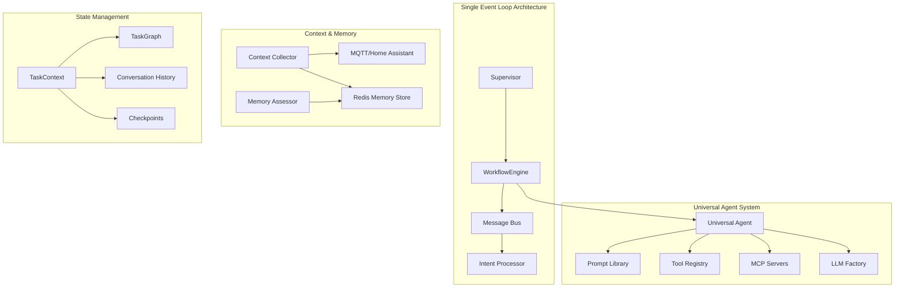

# Universal Agent System

A modern, production-ready AI workflow management platform built on the **Strands Agent Framework** with **single event loop architecture** and **intent-based processing**. The system provides intelligent task delegation, external state management, and seamless integration with external tools through MCP (Model Context Protocol) servers.

## 🎯 **What Is This?**

The Universal Agent System is a **single AI agent** that can assume different specialized roles to handle various tasks. Instead of managing multiple separate agents, you have one intelligent system that dynamically adapts its behavior based on the task at hand.

**Key Concept**: One agent, many roles, unified workflow management.

## ✨ **Key Features**

- **🤖 Universal Agent**: Single agent interface with dynamic role specialization
- **📁 Single-File Roles**: Each role consolidated into one Python file (~300 lines vs 1800+ lines)
- **🔄 Intent-Based Processing**: Declarative event handling eliminates threading complexity
- **⚡ Single Event Loop**: No background threads, no race conditions, no threading issues
- **🧠 Context-Aware Intelligence**: Memory, location, and environmental awareness
- **⏸️ Pause/Resume**: Complete workflow state management with checkpointing
- **🔌 MCP Integration**: Seamless integration with external tool ecosystems
- **🏠 Smart Home Integration**: Home Assistant MQTT integration for household automation
- **📊 Health Monitoring**: Real-time system health and performance monitoring
- **🏗️ LLM-Safe Architecture**: Designed specifically for AI agent development and modification
- **🔧 Production Ready**: Comprehensive testing, deployment guides, and monitoring

## 🚀 **Quick Start**

### **Option 1: Docker Development Setup (Recommended)**

```bash
# Clone and setup
git clone <repository-url>
cd generative-agent

# Create virtual environment
python3 -m venv venv
source venv/bin/activate  # On Windows: venv\Scripts\activate

# One-command setup with Docker Redis
make docker-setup

# Start using the system!
python cli.py
```

### **Option 2: Manual Installation**

```bash
# Clone and setup
git clone <repository-url>
cd generative-agent

# Create virtual environment
python3 -m venv venv
source venv/bin/activate

# Install dependencies
pip install -r requirements.txt

# Install and configure Redis separately
# See DEVELOPMENT_SETUP.md for Redis installation instructions
```

## 💻 **Usage**

### **Interactive Mode (Recommended)**

```bash
python cli.py
```

Start an interactive session where you can:

- Execute workflows with natural language
- Monitor system health and performance
- Switch between different AI roles automatically
- Access memory and context-aware responses

### **Single Command Mode**

```bash
# Execute a workflow and exit
python cli.py --workflow "Set a timer for 10 minutes"

# Check system status
python cli.py --status

# Use custom configuration
python cli.py --config production.yaml
```

### **Programmatic Usage**

```python
from supervisor.supervisor import Supervisor

# Initialize the system
supervisor = Supervisor("config.yaml")
supervisor.start()

# The system is now ready to process workflows
# It will automatically select the right role for each task
```

## 🎭 **Available Roles**

The Universal Agent can assume different specialized roles based on the task:

### **Single-File Roles (Current Architecture)**

- **Timer**: [`roles/core_timer.py`](roles/core_timer.py) - Set timers, alarms, reminders with heartbeat-driven architecture
- **Weather**: [`roles/core_weather.py`](roles/core_weather.py) - Weather information and forecasts
- **Smart Home**: [`roles/core_smart_home.py`](roles/core_smart_home.py) - Device control and automation via Home Assistant MCP
- **Planning**: [`roles/core_planning.py`](roles/core_planning.py) - Complex task planning and analysis
- **Router**: [`roles/core_router.py`](roles/core_router.py) - Request routing and intelligent context selection

### **Role Selection & Context Awareness**

The system automatically selects the appropriate role and gathers relevant context:

- "Set a timer for 5 minutes" → **Timer Role** (no context needed)
- "Turn on the living room lights" → **Smart Home Role** + **Location Context**
- "What's my usual morning routine?" → **Planning Role** + **Memory Context**
- "What's the weather like?" → **Weather Role** + **Environment Context**

## 🏗️ **Architecture**

### **System Overview**



### **Key Components**

1. **Supervisor**: Top-level system coordinator with health monitoring and single event loop management
2. **WorkflowEngine**: Unified orchestration with context-aware request processing
3. **Universal Agent**: Single agent interface with role-based specialization and intent processing hooks
4. **Intent Processor**: Handles declarative intents from pure function event handlers
5. **Context Collector**: Intelligent context gathering (location, memory, environment, presence, schedule)
6. **Memory Assessor**: Post-workflow memory importance assessment and storage
7. **Message Bus**: Event-driven communication with intent processing
8. **TaskContext**: External state management with checkpointing

### **Architecture Benefits**

- **Simplified**: Single event loop eliminates threading complexity
- **Reliable**: No race conditions, no cross-thread async issues
- **Context-Aware**: Intelligent memory and environmental awareness
- **Maintainable**: Clear separation of concerns with intent-based processing
- **Extensible**: Easy to add new roles and capabilities
- **LLM-Friendly**: Designed for AI agent development and modification

## ⚙️ **Configuration**

The system uses a single [`config.yaml`](config.yaml) file for all configuration:

```yaml
# Framework Configuration
framework:
  type: "strands"

# Architecture Configuration
architecture:
  threading_model: "single_event_loop"
  role_system: "single_file"
  llm_development: true

# LLM Provider Configuration
llm_providers:
  bedrock:
    models:
      WEAK: "anthropic.claude-3-haiku-20240307-v1:0"
      DEFAULT: "us.anthropic.claude-3-5-sonnet-20241022-v2:0"
      STRONG: "us.anthropic.claude-3-5-sonnet-20241022-v2:0"

# Role System Configuration
role_system:
  roles_directory: "roles"
  role_pattern: "core_*.py"
  auto_discovery: true
  validate_role_structure: true

# Intent Processing Configuration
intent_processing:
  enabled: true
  validate_intents: true
  timeout_seconds: 30

# Context & Memory Configuration
context_system:
  enabled: true
  memory_assessment: true
  location_tracking: true
  mqtt_integration: true

# Feature Flags
feature_flags:
  enable_universal_agent: true
  enable_intent_processing: true
  enable_single_event_loop: true
  enable_context_awareness: true
```

## 🛠️ **Development**

### **Adding New Roles**

Create a new single-file role following the established pattern:

```python
# roles/core_my_new_role.py
"""My New Role - LLM-friendly single file implementation."""

from dataclasses import dataclass
from typing import List, Dict, Any
from common.intents import Intent, NotificationIntent, AuditIntent
from strands import tool

# 1. ROLE METADATA
ROLE_CONFIG = {
    "name": "my_new_role",
    "version": "1.0.0",
    "description": "Description of what this role does",
    "llm_type": "DEFAULT",
    "fast_reply": True,
    "when_to_use": "When to use this role"
}

# 2. ROLE-SPECIFIC INTENTS
@dataclass
class MyRoleIntent(Intent):
    """Role-specific intent."""
    action: str
    parameters: Dict[str, Any]

    def validate(self) -> bool:
        return bool(self.action and isinstance(self.parameters, dict))

# 3. EVENT HANDLERS (pure functions returning intents)
def handle_my_event(event_data: Any, context) -> List[Intent]:
    """Pure function event handler."""
    return [
        NotificationIntent(
            message=f"Event processed: {event_data}",
            channel=context.get_safe_channel()
        )
    ]

# 4. TOOLS
@tool
def my_tool(parameter: str) -> Dict[str, Any]:
    """Tool function."""
    return {
        "success": True,
        "message": f"Action completed: {parameter}"
    }

# 5. ROLE REGISTRATION
def register_role():
    """Auto-discovered by RoleRegistry."""
    return {
        "config": ROLE_CONFIG,
        "event_handlers": {
            "MY_EVENT": handle_my_event
        },
        "tools": [my_tool],
        "intents": [MyRoleIntent]
    }
```

### **Adding New Tools**

Use the `@tool` decorator pattern:

```python
from strands import tool
from typing import Dict

@tool
def my_custom_tool(data: str, analysis_type: str) -> Dict:
    """Custom tool for specific domain tasks."""
    # Implementation here
    return {"result": "analysis complete", "confidence": 0.95}
```

## 🧪 **Testing**

Run the comprehensive test suite:

```bash
# Run all tests
python -m pytest tests/ -v

# Run specific test categories
python -m pytest tests/integration/ -v    # Integration tests
python -m pytest tests/unit/ -v          # Unit tests
python -m pytest tests/llm_provider/ -v  # Universal Agent tests

# Run architecture validation tests
python -m pytest tests/performance/test_threading_performance.py -v
```

## 🐳 **Docker Development Environment**

The project includes a complete Docker-based development environment:

```bash
# Complete setup with one command
make docker-setup

# Individual commands
make docker-start        # Start Redis container
make redis-cli          # Connect to Redis CLI
make redis-commander    # Start Redis web GUI (http://localhost:8081)
make docker-clean       # Clean up everything
```

### **Docker Services**

- **Redis 7**: Latest stable Redis with optimized development configuration
- **Redis Commander**: Optional web-based Redis management interface
- **Persistent Storage**: Data persists between container restarts
- **Health Checks**: Automatic health monitoring and recovery

## 🔌 **MCP Integration**

The system integrates with multiple MCP servers for enhanced capabilities:

- **AWS Documentation**: Technical documentation and API references
- **Web Search**: Internet search capabilities
- **Weather Services**: Real-time weather data
- **Filesystem**: File system operations
- **GitHub**: Repository management and code search
- **Slack**: Team communication and collaboration
- **Home Assistant**: Smart home device control and automation

## 🏠 **Smart Home Integration**

### **Home Assistant MQTT Integration**

The system provides seamless integration with Home Assistant via MQTT:

- **Location Tracking**: Real-time person location updates
- **Device Control**: Smart home device automation
- **Presence Detection**: Multi-person household awareness
- **Environmental Context**: Temperature, lighting, and sensor data

### **Context-Aware Responses**

The system intelligently gathers context for enhanced responses:

- **Location Context**: "Turn on the lights" → Uses current room location
- **Memory Context**: "Play my usual music" → Recalls previous preferences
- **Environment Context**: "Should I go for a walk?" → Considers weather
- **Presence Context**: "Turn off all lights" → Considers who else is home

## 📊 **Monitoring & Health**

The system includes comprehensive health monitoring:

```python
# Check system health
from supervisor.supervisor import Supervisor
supervisor = Supervisor("config.yaml")
health = supervisor.status()
print(f"System health: {health['overall_status']}")
```

### **Health Monitoring Features**

- Real-time system metrics
- Workflow performance tracking
- Intent processing monitoring
- Single event loop compliance validation
- Context system health checks
- Memory usage and assessment tracking
- Automatic health checks and maintenance

## 📁 **Project Structure**

```
generative-agent/
├── cli.py                    # Command-line interface
├── config.yaml              # Main configuration
├── supervisor/               # System coordination
│   ├── supervisor.py         # Main supervisor with single event loop
│   ├── workflow_engine.py    # Context-aware workflow orchestration
│   └── memory_assessor.py    # Post-workflow memory assessment
├── llm_provider/             # LLM abstraction layer
│   ├── universal_agent.py    # Single agent with role specialization
│   ├── factory.py            # LLM provider factory
│   └── role_registry.py      # Single-file role discovery and management
├── common/                   # Shared components
│   ├── intents.py            # Intent system foundation
│   ├── intent_processor.py   # Intent processing engine
│   ├── message_bus.py        # Event-driven communication
│   ├── context_collector.py  # Intelligent context gathering
│   └── communication_manager.py # Multi-channel communication
├── roles/                    # AI agent roles (single-file architecture)
│   ├── core_timer.py         # Timer role with heartbeat architecture
│   ├── core_weather.py       # Weather role
│   ├── core_smart_home.py    # Smart home automation
│   ├── core_planning.py      # Complex task planning
│   ├── core_router.py        # Request routing with context selection
│   └── shared_tools/         # Shared tool functions
└── tests/                    # Comprehensive test suite
    ├── test_intents.py       # Intent system tests
    ├── test_threading_performance.py # Architecture validation
    └── integration/          # End-to-end tests
```

## 🔧 **Advanced Features**

### **Context-Aware Intelligence**

- **Memory System**: Automatic importance assessment and storage
- **Location Awareness**: MQTT-based real-time location tracking
- **Environmental Context**: Weather, time-of-day, and sensor integration
- **Presence Detection**: Multi-person household awareness
- **Schedule Integration**: Calendar and event awareness

### **Workflow Management**

- **Pause/Resume**: Complete workflow state preservation
- **Checkpointing**: Automatic state snapshots
- **Task Dependencies**: Complex workflow orchestration
- **Result Sharing**: Intelligent predecessor result passing

### **Performance Optimization**

- **Agent Pooling**: Pre-warmed agent instances
- **Fast-Path Routing**: Quick responses for simple requests
- **Semantic Caching**: Intelligent result caching
- **Context Optimization**: Surgical context gathering to minimize latency
- **Reduced LLM Calls**: 33% fewer calls through pre-processing

### **Communication Channels**

- **Slack**: Team collaboration and notifications
- **Console**: Command-line interaction
- **Email**: Email notifications and responses
- **Voice**: Speech recognition and text-to-speech
- **Home Assistant**: Smart home device integration
- **WhatsApp**: Mobile messaging support

## 📖 **Documentation**

Comprehensive documentation is available in the [`docs/`](docs/) directory:

- **[Architecture Overview](docs/01_ARCHITECTURE_OVERVIEW.md)**: System design and patterns
- **[API Reference](docs/02_API_REFERENCE.md)**: Complete API documentation
- **[Configuration Guide](docs/04_CONFIGURATION_GUIDE.md)**: Configuration options and examples
- **[Tool Development Guide](docs/05_TOOL_DEVELOPMENT_GUIDE.md)**: Creating new tools and roles
- **[Deployment Guide](docs/07_DEPLOYMENT_GUIDE.md)**: Production deployment instructions
- **[Threading Architecture](docs/25_THREADING_ARCHITECTURE_IMPROVEMENTS.md)**: LLM-safe architecture design
- **[High-Level Patterns](docs/26_HIGH_LEVEL_ARCHITECTURE_PATTERNS.md)**: Architecture patterns for LLM development
- **[Legacy Code Removal](docs/31_LEGACY_CODE_REMOVAL_CHECKLIST.md)**: Architecture migration cleanup
- **[Context Selection](docs/33_ROUTER_DRIVEN_CONTEXT_SELECTION_DESIGN.md)**: Intelligent context gathering design

## 🎯 **Use Cases**

### **Personal Productivity**

```bash
python cli.py --workflow "Set a timer for 25 minutes for focused work"
python cli.py --workflow "What's the weather forecast for this weekend?"
python cli.py --workflow "Remind me about my usual morning routine"
```

### **Smart Home Automation**

```bash
python cli.py --workflow "Turn on the living room lights and set temperature to 72°F"
python cli.py --workflow "Create a bedtime routine that dims all lights"
python cli.py --workflow "What's the status of all devices in the house?"
```

### **Context-Aware Assistance**

```bash
python cli.py --workflow "Play my usual music"  # Uses location + memory context
python cli.py --workflow "Should I go for a walk?"  # Uses weather + schedule context
python cli.py --workflow "Turn off everything"  # Uses presence + location context
```

### **Development Workflow**

```bash
python cli.py --workflow "Plan the architecture for a new microservice"
python cli.py --workflow "Analyze this system's performance bottlenecks"
```

## 🏛️ **Architecture Principles**

### **Single Event Loop Architecture**

- **No Background Threads**: Everything runs in the main event loop
- **No Threading Locks**: Eliminates race conditions and deadlocks
- **Predictable Execution**: Deterministic event processing order
- **LLM-Safe**: AI agents can safely modify and extend the system

### **Intent-Based Processing**

- **Declarative Events**: Event handlers return "what should happen" not "how to do it"
- **Pure Functions**: Event handlers have no side effects
- **Separation of Concerns**: Business logic separated from I/O operations
- **Testable**: Easy to test and validate event processing logic

### **Single-File Role Architecture**

- **Consolidated**: Each role is completely self-contained in one file
- **LLM-Friendly**: AI agents can understand and modify entire roles
- **Reduced Complexity**: 83% code reduction (1800+ → 300 lines per role)
- **Clear Ownership**: Each role owns all its concerns and dependencies

### **Context-Aware Intelligence**

- **Router-Driven**: Router role determines what context is needed
- **Enum-Based Types**: Predefined context types for surgical gathering
- **Zero Overhead**: Simple commands require no context gathering
- **Memory Assessment**: Automatic importance-based memory storage

## 🔬 **Technical Details**

### **LLM Provider Support**

- **AWS Bedrock**: Claude models with optimized configurations
- **OpenAI**: GPT models with cost optimization
- **Anthropic**: Direct Claude API integration
- **Model Optimization**: Automatic model selection based on task complexity

### **State Management**

- **External State**: TaskContext with Redis persistence
- **Conversation History**: Full conversation tracking with context
- **Progressive Summary**: Intelligent context compression
- **Checkpointing**: Complete workflow state snapshots
- **Memory System**: Importance-based automatic memory storage

### **Event Processing**

- **Message Bus**: Event-driven communication between components
- **Intent System**: Declarative action processing with validation
- **Event Registry**: Dynamic event type registration
- **Handler Registration**: Automatic event handler discovery
- **Context Integration**: Intelligent context injection into workflows

## 🚀 **Performance**

### **Optimizations Achieved**

- **33% Fewer LLM Calls**: Through pre-processing and caching
- **Single Thread Operation**: Eliminates threading overhead
- **Agent Pooling**: Pre-warmed agent instances
- **Fast-Path Routing**: Sub-3-second responses for simple requests
- **Semantic Caching**: Intelligent result reuse
- **Context Optimization**: Surgical context gathering minimizes latency

### **Monitoring**

- **Real-time Metrics**: System performance tracking
- **Health Checks**: Automatic system health validation
- **Intent Processing**: Declarative event processing monitoring
- **Workflow Duration**: Complete workflow timing analysis
- **Context Performance**: Context gathering latency tracking
- **Memory Assessment**: Memory importance and storage metrics

## 🧪 **Testing & Quality**

### **Test Coverage**

- **Architecture Validation**: Single event loop compliance testing
- **Integration Tests**: End-to-end workflow validation
- **Unit Tests**: Component-level testing with minimal mocking
- **Performance Tests**: System performance validation
- **Context Tests**: Context gathering and memory assessment validation

### **Code Quality**

- **Pre-commit Hooks**: Automatic code formatting and linting
- **Type Checking**: Full mypy type validation
- **Security Scanning**: Bandit security analysis
- **Documentation**: Comprehensive inline documentation
- **LLM-Safe Patterns**: Architecture designed for AI modification

## 🚀 **Production Deployment**

### **Production Features**

- **Health Monitoring**: Real-time system health tracking
- **Performance Metrics**: Detailed performance analytics
- **Error Handling**: Comprehensive error recovery
- **Logging**: Structured logging with rotation
- **Configuration**: Environment-specific configurations
- **Context Persistence**: Redis-based context and memory storage

### **Deployment Options**

- **Docker**: Containerized deployment with Redis and MQTT
- **Kubernetes**: Scalable container orchestration
- **Systemd**: Linux service deployment
- **Cloud**: AWS, GCP, Azure deployment guides

## 🤝 **Contributing**

### **Development Setup**

1. Follow the Quick Start guide above
2. Install development dependencies: `pip install -r requirements-dev.txt`
3. Set up pre-commit hooks: `pre-commit install`
4. Run tests: `python -m pytest tests/ -v`

### **Code Style**

- **Black**: Code formatting
- **isort**: Import sorting
- **mypy**: Type checking
- **pytest**: Testing framework with minimal mocking

### **Architecture Guidelines**

- **Single Event Loop**: No background threads
- **Intent-Based**: Use declarative intents for event processing
- **Single-File Roles**: Keep roles consolidated in single files
- **LLM-Safe**: Design for AI agent modification
- **Context-Aware**: Consider memory and environmental context

## 📄 **License**

This project is licensed under the MIT License - see the LICENSE file for details.

## 🆘 **Support**

- **Documentation**: Check the [`docs/`](docs/) directory
- **Issues**: Create GitHub issues for bugs and feature requests
- **Discussions**: Use GitHub Discussions for questions and ideas
- **Development**: See [`DEVELOPMENT_SETUP.md`](DEVELOPMENT_SETUP.md) for development environment setup

## 🎉 **Recent Achievements**

### **Threading Architecture Transformation**

- **Single event loop architecture implemented**
- **All threading issues eliminated**
- **83% code reduction per role achieved**
- **Legacy code removal completed**

### **LLM-Safe Architecture**

- **Intent-based processing implemented**
- **Pure function event handlers**
- **Single-file role architecture**
- **Context-aware intelligence system**

### **Smart Home Integration**

- **Home Assistant MQTT integration**
- **Real-time location tracking**
- **Context-aware device control**
- **Memory and preference learning**

---

**The Universal Agent System: One Agent, Many Roles, Infinite Context-Aware Possibilities** 🚀
