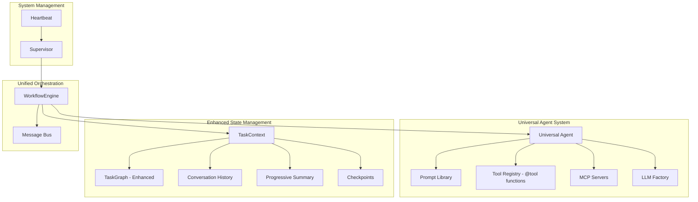

# Universal Agent System

## Overview

The Universal Agent System is a modern, production-ready workflow management platform that provides intelligent task delegation, external state management, and seamless integration with external tools through MCP (Model Context Protocol) servers.

**🎉 Production Ready**: Built with modern AI framework providing enhanced capabilities and simplified architecture.

## Key Features

- **🤖 Universal Agent**: Single agent interface with role-based specialization
- **🔄 Hybrid Role Lifecycle**: Pre/post processing hooks with parameter extraction
- **⏸️ Pause/Resume**: Complete workflow state management with checkpointing
- **🔌 MCP Integration**: Seamless integration with external tool ecosystems
- **📊 Health Monitoring**: Real-time system health and performance monitoring
- **🏗️ Simplified Architecture**: Clean, modular design with minimal dependencies
- **🔧 Production Ready**: Comprehensive documentation, deployment guides, and monitoring
- **🔄 Task Result Sharing**: Intelligent predecessor result passing eliminates duplicate work
- **⚡ Enhanced Performance**: Reduced LLM calls and improved caching with structured parameters

## Architecture

### System Architecture



**Final Architecture**: Supervisor → WorkflowEngine → Universal Agent → LLM Provider

### Key Components

1. **Supervisor**: Top-level system coordinator with health monitoring
2. **WorkflowEngine**: Unified orchestration combining request management and task scheduling
3. **Universal Agent**: Single agent interface with role-based specialization
4. **TaskContext**: External state management with checkpointing
5. **Heartbeat**: System health monitoring and automatic maintenance

## Quick Start

### Installation

```bash
# Clone the repository
git clone https://github.com/your-org/generative-agent.git
cd generative-agent

# Create virtual environment
python3 -m venv venv
source venv/bin/activate  # On Windows: venv\Scripts\activate

# Install dependencies
pip install -r requirements.txt
```

### Configuration

Copy and customize the configuration file:

```bash
cp config.yaml.example config.yaml
# Edit config.yaml with your settings
```

### Basic Usage

**Command Line Interface (Recommended):**

```bash
# Interactive mode
python cli.py

# Show system status
python cli.py --status

# Execute a single workflow
python cli.py --workflow "Search for weather in Seattle and create a summary"

# Use custom config file
python cli.py --config custom.yaml

# Verbose logging
python cli.py --verbose
```

**Programmatic Usage:**

```python
from supervisor.supervisor import Supervisor

# Initialize the system
supervisor = Supervisor("config.yaml")

# Start the system
supervisor.start()

# The system is now ready to process workflows
```

## Universal Agent Roles

The Universal Agent uses a **unified hybrid architecture** where all roles support lifecycle hooks for maximum flexibility:

### Hybrid Roles with Lifecycle Hooks 🆕

- **Weather**: Enhanced weather role with pre-processing data fetching and post-processing formatting
  - Pre-processing: Fetches weather data before LLM call
  - LLM processing: Interprets pre-fetched data
  - Post-processing: TTS formatting, PII scrubbing, audit logging
  - Parameter extraction: Automatic location, timeframe, and format detection
- **Timer**: Timer and alarm management with parameter extraction and validation
- **Calendar**: Calendar event management with time parsing and confirmation
- **Smart Home**: Device control with parameter validation and status tracking

### Hybrid-LLM Roles (Traditional LLM behavior)

- **Planning**: Complex task planning and dependency analysis (uses STRONG models)
- **Analysis**: Data analysis and analytical reasoning (uses STRONG models)
- **Coding**: Code generation, debugging, and software development (uses STRONG models)
- **Code Reviewer**: Code quality assessment and security analysis (uses DEFAULT models)
- **Research Analyst**: Comprehensive research and evidence-based reports (uses DEFAULT models)
- **Search**: Web search and information retrieval (uses WEAK models)
- **Default**: General-purpose assistant capabilities (uses DEFAULT models)
- **Router**: Request routing and task classification (uses WEAK models)

### Hybrid Architecture Benefits

- **33% fewer LLM calls**: Pre-processing eliminates tool calls during LLM execution
- **Enhanced caching**: Structured parameters enable better cache hit rates
- **Better security**: Built-in PII scrubbing and audit logging
- **Consistent formatting**: Post-processing ensures uniform output
- **Comprehensive monitoring**: Detailed timing for all lifecycle phases
- **Unified execution**: All roles use the same execution path with optional lifecycle hooks

## Configuration

### Main Configuration (`config.yaml`)

```yaml
# Framework Configuration
framework:
  type: "strands"

# LLM Provider Configuration
llm_providers:
  bedrock:
    models:
      WEAK: "anthropic.claude-3-haiku-20240307-v1:0"
      DEFAULT: "us.amazon.nova-pro-v1:0"
      STRONG: "us.anthropic.claude-3-5-sonnet-20241022-v2:0"

# Universal Agent Configuration
universal_agent:
  role_llm_mapping:
    planning: "STRONG" # Complex reasoning
    search: "WEAK" # Simple search
    weather: "WEAK" # Simple lookup
    summarizer: "DEFAULT" # Text processing
    slack: "DEFAULT" # Conversational

# Heartbeat Configuration
heartbeat:
  enabled: true
  interval: 30 # Heartbeat interval in seconds
  health_check_interval: 60 # Health check interval in seconds

# Feature Flags
feature_flags:
  enable_universal_agent: true
  enable_mcp_integration: true
  enable_task_scheduling: true
  enable_pause_resume: true
  enable_heartbeat: true
```

## API Usage

### Basic Workflow Execution

```python
from supervisor.workflow_engine import WorkflowEngine
from llm_provider.factory import LLMFactory
from common.message_bus import MessageBus

# Initialize components
message_bus = MessageBus()
llm_factory = LLMFactory(configs, framework="strands")
workflow_engine = WorkflowEngine(llm_factory, message_bus)

# Start a workflow
workflow_id = workflow_engine.start_workflow(
    "Search for current weather in Seattle and create a summary report"
)

# Monitor progress
status = workflow_engine.get_workflow_status(workflow_id)
print(f"Workflow {workflow_id} is {status['state']}")
```

### Pause and Resume Workflows

```python
# Pause a running workflow
checkpoint = workflow_engine.pause_workflow(workflow_id)

# Save checkpoint for later use
import json
with open(f"checkpoint_{workflow_id}.json", "w") as f:
    json.dump(checkpoint, f)

# Resume workflow later
with open(f"checkpoint_{workflow_id}.json", "r") as f:
    checkpoint = json.load(f)

workflow_engine.resume_workflow(workflow_id, checkpoint)
```

## Tool Development

Create new tools using the `@tool` decorator pattern:

```python
from strands import tool
from typing import Dict

@tool
def custom_analysis_tool(data: str, analysis_type: str) -> Dict:
    """Custom analysis tool for specific domain tasks"""
    # Implementation here
    return {"analysis": "results", "confidence": 0.95}

# Register tool with Universal Agent
universal_agent.tool_registry.register_tool("custom_analysis", custom_analysis_tool)
```

## MCP Integration

The system integrates with multiple MCP servers for enhanced capabilities:

- **AWS Documentation**: Technical documentation and API references
- **Web Search**: Internet search capabilities
- **Weather Services**: Real-time weather data
- **Filesystem**: File system operations
- **GitHub**: Repository management and code search
- **Slack**: Team communication and collaboration

## Health Monitoring

The system includes comprehensive health monitoring:

```python
# Check system health
health = supervisor.heartbeat.get_health_status()
print(f"System health: {health['overall_status']}")

# Get detailed metrics
metrics = supervisor.heartbeat.get_system_metrics()
print(f"Active workflows: {metrics['workflow_engine']['active_workflows']}")
```

## Testing

Run the comprehensive test suite:

```bash
# Run all tests
python -m pytest tests/ -v

# Run specific test categories
python -m pytest tests/integration/ -v  # Integration tests
python -m pytest tests/llm_provider/ -v  # Universal Agent tests
python -m pytest tests/supervisor/ -v   # WorkflowEngine tests
```

## Command Line Interface

The system includes a modern CLI with multiple usage modes:

### Interactive Mode

```bash
python cli.py
```

Starts an interactive session where you can:

- Execute workflows with the Universal Agent
- Check system status and health
- Monitor workflow progress in real-time

### Single Command Mode

```bash
# Execute a workflow and exit
python cli.py --workflow "Plan a machine learning project"

# Check system status
python cli.py --status

# Use custom configuration
python cli.py --config production.yaml
```

### CLI Features

- **Real-time Status**: Live system health and workflow monitoring
- **Multiple LLM Providers**: Supports Bedrock, Anthropic, and OpenAI
- **Role-based Execution**: Automatic role selection (planning, search, weather, etc.)
- **Error Handling**: Graceful error recovery and user feedback
- **Flexible Configuration**: Custom config files and verbose logging

## Documentation

Comprehensive documentation is available in the `docs/` directory:

- **[API Reference](docs/02_API_REFERENCE.md)**: Complete API documentation
- **[Architecture Overview](docs/01_ARCHITECTURE_OVERVIEW.md)**: System design and patterns
- **[Configuration Guide](docs/04_CONFIGURATION_GUIDE.md)**: Configuration options and examples
- **[Troubleshooting Guide](docs/03_TROUBLESHOOTING_GUIDE.md)**: Common issues and solutions
- **[Tool Development Guide](docs/05_TOOL_DEVELOPMENT_GUIDE.md)**: Creating new @tool functions
- **[Deployment Guide](docs/07_DEPLOYMENT_GUIDE.md)**: Production deployment instructions
- **[Hybrid Role Lifecycle Design](docs/14_HYBRID_ROLE_LIFECYCLE_DESIGN.md)**: 🆕 Complete hybrid role architecture specification
- **[Hybrid Role Migration Guide](docs/HYBRID_ROLE_MIGRATION_GUIDE.md)**: 🆕 Step-by-step guide for creating hybrid roles

### New Hybrid Role Architecture 🆕

The system now supports **Hybrid Role Lifecycle Architecture** with unified execution for all roles:

#### Key Features

- **Parameter Extraction**: Single LLM call extracts both route and parameters
- **Pre-processing Hooks**: Fetch data before LLM execution (eliminates tool calls)
- **Post-processing Hooks**: Format results, scrub PII, audit logging
- **Data Injection**: Pre-processed data injected into LLM context
- **Enhanced Caching**: Structured parameters enable semantic caching

#### Example: Enhanced Weather Role

```bash
# Request: "What's the weather in Seattle?"
# 1. Enhanced routing extracts: {"location": "Seattle", "timeframe": "current"}
# 2. Pre-processing fetches weather data from API
# 3. LLM interprets pre-fetched data (no tool calls needed)
# 4. Post-processing formats for TTS and logs interaction
# Result: 33% fewer LLM calls, faster execution, better monitoring
```

See [`examples/hybrid_role_example.py`](examples/hybrid_role_example.py) for a working demonstration.

## Architecture Benefits

This system provides significant advantages through its modern architecture:

### Architecture Features

- Universal Agent with role-based specialization
- Clean abstraction over LLM frameworks
- Complete pause/resume with external state management
- Simplified architecture with enhanced capabilities

### Key Benefits

- **Simplified Testing**: Fewer components to test and mock
- **Better Performance**: Reduced overhead from multiple agent instances
- **Enhanced Capabilities**: Pause/resume, external state, MCP integration, task result sharing
- **Cleaner Codebase**: Minimal orchestration complexity
- **Efficiency Improvements**: Task result sharing eliminates duplicate work between dependent tasks
- **Unified Result Storage**: All workflows (fast-reply and complex) use consistent TaskContext storage

### Unified Result Architecture 🆕

The system now uses **unified result storage** for both fast-reply and complex workflows:

#### Before (Dual Storage)

- **Fast-reply**: Results stored in `fast_reply_results` dict
- **Complex workflows**: Results stored in `TaskContext` objects
- **Problem**: Different retrieval mechanisms, inconsistent interfaces

#### After (Unified Storage)

- **All workflows**: Results stored in `TaskContext` with completed `TaskNode`
- **Fast-reply**: Creates minimal `TaskContext` with single completed task
- **Complex workflows**: Uses full DAG execution with multiple tasks
- **Benefit**: Single retrieval mechanism, consistent interfaces, simplified Slack integration

```python
# Fast-reply now creates TaskContext like complex workflows
task_node = TaskNode(
    task_id=request_id,
    task_name=f"fast_reply_{role}",
    status=TaskStatus.COMPLETED,
    result=result,  # Actual AI response stored here
    role=role
)
task_context = TaskContext(task_graph, context_id=request_id)
self.active_workflows[request_id] = task_context  # Unified storage
```

## Project Structure

```
generative-agent/
├── supervisor/
│   ├── supervisor.py              # Main system coordinator
│   ├── workflow_engine.py         # Unified workflow management (was request_manager.py)
│   ├── heartbeat.py              # System health monitoring
│   ├── metrics_manager.py        # Performance metrics
│   └── config_manager.py         # Configuration management
├── llm_provider/
│   ├── factory.py                # StrandsAgent model factory
│   ├── universal_agent.py        # Universal Agent implementation
│   ├── planning_tools.py         # Planning @tool functions
│   ├── search_tools.py           # Search @tool functions
│   ├── weather_tools.py          # Weather @tool functions
│   ├── summarizer_tools.py       # Summarization @tool functions
│   ├── slack_tools.py            # Slack @tool functions
│   ├── tool_registry.py          # Tool registration and management
│   ├── prompt_library.py         # Role-based prompts
│   └── mcp_client.py             # MCP server integration
├── common/
│   ├── task_graph.py             # Enhanced DAG with checkpointing
│   ├── task_context.py           # External state management
│   ├── message_bus.py            # Event-driven communication
│   └── request_model.py          # Request data models
├── config/
│   ├── config_manager.py         # Global configuration management
│   ├── bedrock_config.py         # AWS Bedrock configuration
│   ├── anthropic_config.py       # Anthropic configuration
│   ├── openai_config.py          # OpenAI configuration
│   └── mcp_config.yaml           # MCP server configuration
├── agents/deprecated/             # Legacy agents (deprecated)
├── docs/                         # Comprehensive documentation
├── tests/                        # Comprehensive test suite
├── config.yaml                   # Main configuration file
├── requirements.txt              # Python dependencies (StrandsAgent-based)
└── README.md                     # This file
```

## Development

### Adding New Tools

1. Create a new tool function with the `@tool` decorator
2. Register the tool in the ToolRegistry
3. Add the tool to appropriate role configurations
4. Write comprehensive tests
5. Update documentation

### Adding New Roles

1. Define the role in the Universal Agent
2. Create role-specific prompts
3. Configure appropriate LLM type (WEAK/DEFAULT/STRONG)
4. Assign relevant tools to the role
5. Test role assumption and execution

## Production Deployment

The system supports multiple deployment methods:

- **Docker**: Containerized deployment with health checks
- **Kubernetes**: Scalable deployment with auto-scaling
- **Systemd**: Traditional Linux server deployment
- **Cloud**: AWS, GCP, Azure deployment guides

See [Deployment Guide](docs/DEPLOYMENT_GUIDE.md) for detailed instructions.

## Monitoring and Observability

- **Health Checks**: Real-time component health monitoring
- **Metrics Collection**: Performance and usage metrics
- **Structured Logging**: JSON-formatted logs for analysis
- **Alerting**: Configurable alerts for critical issues
- **Resource Monitoring**: CPU, memory, and disk usage tracking

## Contributing

1. Fork the repository
2. Create a feature branch
3. Write tests for your changes
4. Ensure all tests pass
5. Submit a pull request

See [docs/CONTRIBUTING.md](docs/CONTRIBUTING.md) for detailed guidelines.

## License

This project is licensed under the MIT License - see the LICENSE file for details.

## Support

- **Documentation**: See `docs/` directory for comprehensive guides
- **Issues**: Report bugs and feature requests via GitHub Issues
- **Troubleshooting**: See [Troubleshooting Guide](docs/TROUBLESHOOTING_GUIDE.md)

## Migration History

This system represents a complete architectural evolution:

**Phase 1-3**: Foundation and Universal Agent implementation
**Phase 4-5**: MCP integration and comprehensive testing
**Phase 6-7**: Architecture consolidation and framework optimization
**Phase 8**: Post-migration cleanup and production readiness
**Phase 9**: 🆕 **Hybrid Role Lifecycle Architecture** - Advanced role execution with lifecycle hooks

### Latest Enhancement: Hybrid Role Lifecycle Architecture

The system now includes a revolutionary hybrid role execution model:

#### Implementation Achievements

- **Enhanced RoleRegistry**: Lifecycle function support and parameter schemas
- **Enhanced RequestRouter**: Parameter extraction in single LLM call
- **Enhanced UniversalAgent**: Hybrid execution with pre/post processing hooks
- **Updated WorkflowEngine**: Hybrid role support with async execution
- **Migrated Weather Role**: Complete hybrid pattern implementation
- **Comprehensive Testing**: 41 tests covering all hybrid functionality
- **Full Documentation**: Migration guide and working examples

#### Performance Impact

- **Reduced LLM calls**: 3 → 2 calls per weather request (33% reduction)
- **Enhanced caching**: Structured parameters improve cache hit rates
- **Better monitoring**: Comprehensive execution time logging
- **Improved security**: Built-in PII scrubbing and audit logging

The migration maintained 100% functionality while achieving:

- Modern AI framework architecture
- Simplified architecture (5 components → 1 Universal Agent)
- Enhanced capabilities (pause/resume, external state, MCP integration, hybrid roles)
- Production-ready features (health monitoring, deployment guides)
- Comprehensive documentation and testing
