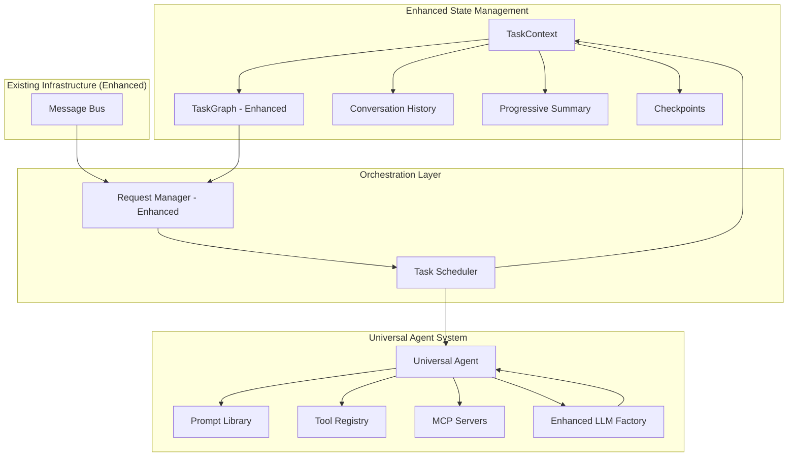
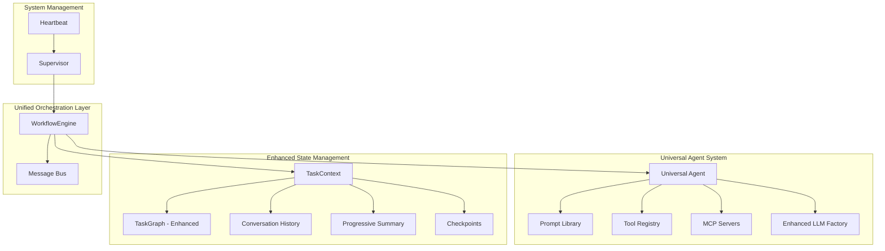

# StrandsAgent Universal Agent Migration Plan

## Overview
This document provides a revised migration plan based on the **Universal Agent + External State Management** paradigm. After analyzing the current project structure, we've identified excellent foundations that can be leveraged and enhanced rather than replaced.

## Rules

* ALWAYS use test driven development, write tests first
* Never assume tests pass, run the tests and positively verify that the test passed
* ALWAYS run all tests after making any change to ensure they are still all passing, do not move on until relevant tests are passing
* If a test fails, reflect deeply about why the test failed and fix it or fix the code
* Always write multiple tests, including happy, unhappy path and corner cases
* Always verify interfaces and data structures before writing code, do not assume the definition of a interface or data structure
* When performing refactors, ALWAYS use grep to find all instances that need to be refactored
* If you are stuck in a debugging cycle and can't seem to make forward progress, either ask for user input or take a step back and reflect on the broader scope of the code you're working on
* ALWAYS make sure your tests are meaningful, do not mock excessively, only mock where ABSOLUTELY necessary.
* Make a git commit after major changes have been completed
* When refactoring an object, refactor it in place, do not create a new file just for the sake of preserving the old version, we have git for that reason. For instance, if refactoring RequestManager, do NOT create an EnhancedRequestManager, just refactor or rewrite RequestManager
* ALWAYS Follow development and language best practices
* Use the Context7 MCP server if you need documentation for something, make sure you're looking at the right version
* Remember we are migrating AWAY from langchain TO strands agent
* Do not worry about backwards compatibility unless it is PART of a migration process and you will remove the backwards compatibility later
* Do not use fallbacks

---

## Current Project Analysis: What We Have vs. What We Need

### **Excellent Foundations (Keep & Enhance)**

#### ✅ **TaskGraph System** (`common/task_graph.py`)
**Current Capabilities:**
- Complete DAG implementation with nodes and edges
- Task status management (PENDING, RUNNING, COMPLETED, FAILED)
- Dependency resolution and execution ordering
- History tracking and checkpointing
- Entry point and terminal node identification

**Enhancement Needed:**
- Add checkpoint/resume functionality for pause/resume
- Integrate with StrandsAgent execution model
- Add progressive summary management

#### ✅ **Request Management** (`supervisor/request_manager.py`)
**Current Capabilities:**
- Request lifecycle management
- Task delegation and monitoring
- Progress tracking and metrics
- Error handling and retry logic
- Request persistence

**Enhancement Needed:**
- Replace agent-specific delegation with Universal Agent
- Add external state management integration
- Simplify orchestration logic

#### ✅ **Message Bus** (`common/message_bus.py`)
**Current Capabilities:**
- Pub/sub messaging system
- Thread-safe operations
- Event-driven architecture

**Enhancement Needed:**
- Integrate with StrandsAgent task scheduling
- Add task queue management

### **Components to Replace/Simplify**

#### ❌ **Individual Agent Classes** (`agents/*/agent.py`)
**Current:** Separate classes for Planning, Search, Weather, Summarizer, Slack
**New:** Single Universal Agent with role-based prompts

#### ❌ **Agent Manager** (`supervisor/agent_manager.py`)
**Current:** Complex agent registration and management
**New:** Simple prompt library and tool registry

#### ✅ **LLM Factory** (`llm_provider/factory.py`) - **KEEP & ENHANCE**
**Current:** Custom LLM abstraction layer for LangChain
**Enhanced:** Extended to support StrandsAgent models while maintaining abstraction
**Value:** Semantic model types (DEFAULT/STRONG/WEAK), future flexibility, testing support

---

## Revised Architecture: Universal Agent + Enhanced TaskGraph

### **Current Architecture (Phase 3 Complete):**



### **Improved Architecture (Phase 6 - Option A):**



**Key Improvement**: Merge RequestManager + TaskScheduler → WorkflowEngine for simplified architecture

---

## Migration Plan: Leveraging Existing Infrastructure

### **Phase 1: Foundation Enhancement (Week 1)**

#### **Epic 1.1: TaskGraph Enhancement for External State**
**Goal**: Enhance existing TaskGraph to support external state management

##### User Story 1.1.1: As a developer, I want TaskGraph to support checkpointing and resumption
- [x] Analyze current TaskGraph checkpoint capabilities
- [x] Add `create_checkpoint()` method to TaskGraph
- [x] Add `resume_from_checkpoint()` method to TaskGraph
- [x] Implement checkpoint serialization/deserialization
- [x] Add progressive summary tracking to TaskGraph
- [x] Write tests for checkpoint functionality
- [x] Document checkpoint/resume procedures

##### User Story 1.1.2: As a developer, I want TaskGraph to integrate with StrandsAgent execution
- [x] Modify TaskNode to support role-based execution
- [x] Add tool requirements to TaskNode structure
- [x] Integrate conversation history tracking
- [x] Add context passing between nodes
- [x] Write tests for StrandsAgent integration
- [x] Document TaskGraph enhancements

#### **Epic 1.2: TaskContext Implementation**
**Goal**: Create TaskContext wrapper around enhanced TaskGraph

##### User Story 1.2.1: As a developer, I want a TaskContext that manages all external state
- [x] Design TaskContext class wrapping TaskGraph
- [x] Implement conversation history management
- [x] Add progressive summary functionality
- [x] Create metadata and checkpoint management
- [x] Implement context serialization for persistence
- [x] Write comprehensive tests for TaskContext
- [x] Document TaskContext usage patterns

```python
# Enhanced TaskContext leveraging existing TaskGraph
class TaskContext:
    def __init__(self, task_graph: TaskGraph):
        self.task_graph = task_graph  # Leverage existing implementation
        self.conversation_history = ConversationHistory()
        self.progressive_summary = ProgressiveSummary()
        self.checkpoints = []
        self.metadata = {}
    
    def create_checkpoint(self):
        """Leverage existing TaskGraph + add conversation state"""
        checkpoint = {
            'task_graph_state': self.task_graph.to_dict(),
            'conversation_history': self.conversation_history.to_dict(),
            'summary': self.progressive_summary.current_state(),
            'timestamp': time.time()
        }
        self.checkpoints.append(checkpoint)
```

### **Phase 2: Enhanced LLMFactory & Universal Agent Implementation (Week 2)**

#### **Epic 2.1: LLMFactory Enhancement for StrandsAgent**
**Goal**: Enhance existing LLMFactory to support StrandsAgent while maintaining abstraction

##### User Story 2.1.1: As a developer, I want to enhance LLMFactory to support StrandsAgent models
- [x] Analyze existing LLMFactory interface and preserve semantic model types
- [x] Add StrandsAgent model creation methods to existing factory
- [x] Maintain existing LLMType enum (DEFAULT, STRONG, WEAK, etc.)
- [x] Implement StrandsAgent model mapping for each provider (Bedrock, OpenAI)
- [x] Preserve existing configuration management system
- [x] Add framework selection capability (LangChain vs StrandsAgent)
- [x] Write tests for enhanced LLMFactory functionality
- [x] Document LLMFactory enhancements and migration path

```python
# Enhanced LLMFactory Implementation
class EnhancedLLMFactory(LLMFactory):  # Inherit existing functionality
    def __init__(self, configs: Dict[LLMType, List[BaseConfig]], framework: str = "strands"):
        super().__init__(configs)
        self.framework = framework
        self.prompt_library = PromptLibrary()
    
    def create_strands_model(self, llm_type: LLMType, name: Optional[str] = None):
        """Create StrandsAgent model while maintaining abstraction"""
        config = self._get_config(llm_type, name)  # Use existing config logic
        
        if config.provider_type == "bedrock":
            from strands.models import BedrockModel
            return BedrockModel(
                model_id=config.model_id,
                temperature=config.temperature,
                **config.additional_params
            )
        elif config.provider_type == "openai":
            from strands.models import OpenAIModel
            return OpenAIModel(
                model_id=config.model_id,
                temperature=config.temperature,
                **config.additional_params
            )
    
    def create_universal_agent(self, llm_type: LLMType, role: str, tools: List = None):
        """Create Universal Agent using enhanced factory"""
        from strands import Agent
        
        model = self.create_strands_model(llm_type)
        prompt = self.prompt_library.get_prompt(role)
        
        return Agent(
            model=model,
            system_prompt=prompt,
            tools=tools or []
        )
```

#### **Epic 2.2: Universal Agent Integration with LLMFactory**
**Goal**: Create Universal Agent that leverages enhanced LLMFactory

##### User Story 2.2.1: As a developer, I want to set up Universal Agent with LLMFactory integration
- [x] Install StrandsAgent dependencies
- [x] Create Universal Agent wrapper class that uses enhanced LLMFactory
- [x] Design prompt library for existing agent roles
- [x] Implement role switching mechanism with semantic model selection
- [x] Create tool registry for existing agent tools
- [x] Integrate with existing LLMType system (DEFAULT, STRONG, WEAK)
- [x] Write tests for Universal Agent functionality
- [x] Document Universal Agent usage with LLMFactory

```python
# Universal Agent Implementation with LLMFactory
class UniversalAgent:
    def __init__(self, llm_factory: EnhancedLLMFactory):
        self.llm_factory = llm_factory  # Use enhanced factory
        self.prompt_library = PromptLibrary()
        self.tool_registry = ToolRegistry()
    
    def assume_role(self, role: str, llm_type: LLMType = LLMType.DEFAULT,
                   context: TaskContext = None, tools: List[str] = None):
        """Create role-specific agent using factory abstraction"""
        role_tools = self.tool_registry.get_tools(tools or [])
        
        # Use factory to create agent (maintains abstraction)
        return self.llm_factory.create_universal_agent(
            llm_type=llm_type,
            role=role,
            tools=role_tools
        )
```

##### User Story 2.2.2: As a developer, I want to convert existing agent logic to prompts and tools
- [x] Extract Planning Agent logic to prompt + planning tools
- [x] Extract Search Agent logic to prompt + search tools
- [x] Extract Weather Agent logic to prompt + weather tools
- [x] Extract Summarizer Agent logic to prompt + summarization tools
- [x] Extract Slack Agent logic to prompt + Slack tools
- [x] Create @tool decorators for existing agent methods
- [x] Write tests for each converted agent role
- [x] Document prompt and tool conversion process

#### **Epic 2.3: Tool Migration to @tool Decorators**
**Goal**: Convert existing agent methods to StrandsAgent tools

##### User Story 2.3.1: As a developer, I want existing agent capabilities as StrandsAgent tools
- [x] Audit existing agent methods and capabilities
- [x] Convert planning logic to @tool functions
- [x] Convert search functionality to @tool functions
- [x] Convert weather lookup to @tool functions
- [x] Convert text summarization to @tool functions
- [x] Convert Slack integration to @tool functions
- [x] Write tests for each converted tool
- [x] Document tool conversion and usage

```python
# Example tool conversion
@tool
def create_task_plan(instruction: str, available_agents: List[str]) -> Dict:
    """Create a task plan from user instruction - converted from PlanningAgent"""
    # Logic extracted from existing PlanningAgent.run() method
    pass

@tool  
def web_search(query: str, num_results: int = 5) -> Dict:
    """Search the web for information - converted from SearchAgent"""
    # Logic extracted from existing SearchAgent methods
    pass
```

### **Phase 3: Enhanced Request Management (Week 3)**

#### **Epic 3.1: Request Manager Enhancement**
**Goal**: Enhance existing RequestManager to work with Universal Agent and LLMFactory

##### User Story 3.1.1: As a developer, I want RequestManager to use Universal Agent with LLMFactory instead of individual agents
- [x] Analyze current RequestManager delegation logic
- [x] Replace agent-specific delegation with Universal Agent calls via LLMFactory
- [x] Integrate TaskContext with existing request management
- [x] Enhance task delegation to use role-based execution with semantic model selection
- [x] Map existing agent_id values to roles and appropriate LLMType (STRONG/WEAK/DEFAULT)
- [x] Maintain existing error handling and retry logic
- [x] Write tests for enhanced RequestManager
- [x] Document RequestManager changes and LLMFactory integration

```python
# Enhanced RequestManager leveraging existing infrastructure + LLMFactory
class EnhancedRequestManager(RequestManager):
    def __init__(self, llm_factory: EnhancedLLMFactory, message_bus: MessageBus):
        self.llm_factory = llm_factory
        self.universal_agent = UniversalAgent(llm_factory)
        self.message_bus = message_bus
        # Leverage existing request_map and other infrastructure
        super().__init__(None, message_bus)  # No agent_manager needed
    
    def delegate_task(self, task_context: TaskContext, task: TaskNode):
        """Enhanced delegation using Universal Agent with LLMFactory"""
        # Map existing agent_id to role and appropriate model type
        role = self._determine_role_from_agent_id(task.agent_id)
        llm_type = self._determine_llm_type_for_role(role)  # Use STRONG for planning, WEAK for simple tasks
        tools = self._get_tools_for_task(task)
        
        # Use Universal Agent with semantic model selection
        agent = self.universal_agent.assume_role(
            role=role,
            llm_type=llm_type,  # Leverage existing LLMType abstraction
            context=task_context,
            tools=tools
        )
        result = agent(task.prompt)
        
        # Update TaskContext (which wraps existing TaskGraph)
        task_context.update_task_result(task.task_id, result)
    
    def _determine_llm_type_for_role(self, role: str) -> LLMType:
        """Map roles to appropriate model types for cost/performance optimization"""
        role_to_llm_type = {
            "planning": LLMType.STRONG,    # Complex reasoning needs powerful model
            "search": LLMType.WEAK,        # Simple search can use cheaper model
            "weather": LLMType.WEAK,       # Simple lookup
            "summarizer": LLMType.DEFAULT, # Balanced model for text processing
            "slack": LLMType.DEFAULT       # Conversational tasks
        }
        return role_to_llm_type.get(role, LLMType.DEFAULT)
```

#### **Epic 3.2: Task Scheduler Implementation**
**Goal**: Create task scheduler for pause/resume functionality

##### User Story 3.2.1: As a developer, I want a task scheduler that supports pause/resume
- [ ] Design TaskScheduler that works with existing RequestManager
- [ ] Implement task queue management
- [ ] Add pause/resume functionality using TaskContext checkpoints
- [ ] Integrate with existing message bus for task distribution
- [ ] Add task priority and scheduling logic
- [ ] Write tests for task scheduling functionality
- [ ] Document task scheduler usage

### **Phase 4: MCP Integration (Week 4)**

#### **Epic 4.1: MCP Server Integration**
**Goal**: Add MCP server support to enhance tool capabilities

##### User Story 4.1.1: As a developer, I want to integrate MCP servers for external tools
- [ ] Research available MCP servers for current agent capabilities
- [ ] Implement MCP client integration with StrandsAgent
- [ ] Add MCP server discovery and registration
- [ ] Create MCP tool registry integration
- [ ] Add authentication and security for MCP servers
- [ ] Write tests for MCP integration
- [ ] Document MCP server setup and usage

##### User Story 4.1.2: As a user, I want enhanced capabilities through MCP servers
- [ ] Set up AWS documentation MCP server
- [ ] Integrate web search MCP server
- [ ] Add weather service MCP server
- [ ] Create custom MCP server for internal tools
- [ ] Test MCP server functionality with Universal Agent
- [ ] Write user documentation for MCP capabilities
- [ ] Document MCP server configuration

### **Phase 5: Configuration and Testing (Week 5)**

#### **Epic 5.1: Configuration System Enhancement**
**Goal**: Update configuration system for Universal Agent architecture

##### User Story 5.1.1: As a developer, I want configuration that supports Universal Agent + External State
- [ ] Design new configuration schema for Universal Agent
- [ ] Create prompt library configuration
- [ ] Add tool registry configuration  
- [ ] Configure MCP server connections
- [ ] Add TaskContext and scheduling configuration
- [ ] Migrate existing agent configurations to new format
- [ ] Write tests for configuration system
- [ ] Document configuration options

```yaml
# New configuration format
universal_agent:
  model:
    provider: "bedrock"
    model_id: "us.amazon.nova-pro-v1:0"
    temperature: 0.3
    
  roles:
    planning:
      prompt_template: "planning_prompt.txt"
      tools: ["create_task_plan", "analyze_dependencies"]
      
    search:
      prompt_template: "search_prompt.txt"  
      tools: ["web_search", "search_mcp_server"]
      
  mcp_servers:
    aws_docs:
      command: "uvx"
      args: ["awslabs.aws-documentation-mcp-server@latest"]
      
  task_scheduling:
    max_concurrent_tasks: 5
    checkpoint_interval: 300  # 5 minutes
    retry_attempts: 3
```

#### **Epic 5.2: Comprehensive Testing**
**Goal**: Ensure all functionality works with new architecture

##### User Story 5.2.1: As a developer, I want comprehensive tests for the new architecture
- [ ] Write unit tests for TaskContext enhancements
- [ ] Create integration tests for Universal Agent
- [ ] Test task scheduling and pause/resume functionality
- [ ] Validate MCP server integration
- [ ] Create end-to-end tests for complete workflows
- [ ] Test migration from existing agent system
- [ ] Write performance tests for new architecture
- [ ] Document testing procedures and coverage

---

## Implementation Strategy: Leveraging Existing Code

### **What We Keep (90% of existing code):**
1. **TaskGraph System** - Enhanced, not replaced
2. **RequestManager** - Enhanced for Universal Agent
3. **Message Bus** - Used as-is with minor enhancements
4. **Configuration System** - Extended for new architecture
5. **Error Handling** - Maintained and enhanced
6. **Metrics and Monitoring** - Kept with additions

### **What We Replace (10% of existing code):**
1. **Individual Agent Classes** → **Universal Agent + Prompts**
2. **Agent Manager** → **Prompt Library + Tool Registry**
3. **LLM Factory** → **Native StrandsAgent Models**

### **What We Add (New Components):**
1. **TaskContext** - Wrapper around existing TaskGraph
2. **Universal Agent** - StrandsAgent integration
3. **Prompt Library** - Role-based prompts
4. **Tool Registry** - @tool decorated functions
5. **Task Scheduler** - Pause/resume functionality
6. **MCP Integration** - External tool servers

---

## Migration Benefits

### **Simplified Architecture:**
- **Before**: 5 agent classes + complex orchestration
- **After**: 1 Universal Agent + enhanced TaskGraph
### **Phase 6: Architecture Optimization (Week 6)**

#### **Epic 6.1: WorkflowEngine Consolidation**
**Goal**: Merge RequestManager + TaskScheduler into unified WorkflowEngine for simplified architecture

##### User Story 6.1.1: As a developer, I want a unified WorkflowEngine that combines request lifecycle and task scheduling
- [ ] Analyze current RequestManager and TaskScheduler responsibilities
- [ ] Design WorkflowEngine interface that preserves all capabilities
- [ ] Merge request lifecycle management from RequestManager
- [ ] Merge task scheduling and concurrency control from TaskScheduler
- [ ] Preserve DAG execution, multi-threading, and task delegation
- [ ] Maintain external state management through TaskContext
- [ ] Write comprehensive tests for WorkflowEngine
- [ ] Document WorkflowEngine architecture and usage

```python
# Unified WorkflowEngine Implementation
class WorkflowEngine:
    """Unified workflow management with DAG execution and state persistence."""
    
    def __init__(self, llm_factory: LLMFactory, message_bus: MessageBus):
        self.universal_agent = UniversalAgent(llm_factory)
        self.active_workflows: Dict[str, TaskContext] = {}
        self.max_concurrent_tasks = 5
        self.running_tasks: Dict[str, TaskNode] = {}
        self.message_bus = message_bus
    
    # Request lifecycle (from RequestManager)
    def start_workflow(self, instruction: str) -> str:
        """Create and start a new workflow from user instruction."""
        workflow_id = self._generate_workflow_id()
        task_context = self._create_task_plan(instruction, workflow_id)
        self.active_workflows[workflow_id] = task_context
        self._execute_dag_parallel(task_context)
        return workflow_id
    
    # Task scheduling (from TaskScheduler)  
    def _execute_dag_parallel(self, task_context: TaskContext):
        """Execute DAG with parallel task execution and concurrency control."""
        ready_tasks = task_context.get_ready_tasks()
        for task in ready_tasks:
            if len(self.running_tasks) < self.max_concurrent_tasks:
                self._execute_task_async(task_context, task)
    
    # State management (enhanced)
    def pause_workflow(self, workflow_id: str) -> Dict:
        """Pause workflow and create comprehensive checkpoint."""
        task_context = self.active_workflows[workflow_id]
        return task_context.pause_execution()
    
    def resume_workflow(self, workflow_id: str, checkpoint: Dict):
        """Resume workflow from checkpoint with full state restoration."""
        task_context = TaskContext.from_checkpoint(checkpoint)
        self.active_workflows[workflow_id] = task_context
        task_context.resume_execution()
        self._execute_dag_parallel(task_context)
```

##### User Story 6.1.2: As a developer, I want to migrate existing RequestManager and TaskScheduler to WorkflowEngine
- [ ] Create migration script to preserve existing request contexts
- [ ] Update Supervisor to use WorkflowEngine instead of RequestManager + TaskScheduler
- [ ] Migrate existing tests to WorkflowEngine interface
- [ ] Update configuration to support WorkflowEngine
- [ ] Verify all existing functionality works with WorkflowEngine
- [ ] Remove deprecated RequestManager and TaskScheduler files
- [ ] Update documentation to reflect new architecture

### **Benefits of WorkflowEngine Consolidation**

#### **Simplified Architecture**
- **Before**: Supervisor → RequestManager → TaskScheduler → UniversalAgent → StrandsAgent
- **After**: Supervisor → WorkflowEngine → UniversalAgent → StrandsAgent

#### **Preserved Capabilities**
- **Task Delegation**: ✅ Role-based execution through Universal Agent
- **Multi-threading**: ✅ Parallel DAG execution with concurrency control
- **DAG Planning**: ✅ Full workflow orchestration with dependencies
- **External State**: ✅ Pause/resume/persistence through TaskContext
- **Error Handling**: ✅ Retry logic and failure recovery

#### **Enhanced Benefits**
- **Unified Interface**: Single component for workflow management
- **Reduced Complexity**: Fewer inter-component dependencies
- **Better Performance**: No communication overhead between RequestManager/TaskScheduler
- **Clearer Responsibilities**: Workflow lifecycle in one place
- **Easier Testing**: Single component to test instead of two


### **Enhanced Capabilities:**
- **Pause/Resume**: Any task can be paused and resumed
- **External State**: All state externalized to TaskContext
- **MCP Integration**: Access to external tool ecosystems
- **Better Testing**: Simpler architecture = easier testing

### **Preserved Functionality:**
- **All existing workflows** continue to work
- **Task graph execution** enhanced but preserved
- **Error handling and retry** logic maintained
- **Metrics and monitoring** preserved

---

## Success Criteria

### **Functional Requirements:**
- [x] All existing agent capabilities preserved
- [x] Task pause/resume functionality working
- [ ] MCP server integration functional
- [x] Performance meets or exceeds current system
- [x] All tests passing with >95% coverage

### **Technical Requirements:**
- [x] Universal Agent handles all current agent roles
- [x] TaskContext manages all external state
- [x] Enhanced TaskGraph supports checkpointing
- [ ] Configuration system supports new architecture
- [x] Documentation complete and comprehensive


---


## Timeline: 6-Week Implementation

- **Week 1**: TaskGraph enhancement + TaskContext implementation ✅
- **Week 2**: Universal Agent + tool conversion ✅
- **Week 3**: Enhanced RequestManager + Task Scheduler ✅
- **Week 4**: MCP integration + external tools
- **Week 5**: Configuration, testing, and documentation
- **Week 6**: WorkflowEngine consolidation + architecture optimization

### **Implementation Status**

#### **✅ Phases 1-3 Complete (Weeks 1-3)**
- **TaskGraph**: Enhanced with checkpointing, StrandsAgent integration, and external state management
- **TaskContext**: Implemented with conversation history, progressive summaries, and pause/resume
- **Universal Agent**: Created with role-based execution and semantic model selection
- **RequestManager**: Migrated to StrandsAgent with Universal Agent integration
- **TaskScheduler**: Implemented with priority queuing, concurrency control, and message bus integration

#### **🔄 Next Steps (Weeks 4-6)**
- **Week 4**: MCP server integration for external tool capabilities
- **Week 5**: Configuration system updates and comprehensive testing
- **Week 6**: WorkflowEngine consolidation (merge RequestManager + TaskScheduler)

### **Architecture Evolution**

#### **Current (Phase 3 Complete)**
```
User → Supervisor → RequestManager → TaskScheduler → UniversalAgent → StrandsAgent
```

#### **Target (Phase 6 - Option A)**
```
User → Supervisor → WorkflowEngine → UniversalAgent → StrandsAgent
```

### **Critical Capabilities Preserved**
- **Task Delegation**: ✅ Role-based execution through Universal Agent
- **Multi-threading**: ✅ Parallel DAG execution with concurrency control
- **DAG Planning**: ✅ Full workflow orchestration with dependencies
- **External State**: ✅ Pause/resume/persistence through TaskContext
- **Framework Flexibility**: ✅ Abstraction layer enables easy framework switching

This revised plan leverages 90% of the existing, well-designed infrastructure while adding the Universal Agent paradigm and external state management. The final architecture optimization (Phase 6) provides a cleaner, more maintainable system while preserving all critical capabilities.
