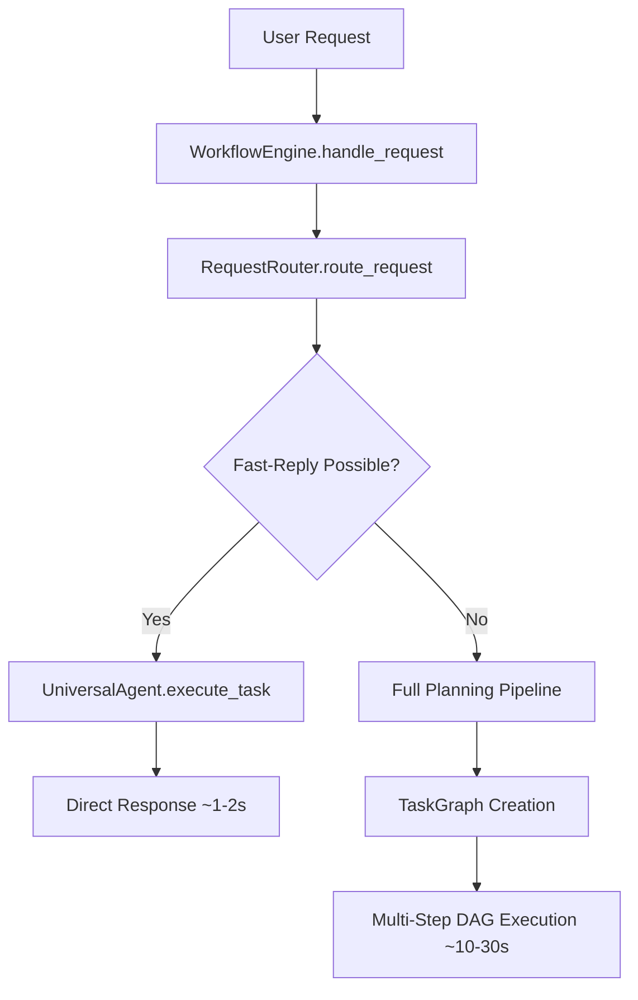

# Fast-Path Routing System Design


## Rules, YOU MUST FOLLOW THESE

* ALWAYS use test driven development, write tests first
* Never assume tests pass, run the tests and positively verify that the test passed
* ALWAYS run all tests after making any change to ensure they are still all passing, do not move on until relevant tests are passing
* If a test fails, reflect deeply about why the test failed and fix it or fix the code
* Always write multiple tests, including happy, unhappy path and corner cases
* Always verify interfaces and data structures before writing code, do not assume the definition of a interface or data structure
* When performing refactors, ALWAYS use grep to find all instances that need to be refactored
* If you are stuck in a debugging cycle and can't seem to make forward progress, either ask for user input or take a step back and reflect on the broader scope of the code you're working on
* ALWAYS make sure your tests are meaningful, do not mock excessively, only mock where ABSOLUTELY necessary.
* Make a git commit after major changes have been completed
* When refactoring an object, refactor it in place, do not create a new file just for the sake of preserving the old version, we have git for that reason. For instance, if refactoring RequestManager, do NOT create an EnhancedRequestManager, just refactor or rewrite RequestManager
* ALWAYS Follow development and language best practices
* Use the Context7 MCP server if you need documentation for something, make sure you're looking at the right version
* Remember we are migrating AWAY from langchain TO strands agent
* Do not worry about backwards compatibility unless it is PART of a migration process and you will remove the backwards compatibility later
* Do not use fallbacks
* Whenever you complete a phase, make sure to update this checklist
* Don't just blindly implement changes. Reflect on them to make sure they make sense within the larger project. Pull in other files if additional context is needed


## Overview

This document describes the design and implementation of a fast-path routing system for the StrandsAgent Universal Agent System. The goal is to enable rapid responses (1-3 seconds) for simple, single-step personal assistant tasks while maintaining the existing sophisticated multi-step workflow planning capabilities.

## Problem Statement

The current system is optimized for complex multi-step workflows that require planning and coordination. While powerful, this approach takes 10-30 seconds for simple tasks like:
- "What's the weather?"
- "Set a 10-minute timer"
- "Add meeting tomorrow at 2pm"
- "Turn off the lights"

For personal assistant usage, these simple tasks need to respond in 1-3 seconds to provide a responsive user experience.

## Solution Architecture

### High-Level Design



### Core Components

#### 1. RequestRouter
- **Purpose**: Classify incoming requests as fast-reply or complex workflow
- **Technology**: Uses existing WEAK model via LLMFactory for fast, cost-effective routing
- **Integration**: Plugs into WorkflowEngine.handle_request() as first step
- **Fallback**: Routes to existing planning pipeline when fast-path not suitable

#### 2. Fast-Reply Role System
- **Identification**: Roles marked with `fast_reply: true` in definition.yaml
- **Criteria**: Roles that provide meaningful direct output (not intermediate data)
- **Examples**: weather, calendar, timer, smart_home vs search (returns raw URLs)

#### 3. Dual-Path Execution
- **Fast Path**: Direct Universal Agent execution with WEAK model
- **Complex Path**: Existing TaskGraph planning with appropriate model types
- **Seamless Fallback**: Low confidence routing automatically uses planning

## Detailed Component Design

### RequestRouter Implementation

```python
class RequestRouter:
    def __init__(self, llm_factory: LLMFactory, role_registry: RoleRegistry):
        self.llm_factory = llm_factory
        self.role_registry = role_registry
        
    def route_request(self, instruction: str) -> Dict:
        """Route request using existing WEAK model from LLMFactory"""
        
        # Get fast-reply capable roles
        fast_reply_roles = self.role_registry.get_fast_reply_roles()
        
        # Build routing prompt
        prompt = self._build_routing_prompt(instruction, fast_reply_roles)
        
        # Use existing WEAK model via LLMFactory
        model = self.llm_factory.create_strands_model(LLMType.WEAK)
        agent = Agent(model=model, system_prompt="You are a request router.")
        response = agent(prompt)
        
        return self._parse_routing_response(response)
    
    def _build_routing_prompt(self, instruction: str, roles: List[RoleDefinition]) -> str:
        roles_list = "\n".join([
            f"- {role.name}: {role.config.get('description', '')}"
            for role in roles
        ])
        
        return f"""Route this user request to the best option:

USER REQUEST: "{instruction}"

OPTIONS:
{roles_list}
- PLANNING: Multi-step task requiring planning and coordination

Respond with JSON only:
{{"route": "<role_name_or_PLANNING>", "confidence": <0.0-1.0>}}"""

    def _parse_routing_response(self, response: str) -> Dict:
        """Parse LLM routing response with fallback handling"""
        try:
            import json
            result = json.loads(response.strip())
            
            # Validate required fields
            if "route" not in result:
                return {"route": "PLANNING", "confidence": 0.0, "error": "Missing route field"}
            
            # Ensure confidence is present and valid
            confidence = result.get("confidence", 0.0)
            if not isinstance(confidence, (int, float)) or confidence < 0 or confidence > 1:
                confidence = 0.0
            
            return {
                "route": result["route"],
                "confidence": confidence
            }
            
        except (json.JSONDecodeError, KeyError, TypeError) as e:
            # Fallback to planning on parsing errors
            return {
                "route": "PLANNING", 
                "confidence": 0.0, 
                "error": f"Failed to parse routing response: {e}"
            }
```

### WorkflowEngine Integration

The integration point is in `WorkflowEngine.handle_request()` method. Here's the exact modification:

```python
class WorkflowEngine:
    def __init__(self, llm_factory: LLMFactory, message_bus: MessageBus, ...):
        # Existing initialization...
        self.request_router = RequestRouter(llm_factory, self.role_registry)
        
        # Configuration
        self.fast_path_enabled = True  # From config
        self.confidence_threshold = 0.7  # From config
    
    def handle_request(self, request: RequestMetadata) -> str:
        """Enhanced request handling with fast-path routing"""
        
        # Fast-path routing (if enabled)
        if self.fast_path_enabled:
            routing_result = self.request_router.route_request(request.prompt)
            
            if (routing_result["route"] != "PLANNING" and 
                routing_result.get("confidence", 0) >= self.confidence_threshold):
                
                # Fast-path execution
                return self._handle_fast_reply(request, routing_result)
        
        # Existing complex workflow path (unchanged)
        return self._handle_complex_workflow(request)
    
    def _handle_fast_reply(self, request: RequestMetadata, routing_result: Dict) -> str:
        """Execute fast-reply using existing Universal Agent"""
        try:
            request_id = 'fr_' + str(uuid.uuid4()).split('-')[-1]  # Fast-reply ID
            role = routing_result["route"]
            
            logger.info(f"Fast-reply '{request_id}' via {role} role (confidence: {routing_result['confidence']:.2f})")
            
            # Direct Universal Agent execution (no TaskContext needed)
            result = self.universal_agent.execute_task(
                instruction=request.prompt,
                role=role,
                llm_type=LLMType.WEAK,  # Fast model for quick responses
                context=None  # No TaskContext for single-step execution
            )
            
            logger.info(f"Fast-reply '{request_id}' completed in {role} role")
            return result
            
        except Exception as e:
            logger.error(f"Fast-reply execution failed: {e}")
            # Graceful fallback to complex workflow
            logger.info("Falling back to complex workflow due to fast-reply failure")
            return self._handle_complex_workflow(request)
    
    def _handle_complex_workflow(self, request: RequestMetadata) -> str:
        """Existing complex workflow handling - UNCHANGED"""
        # This is the existing handle_request implementation
        # All existing planning pipeline logic remains exactly the same
        try:
            request_id = 'wf_' + str(uuid.uuid4()).split('-')[-1]
            request_time = time.time()
            
            logger.info(f"Handling workflow '{request_id}' with Universal Agent")
            
            # Create task plan using Universal Agent with planning role
            task_context = self._create_task_plan(request.prompt, request_id)
            
            # Store the workflow context
            self.active_workflows[request_id] = task_context
            
            # Start execution and workflow state
            task_context.start_execution()
            if self.state == WorkflowState.IDLE:
                self.state = WorkflowState.RUNNING
                self.start_time = time.time()
                self.last_checkpoint_time = self.start_time
            
            # Execute DAG with parallel task processing
            self._execute_dag_parallel(task_context)
            
            logger.info(f"Workflow '{request_id}' created and started")
            return request_id
            
        except Exception as e:
            logger.error(f"Error handling workflow request: {e}")
            # Existing error handling logic...
```

### RoleRegistry Extensions

Add methods to support fast-reply role identification:

```python
class RoleRegistry:
    def get_fast_reply_roles(self) -> List[RoleDefinition]:
        """
        Return roles marked with fast_reply: true that provide meaningful direct output.
        
        Returns:
            List[RoleDefinition]: Roles suitable for fast-reply execution
        """
        return [role for role in self.llm_roles.values() 
                if role.config.get('fast_reply', False)]
    
    def is_fast_reply_role(self, role_name: str) -> bool:
        """
        Check if role supports fast replies.
        
        Args:
            role_name: Name of the role to check
            
        Returns:
            bool: True if role supports fast replies
        """
        role = self.get_role(role_name)
        return role and role.config.get('fast_reply', False)
    
    def get_fast_reply_role_summaries(self) -> List[Dict[str, str]]:
        """
        Get summaries of fast-reply roles for routing prompts.
        
        Returns:
            List of role summaries with name and description
        """
        fast_roles = self.get_fast_reply_roles()
        return [
            {
                "name": role.name,
                "description": role.config.get('description', 'No description available')
            }
            for role in fast_roles
        ]
```

### Role Definition Extensions

Minimal changes to existing role definitions:

```yaml
# roles/weather/definition.yaml
role:
  name: "weather"
  version: "1.0.0"
  description: "Get current weather conditions and forecasts for any location"
  fast_reply: true  # NEW: Only addition needed
  author: "system@generative-agent"
  when_to_use: |
    Use this role when you need to:
    - Get current weather conditions for any location
    - Retrieve weather forecasts
    - Convert location formats (city names, ZIP codes, coordinates)

# All existing configuration remains unchanged
model_config:
  temperature: 0.1
  max_tokens: 2048

prompts:
  system: |
    You are a weather information specialist...

tools:
  automatic: false
  shared:
    - "get_weather"
    - "get_weather_forecast"
```

### Configuration Updates

Add fast-path configuration to existing config.yaml:

```yaml
# config.yaml additions
# Fast-Path Configuration
fast_path:
  enabled: true
  confidence_threshold: 0.7  # Minimum confidence for fast-path routing
  max_response_time: 3       # Target response time in seconds
  fallback_on_error: true    # Fall back to planning on fast-path errors
  
  # Logging and monitoring
  log_routing_decisions: true
  track_performance_metrics: true

# Existing LLM configuration works as-is
llm_providers:
  bedrock:
    models:
      WEAK: "anthropic.claude-3-haiku-20240307-v1:0"  # Used for routing + fast execution
      DEFAULT: "us.amazon.nova-pro-v1:0"
      STRONG: "us.anthropic.claude-3-5-sonnet-20241022-v2:0"  # Used for planning
```

## Example Fast-Reply Role Definitions

### Calendar Role (Agentic)
```yaml
# roles/calendar/definition.yaml
role:
  name: "calendar"
  version: "1.0.0"
  description: "Manage calendar events, appointments, and scheduling"
  fast_reply: true
  
model_config:
  temperature: 0.2
  max_tokens: 1024

prompts:
  system: |
    You are a calendar management specialist. Handle calendar operations efficiently:
    - Add, update, and delete calendar events
    - Check availability and schedule conflicts
    - Provide clear confirmations for all actions

tools:
  shared:
    - "calendar_get_events"
    - "calendar_add_event" 
    - "calendar_update_event"
    - "calendar_delete_event"
```

### Timer Role (Programmatic)
```yaml
# roles/timer/definition.yaml
role:
  name: "timer"
  version: "1.0.0"
  description: "Set timers, alarms, and reminders"
  fast_reply: true
  execution_type: "programmatic"  # Uses programmatic execution path
  
model_config:
  temperature: 0.1
  max_tokens: 512

prompts:
  system: |
    You are a timer and alarm specialist. Handle timing operations:
    - Set countdown timers
    - Create alarms for specific times
    - Manage recurring reminders
```

### Smart Home Role (Agentic)
```yaml
# roles/smart_home/definition.yaml
role:
  name: "smart_home"
  version: "1.0.0" 
  description: "Control smart home devices including lights, thermostat, and appliances"
  fast_reply: true
  
model_config:
  temperature: 0.1
  max_tokens: 1024

prompts:
  system: |
    You are a smart home control specialist. Control home devices efficiently:
    - Turn lights on/off and adjust brightness
    - Set thermostat temperature
    - Control smart appliances and switches

tools:
  shared:
    - "home_assistant_api"
    - "smart_lights_control"
    - "thermostat_control"
```

## Performance Characteristics

### Expected Response Times

| Request Type | Fast-Path | Complex Workflow |
|--------------|-----------|------------------|
| Weather Query | ~1.2s | ~15s |
| Calendar Add | ~1.5s | ~20s |
| Timer Set | ~0.8s | ~12s |
| Smart Home Control | ~1.0s | ~18s |
| Complex Planning | N/A | ~15-30s |

### Resource Usage

- **WEAK Model Usage**: Routing (~200ms) + Execution (~800ms) = ~1s total
- **Memory**: No additional TaskContext or TaskGraph overhead for fast-path
- **Cost**: Significantly lower due to WEAK model usage vs STRONG planning models

## Error Handling and Fallback Strategy

### Routing Failures
- **JSON Parse Errors**: Automatic fallback to planning pipeline
- **Low Confidence**: Routes to planning when confidence < threshold
- **Missing Roles**: Graceful degradation to planning

### Execution Failures  
- **Fast-Reply Errors**: Automatic fallback to complex workflow
- **Timeout Handling**: Fast-path has shorter timeout, falls back on timeout
- **Tool Failures**: Role-specific error handling with fallback option

### Monitoring and Observability
- **Routing Decision Logging**: Track which path was chosen and why
- **Performance Metrics**: Response times, success rates, fallback frequency
- **User Satisfaction**: Track completion rates and error patterns

## Migration Strategy

### Phase 1: Core Infrastructure
1. Implement RequestRouter class
2. Add RoleRegistry fast-reply methods
3. Integrate routing into WorkflowEngine
4. Add configuration support

### Phase 2: Fast-Reply Roles
1. Update existing weather role with fast_reply flag
2. Create calendar, timer, smart_home roles
3. Test fast-path execution paths
4. Validate fallback mechanisms

### Phase 3: Optimization and Monitoring
1. Add performance monitoring
2. Tune confidence thresholds
3. Optimize routing prompts
4. Add user feedback mechanisms

## Testing Strategy

### Unit Tests
- RequestRouter routing logic
- RoleRegistry fast-reply methods
- Configuration parsing and validation
- Error handling and fallback scenarios

### Integration Tests
- End-to-end fast-path execution
- Fallback to complex workflow
- Multi-user concurrent fast-path requests
- Performance benchmarking

### User Acceptance Tests
- Personal assistant usage scenarios
- Response time validation
- Accuracy of routing decisions
- Graceful error handling

## Backward Compatibility

### Existing Functionality
- **Zero Breaking Changes**: All existing workflows continue to work unchanged
- **Opt-in Feature**: Fast-path can be disabled via configuration
- **Role Compatibility**: Existing roles work without modification

### Migration Path
- **Gradual Rollout**: Enable fast-path for specific roles incrementally
- **A/B Testing**: Compare fast-path vs traditional routing
- **Rollback Capability**: Can disable fast-path without system changes

## Security and Privacy Considerations

### Data Handling
- **Same Security Model**: Fast-path uses same Universal Agent security
- **No Additional Data Storage**: Fast-path doesn't store additional user data
- **Audit Trail**: All fast-path executions are logged for audit

### Access Control
- **Role-Based Security**: Fast-reply roles inherit existing role security
- **Tool Permissions**: Same tool access controls apply
- **API Security**: No additional API endpoints or security surfaces

## Future Enhancements

### Potential Improvements
1. **Context Awareness**: Include conversation history in routing decisions
2. **User Preferences**: Learn user patterns for better routing
3. **Dynamic Thresholds**: Adjust confidence thresholds based on success rates
4. **Caching**: Cache common fast-reply responses for even faster execution
5. **Streaming Responses**: Stream fast-reply responses for perceived speed

### Scalability Considerations
1. **Role Growth**: System scales linearly with number of fast-reply roles
2. **Load Balancing**: Multiple RequestRouter instances for high load
3. **Model Optimization**: Fine-tune WEAK models for routing accuracy
4. **Distributed Execution**: Scale fast-path execution across multiple nodes

## Conclusion

The fast-path routing system provides a clean, efficient solution for responsive personal assistant interactions while maintaining the sophisticated workflow planning capabilities that make the system powerful for complex tasks. The design leverages existing infrastructure, requires minimal changes, and provides graceful fallback to ensure reliability.

Key benefits:
- **10-30x faster responses** for simple tasks (1-3s vs 10-30s)
- **Cost effective** using WEAK models for routing and execution
- **Backward compatible** with zero breaking changes
- **Reliable fallback** to existing planning pipeline
- **Easy to extend** with new fast-reply roles

This enhancement transforms the system from a powerful but slow workflow engine into a responsive personal assistant that can handle both quick queries and complex multi-step tasks effectively.


# Fast-Path Routing Implementation Plan

## Overview

This document provides a detailed implementation plan for the Fast-Path Routing System described in `FAST_PATH_ROUTING_DESIGN.md`. The implementation is broken down into phases with specific tasks, acceptance criteria, and testing requirements.

## Implementation Phases

### Phase 1: Core Infrastructure (Week 1-2)

#### 1.1 RequestRouter Component
**File**: `llm_provider/request_router.py`

**Tasks:**
- [ ] Create RequestRouter class with LLMFactory integration
- [ ] Implement route_request() method using WEAK model
- [ ] Add routing prompt generation logic
- [ ] Implement robust JSON response parsing with fallbacks
- [ ] Add error handling and graceful degradation
- [ ] Add logging for routing decisions and performance

**Acceptance Criteria:**
- [ ] RequestRouter successfully routes simple requests to appropriate roles
- [ ] Complex requests are routed to PLANNING with high confidence
- [ ] JSON parsing errors gracefully fall back to PLANNING
- [ ] Routing decisions are logged with confidence scores
- [ ] Performance target: <200ms for routing decisions

**Code Structure:**
```python
class RequestRouter:
    def __init__(self, llm_factory: LLMFactory, role_registry: RoleRegistry)
    def route_request(self, instruction: str) -> Dict
    def _build_routing_prompt(self, instruction: str, roles: List[RoleDefinition]) -> str
    def _parse_routing_response(self, response: str) -> Dict
    def _get_routing_agent(self) -> Agent
```

#### 1.2 RoleRegistry Extensions
**File**: `llm_provider/role_registry.py`

**Tasks:**
- [ ] Add get_fast_reply_roles() method
- [ ] Add is_fast_reply_role() method  
- [ ] Add get_fast_reply_role_summaries() method
- [ ] Update role loading to recognize fast_reply flag
- [ ] Add validation for fast_reply role configurations
- [ ] Add caching for fast_reply role lookups

**Acceptance Criteria:**
- [ ] Fast-reply roles are correctly identified from YAML definitions
- [ ] Role summaries are properly formatted for routing prompts
- [ ] Invalid fast_reply configurations are handled gracefully
- [ ] Performance target: <10ms for role lookups

**Code Changes:**
```python
# Add to RoleRegistry class
def get_fast_reply_roles(self) -> List[RoleDefinition]:
def is_fast_reply_role(self, role_name: str) -> bool:
def get_fast_reply_role_summaries(self) -> List[Dict[str, str]]:
```

#### 1.3 Configuration Support
**File**: `config.yaml` and related config classes

**Tasks:**
- [ ] Add fast_path configuration section to config.yaml
- [ ] Update SupervisorConfig to include fast_path settings
- [ ] Add configuration validation for fast_path parameters
- [ ] Add runtime configuration updates support
- [ ] Document all configuration options

**Acceptance Criteria:**
- [ ] Fast-path can be enabled/disabled via configuration
- [ ] Confidence threshold is configurable
- [ ] Invalid configurations are rejected with clear error messages
- [ ] Configuration changes take effect without restart (where possible)

**Configuration Schema:**
```yaml
fast_path:
  enabled: true
  confidence_threshold: 0.7
  max_response_time: 3
  fallback_on_error: true
  log_routing_decisions: true
  track_performance_metrics: true
```

### Phase 2: WorkflowEngine Integration (Week 2-3)

#### 2.1 Dual-Path Request Handling
**File**: `supervisor/workflow_engine.py`

**Tasks:**
- [ ] Add RequestRouter initialization to WorkflowEngine.__init__()
- [ ] Modify handle_request() to include routing logic
- [ ] Implement _handle_fast_reply() method
- [ ] Implement _handle_complex_workflow() method (refactor existing logic)
- [ ] Add fast-path performance monitoring
- [ ] Add graceful fallback from fast-path to complex workflow

**Acceptance Criteria:**
- [ ] Fast-path requests execute in <3 seconds end-to-end
- [ ] Complex requests continue to work unchanged
- [ ] Fast-path failures automatically fall back to planning
- [ ] All existing functionality remains intact
- [ ] Performance metrics are collected for both paths

**Code Changes:**
```python
# Add to WorkflowEngine class
def __init__(self, ...):
    self.request_router = RequestRouter(llm_factory, self.role_registry)
    
def handle_request(self, request: RequestMetadata) -> str:
    # Add routing logic before existing planning
    
def _handle_fast_reply(self, request: RequestMetadata, routing_result: Dict) -> str:
def _handle_complex_workflow(self, request: RequestMetadata) -> str:
```

#### 2.2 Universal Agent Integration
**File**: `llm_provider/universal_agent.py`

**Tasks:**
- [ ] Verify execute_task() method works for fast-path execution
- [ ] Add fast-path specific logging and metrics
- [ ] Optimize role assumption for fast-path scenarios
- [ ] Add timeout handling for fast-path execution
- [ ] Test programmatic vs agentic execution paths

**Acceptance Criteria:**
- [ ] Universal Agent executes fast-path tasks efficiently
- [ ] Both programmatic and agentic roles work in fast-path
- [ ] Timeouts are handled gracefully
- [ ] Performance target: <1.5s for task execution

#### 2.3 Error Handling and Fallback
**Files**: `supervisor/workflow_engine.py`, `llm_provider/request_router.py`

**Tasks:**
- [ ] Implement comprehensive error handling for routing failures
- [ ] Add automatic fallback mechanisms for execution failures
- [ ] Add retry logic for transient failures
- [ ] Implement circuit breaker pattern for repeated failures
- [ ] Add detailed error logging and monitoring

**Acceptance Criteria:**
- [ ] All error scenarios gracefully fall back to planning
- [ ] No user-facing errors for fast-path failures
- [ ] Error rates are monitored and alertable
- [ ] System remains stable under error conditions

### Phase 3: Fast-Reply Role Implementation (Week 3-4)

#### 3.1 Weather Role Enhancement
**File**: `roles/weather/definition.yaml`

**Tasks:**
- [ ] Add fast_reply: true flag to weather role definition
- [ ] Verify weather role provides meaningful direct output
- [ ] Test weather role in fast-path execution
- [ ] Optimize weather role prompts for speed
- [ ] Add weather-specific error handling

**Acceptance Criteria:**
- [ ] Weather queries route to weather role with high confidence
- [ ] Weather responses are complete and user-friendly
- [ ] Performance target: <2s for weather queries

#### 3.2 Calendar Role Creation
**Files**: `roles/calendar/definition.yaml`, `roles/calendar/tools.py`

**Tasks:**
- [ ] Create calendar role definition with fast_reply flag
- [ ] Implement calendar tool functions (add, get, update, delete)
- [ ] Create calendar role system prompts
- [ ] Add calendar API integration (mock for testing)
- [ ] Test calendar operations in fast-path

**Acceptance Criteria:**
- [ ] Calendar operations route correctly and execute quickly
- [ ] Calendar tools work reliably
- [ ] Calendar responses are clear and actionable
- [ ] Performance target: <2.5s for calendar operations

#### 3.3 Timer Role Creation
**Files**: `roles/timer/definition.yaml`, `roles/programmatic/timer_role.py`

**Tasks:**
- [ ] Create timer role definition with programmatic execution
- [ ] Implement programmatic timer role class
- [ ] Add system timer integration
- [ ] Test timer operations (set, cancel, list)
- [ ] Add timer persistence and notifications

**Acceptance Criteria:**
- [ ] Timer operations execute via programmatic path
- [ ] Timers are set and managed correctly
- [ ] Timer responses are immediate and clear
- [ ] Performance target: <1s for timer operations

#### 3.4 Smart Home Role Creation
**Files**: `roles/smart_home/definition.yaml`, `roles/smart_home/tools.py`

**Tasks:**
- [ ] Create smart home role definition
- [ ] Implement Home Assistant API integration tools
- [ ] Add device control functions (lights, thermostat, switches)
- [ ] Create smart home system prompts
- [ ] Test device control operations

**Acceptance Criteria:**
- [ ] Smart home commands route and execute correctly
- [ ] Device controls work reliably
- [ ] Responses confirm actions taken
- [ ] Performance target: <2s for device control

### Phase 4: Testing and Validation (Week 4-5)

#### 4.1 Unit Tests
**Files**: `tests/llm_provider/test_request_router.py`, `tests/supervisor/test_fast_path_workflow.py`

**Tasks:**
- [ ] Create RequestRouter unit tests
- [ ] Test routing logic with various input types
- [ ] Test error handling and fallback scenarios
- [ ] Test RoleRegistry fast-reply methods
- [ ] Test configuration parsing and validation
- [ ] Achieve >90% code coverage for new components

**Test Categories:**
- [ ] Routing accuracy tests
- [ ] Error handling tests
- [ ] Performance tests
- [ ] Configuration tests
- [ ] Integration boundary tests

#### 4.2 Integration Tests
**Files**: `tests/integration/test_fast_path_integration.py`

**Tasks:**
- [ ] Create end-to-end fast-path execution tests
- [ ] Test fallback from fast-path to complex workflow
- [ ] Test concurrent fast-path requests
- [ ] Test all fast-reply roles in integration
- [ ] Performance benchmarking tests

**Test Scenarios:**
- [ ] Simple weather query → fast-path
- [ ] Complex planning request → planning pipeline
- [ ] Fast-path failure → graceful fallback
- [ ] Multiple concurrent fast-path requests
- [ ] Mixed fast-path and complex requests

#### 4.3 Performance Testing
**Files**: `tests/performance/test_fast_path_performance.py`

**Tasks:**
- [ ] Benchmark fast-path vs complex workflow response times
- [ ] Load testing with multiple concurrent users
- [ ] Memory usage analysis for fast-path execution
- [ ] Latency analysis for each component
- [ ] Throughput testing for high-volume scenarios

**Performance Targets:**
- [ ] Fast-path routing: <200ms
- [ ] Fast-path execution: <1.5s
- [ ] End-to-end fast-path: <3s
- [ ] Fallback overhead: <500ms
- [ ] Memory overhead: <10% increase

#### 4.4 User Acceptance Testing
**Files**: `tests/acceptance/test_personal_assistant_scenarios.py`

**Tasks:**
- [ ] Create realistic personal assistant usage scenarios
- [ ] Test response quality and accuracy
- [ ] Validate user experience improvements
- [ ] Test error scenarios from user perspective
- [ ] Collect performance metrics for real usage patterns

**Scenarios:**
- [ ] Morning routine: weather, calendar, news
- [ ] Work day: meetings, timers, reminders
- [ ] Evening: smart home controls, planning
- [ ] Complex tasks: trip planning, research
- [ ] Error recovery: network issues, service failures

### Phase 5: Monitoring and Optimization (Week 5-6)

#### 5.1 Metrics and Monitoring
**Files**: `supervisor/metrics_manager.py`, `llm_provider/request_router.py`

**Tasks:**
- [ ] Add fast-path specific metrics collection
- [ ] Implement routing decision tracking
- [ ] Add performance monitoring dashboards
- [ ] Create alerting for fast-path failures
- [ ] Add user satisfaction metrics

**Metrics to Track:**
- [ ] Fast-path usage percentage
- [ ] Routing accuracy rates
- [ ] Response time distributions
- [ ] Error rates and types
- [ ] Fallback frequency
- [ ] User satisfaction scores

#### 5.2 Performance Optimization
**Files**: Various components based on profiling results

**Tasks:**
- [ ] Profile fast-path execution bottlenecks
- [ ] Optimize routing prompt efficiency
- [ ] Cache frequently used role definitions
- [ ] Optimize Universal Agent role assumption
- [ ] Tune confidence thresholds based on data

**Optimization Targets:**
- [ ] Reduce routing time by 20%
- [ ] Reduce execution time by 15%
- [ ] Improve routing accuracy by 10%
- [ ] Reduce memory usage by 10%

#### 5.3 Documentation and Training
**Files**: `docs/`, `README.md`

**Tasks:**
- [ ] Update system documentation with fast-path features
- [ ] Create user guide for fast-path capabilities
- [ ] Document troubleshooting procedures
- [ ] Create developer guide for adding fast-reply roles
- [ ] Update API documentation

**Documentation Deliverables:**
- [ ] Updated architecture documentation
- [ ] Fast-path user guide
- [ ] Role development guide
- [ ] Troubleshooting guide
- [ ] Performance tuning guide

## Testing Strategy

### Test Pyramid Structure

#### Unit Tests (70% of tests)
- RequestRouter routing logic
- RoleRegistry fast-reply methods
- Configuration validation
- Error handling functions
- Individual component functionality

#### Integration Tests (20% of tests)
- End-to-end fast-path execution
- WorkflowEngine integration
- Universal Agent integration
- Fallback mechanisms
- Multi-component interactions

#### Acceptance Tests (10% of tests)
- User scenario validation
- Performance requirements
- System reliability
- User experience quality
- Business requirement compliance

### Test Data and Fixtures

#### Routing Test Cases
```python
ROUTING_TEST_CASES = [
    # Fast-path cases
    ("What's the weather?", "weather", 0.9),
    ("Set a 10 minute timer", "timer", 0.85),
    ("Add meeting tomorrow at 2pm", "calendar", 0.8),
    ("Turn off the lights", "smart_home", 0.9),
    
    # Complex workflow cases
    ("Plan a vacation to Japan", "PLANNING", 0.95),
    ("Analyze this data and create a report", "PLANNING", 0.9),
    ("Research competitors and create strategy", "PLANNING", 0.85),
    
    # Edge cases
    ("", "PLANNING", 0.0),
    ("asdfghjkl", "PLANNING", 0.0),
    ("What's the weather for my vacation planning?", "PLANNING", 0.7),
]
```

#### Performance Benchmarks
```python
PERFORMANCE_BENCHMARKS = {
    "routing_time": 200,  # ms
    "fast_execution_time": 1500,  # ms
    "end_to_end_time": 3000,  # ms
    "fallback_overhead": 500,  # ms
    "memory_overhead": 0.1,  # 10% increase
}
```

## Risk Mitigation

### Technical Risks

#### Risk: Fast-path routing accuracy
- **Mitigation**: Extensive testing with diverse input cases
- **Fallback**: Automatic fallback to planning pipeline
- **Monitoring**: Track routing accuracy metrics

#### Risk: Performance degradation
- **Mitigation**: Performance testing and optimization
- **Fallback**: Ability to disable fast-path via configuration
- **Monitoring**: Real-time performance monitoring

#### Risk: Integration complexity
- **Mitigation**: Incremental integration with thorough testing
- **Fallback**: Feature flags for gradual rollout
- **Monitoring**: Integration health checks

### Operational Risks

#### Risk: Increased system complexity
- **Mitigation**: Comprehensive documentation and training
- **Fallback**: Rollback procedures for fast-path features
- **Monitoring**: System health and error rate monitoring

#### Risk: User experience issues
- **Mitigation**: User acceptance testing and feedback loops
- **Fallback**: Quick disable mechanism for problematic features
- **Monitoring**: User satisfaction and usage metrics

## Success Criteria

### Functional Requirements
- [ ] Fast-path requests complete in <3 seconds
- [ ] Complex requests continue to work unchanged
- [ ] Routing accuracy >85% for intended fast-path cases
- [ ] Zero breaking changes to existing functionality
- [ ] Graceful fallback for all error scenarios

### Performance Requirements
- [ ] 10-30x improvement in response time for simple tasks
- [ ] <10% increase in system resource usage
- [ ] >99% system availability maintained
- [ ] <1% increase in error rates

### User Experience Requirements
- [ ] Improved responsiveness for personal assistant use cases
- [ ] Maintained quality for complex workflow scenarios
- [ ] Clear error messages and recovery paths
- [ ] Seamless transition between fast and complex paths

## Rollout Plan

### Phase 1: Internal Testing (Week 6)
- [ ] Deploy to development environment
- [ ] Internal team testing and feedback
- [ ] Performance validation
- [ ] Bug fixes and optimizations

### Phase 2: Limited Beta (Week 7)
- [ ] Deploy to staging environment
- [ ] Limited user beta testing
- [ ] Collect usage metrics and feedback
- [ ] Refine based on real usage patterns

### Phase 3: Gradual Production Rollout (Week 8)
- [ ] Deploy to production with feature flag
- [ ] Enable for 10% of users initially
- [ ] Monitor metrics and user feedback
- [ ] Gradually increase to 100% of users

### Phase 4: Full Production (Week 9)
- [ ] Enable fast-path for all users
- [ ] Remove feature flags
- [ ] Monitor long-term performance
- [ ] Plan future enhancements

## Maintenance and Support

### Ongoing Responsibilities
- [ ] Monitor fast-path performance and accuracy
- [ ] Add new fast-reply roles as needed
- [ ] Tune confidence thresholds based on usage data
- [ ] Update documentation and training materials
- [ ] Respond to user feedback and issues

### Future Enhancements
- [ ] Context-aware routing using conversation history
- [ ] User preference learning for better routing
- [ ] Dynamic threshold adjustment based on success rates
- [ ] Response caching for common queries
- [ ] Streaming responses for perceived speed improvements

This implementation plan provides a comprehensive roadmap for delivering the fast-path routing system while maintaining system reliability and user experience quality.