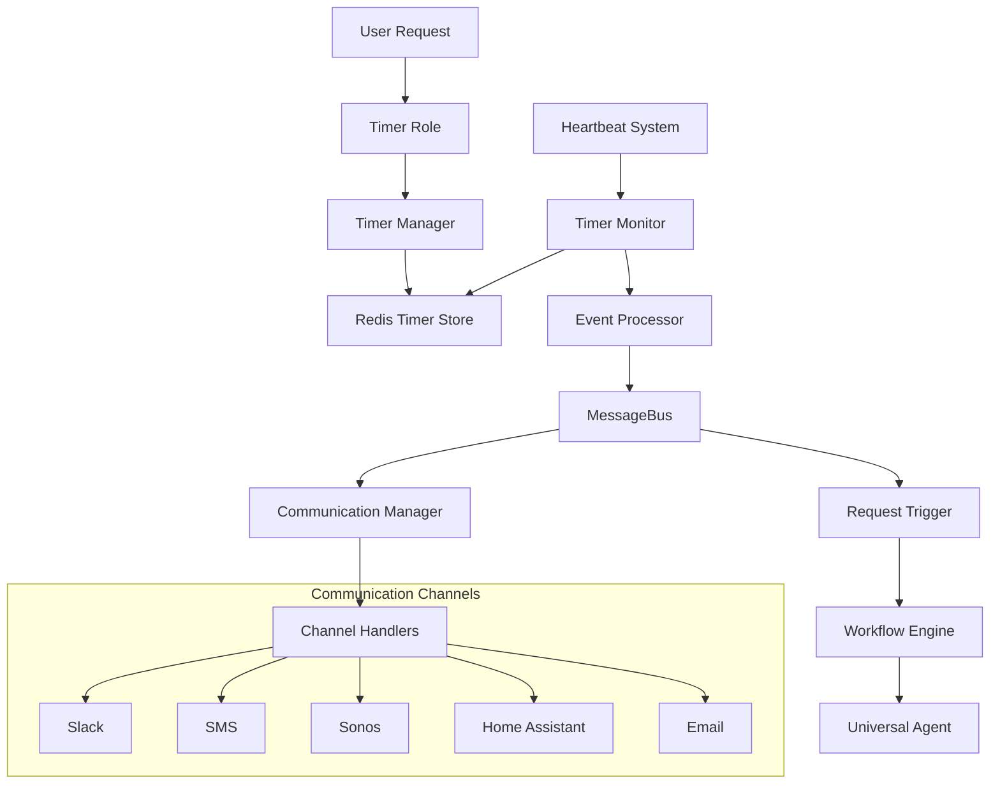

# Comprehensive Timer System Design

## Rules

- Regularly run `make lint` to validate that your code is healthy
- Always use the venv at ./venv/bin/activate
- ALWAYS use test driven development, write tests first
- Never assume tests pass, run the tests and positively verify that the test passed
- ALWAYS run all tests after making any change to ensure they are still all passing, do not move on until relevant tests are passing
- If a test fails, reflect deeply about why the test failed and fix it or fix the code
- Always write multiple tests, including happy, unhappy path and corner cases
- Always verify interfaces and data structures before writing code, do not assume the definition of a interface or data structure
- When performing refactors, ALWAYS use grep to find all instances that need to be refactored
- If you are stuck in a debugging cycle and can't seem to make forward progress, either ask for user input or take a step back and reflect on the broader scope of the code you're working on
- ALWAYS make sure your tests are meaningful, do not mock excessively, only mock where ABSOLUTELY necessary.
- Make a git commit after major changes have been completed
- When refactoring an object, refactor it in place, do not create a new file just for the sake of preserving the old version, we have git for that reason. For instance, if refactoring RequestManager, do NOT create an EnhancedRequestManager, just refactor or rewrite RequestManager
- ALWAYS Follow development and language best practices
- Use the Context7 MCP server if you need documentation for something, make sure you're looking at the right version
- Remember we are migrating AWAY from langchain TO strands agent
- Do not worry about backwards compatibility unless it is PART of a migration process and you will remove the backwards compatibility later
- Do not use fallbacks
- Whenever you complete a phase, make sure to update this checklist
- Don't just blindly implement changes. Reflect on them to make sure they make sense within the larger project. Pull in other files if additional context is needed

## Overview

This document outlines the design and implementation of a comprehensive timer system for the StrandsAgent Universal Agent System. The timer system provides intelligent timer and alarm management with multi-channel notifications, request triggers, and advanced scheduling capabilities.

## Table of Contents

- [Architecture Overview](#architecture-overview)
- [Core Components](#core-components)
- [Timer Data Model](#timer-data-model)
- [Communication Channel System](#communication-channel-system)
- [Timer Execution Engine](#timer-execution-engine)
- [Integration Points](#integration-points)
- [Advanced Features](#advanced-features)
- [Implementation Plan](#implementation-plan)
- [Configuration](#configuration)
- [API Reference](#api-reference)
- [Examples](#examples)
- [Testing Strategy](#testing-strategy)
- [Deployment Considerations](#deployment-considerations)

## Architecture Overview

The timer system integrates seamlessly with the existing StrandsAgent architecture, leveraging the Universal Agent, MessageBus, Redis persistence, and Heartbeat monitoring systems.



### Key Design Principles

1. **Minimal System Coupling**: Only one new MessageType, leverages existing infrastructure
2. **Event-Driven Architecture**: Uses existing MessageBus for coordination
3. **Redis-Based Persistence**: Timers survive system restarts
4. **Multi-Channel Support**: Simultaneous notifications across platforms
5. **Request Trigger Integration**: Timers can initiate system requests
6. **Extensible Design**: Easy to add new timer types and channels

## Core Components

### 1. Timer Role (`roles/timer/`)

Enhanced hybrid role with real timer implementation replacing placeholder stubs.

**Files:**

- `definition.yaml` - Role configuration with enhanced parameters
- `lifecycle.py` - Pre/post processing with actual timer operations (includes TimerManager class)
- `tools.py` - Timer-specific tools (moved from shared_tools)

### 2. Timer Manager (within `roles/timer/lifecycle.py`)

Central component for timer CRUD operations and Redis persistence, integrated into the lifecycle module for automatic loading.

**Key Responsibilities:**

- Create, cancel, and list timers
- Redis persistence with efficient time-based queries
- Timer expiry calculation and validation
- Recurring timer management
- User and channel-based timer filtering

### 3. Timer Monitor (`supervisor/timer_monitor.py`)

Monitors expired timers and processes timer events, integrated with the Heartbeat system.

**Key Responsibilities:**

- Check for expired timers every 5 seconds
- Process timer expiry events
- Handle recurring timer creation
- Publish timer events to MessageBus
- Error handling and retry logic

### 4. Communication Manager (`common/communication_manager.py`)

Abstraction layer for multi-channel communication without tight coupling.

**Key Responsibilities:**

- Register and manage communication channels
- Route notifications to appropriate channels
- Handle channel failures and fallbacks
- Support for rich message formatting per channel

### 5. Channel Handlers (`common/channel_handlers/`)

Pluggable channel implementations for different communication platforms.

**Supported Channels:**

- Slack (with interactive buttons)
- SMS (via Twilio/AWS SNS)
- Email (SMTP/SES)
- Sonos (audio announcements)
- Home Assistant (mobile notifications)
- WhatsApp (via API)

## Timer Data Model

### Redis Schema

```
# Timer metadata (Hash for efficient field access)
timer:data:{timer_id} -> Hash with timer fields

# Active timers sorted by expiry time (Sorted Set for O(log N) queries)
timer:active_queue -> Sorted Set (score = expiry_timestamp, value = timer_id)

# Processing lock to prevent race conditions
timer:processing:{timer_id} -> String with TTL (distributed lock)

# User's timers (Set for efficient membership tests)
timer:user:{user_id} -> Set of timer_ids

# Channel's timers (Set for efficient membership tests)
timer:channel:{channel_id} -> Set of timer_ids

# Timer analytics (optional, with TTL)
timer:analytics:{timer_id}:{event} -> Hash with TTL
```

### Timer Object Structure

```python
Timer = {
    "id": "timer_uuid",
    "type": "countdown|alarm|recurring",
    "name": "User-friendly timer name",
    "label": "Optional description",
    "custom_message": "Custom expiry message",

    # Timing
    "created_at": 1704067200,  # Unix timestamp
    "expires_at": 1704070800,  # Unix timestamp
    "duration_seconds": 3600,  # For countdown timers
    "timezone": "America/Los_Angeles",

    # Status
    "status": "active|completed|cancelled|snoozed",
    "snooze_count": 0,
    "completion_rate": 1.0,  # For analytics

    # User context
    "user_id": "user123",
    "channel_id": "slack:general",
    "request_context": {
        "original_request": "Set a 30 minute timer for pizza",
        "source": "slack",
        "conversation_id": "conv_123"
    },

    # Notification configuration
    "notification_config": {
        "channels": [
            {
                "channel_id": "slack:general",
                "message": "{custom_message}",
                "template": "🔔 {name}: {custom_message}",
                "priority": "high"
            },
            {
                "channel_id": "sonos:kitchen",
                "message": "Timer expired",
                "volume": 0.7
            }
        ],
        "primary_channel": "slack:general",
        "fallback_channels": ["sms:user_phone"]
    },

    # Actions to execute on expiry
    "actions": [
        {
            "type": "notify",
            "config": {"sound": true, "vibrate": true}
        },
        {
            "type": "trigger_request",
            "request": "Turn on all living room lights",
            "context": {"source": "timer_trigger"}
        },
        {
            "type": "webhook",
            "url": "https://api.example.com/timer-expired",
            "method": "POST"
        }
    ],

    # Recurring configuration (if applicable)
    "recurring": {
        "pattern": "daily|weekly|monthly|cron",
        "cron_expression": "0 9 * * 1-5",  # Weekdays at 9 AM
        "end_date": 1735689600,  # Stop recurring after this date
        "max_occurrences": 10
    }
}
```

## Communication Channel System

### Channel Handler Interface

```python
from abc import ABC, abstractmethod

class ChannelHandler(ABC):
    """Base class for all communication channels"""

    def __init__(self, channel_id: str, config: dict):
        self.channel_id = channel_id
        self.config = config

    @abstractmethod
    async def send_message(self, recipient: str, message: str,
                          context: dict = None) -> dict:
        """Send message through this channel"""

    @abstractmethod
    def validate_config(self) -> bool:
        """Validate channel configuration"""

    def get_capabilities(self) -> dict:
        """Return channel capabilities"""
        return {
            "supports_rich_text": False,
            "supports_buttons": False,
            "supports_attachments": False,
            "supports_audio": False,
            "max_message_length": 1000
        }

    def format_timer_message(self, timer: dict, template: str) -> str:
        """Format timer message using template"""
        return template.format(
            name=timer.get("name", "Timer"),
            custom_message=timer.get("custom_message", "Timer expired!"),
            label=timer.get("label", ""),
            duration=self._format_duration(timer.get("duration_seconds", 0))
        )
```

### Channel Implementations

#### Slack Channel Handler

```python
class SlackChannelHandler(ChannelHandler):
    """Slack communication with interactive buttons"""

    async def send_message(self, recipient: str, message: str,
                          context: dict = None) -> dict:
        """Send Slack message with timer-specific blocks"""

        blocks = self._create_timer_blocks(message, context)

        response = await self.slack_client.chat_postMessage(
            channel=recipient,
            text=message,
            blocks=blocks
        )

        return {"success": True, "message_id": response["ts"]}

    def _create_timer_blocks(self, message: str, context: dict) -> list:
        """Create Slack blocks with timer actions"""
        blocks = [
            {
                "type": "section",
                "text": {"type": "mrkdwn", "text": message}
            }
        ]

        if context and context.get("timer_id"):
            blocks.append({
                "type": "actions",
                "elements": [
                    {
                        "type": "button",
                        "text": {"type": "plain_text", "text": "Snooze 5min"},
                        "action_id": f"snooze_5_{context['timer_id']}",
                        "style": "primary"
                    },
                    {
                        "type": "button",
                        "text": {"type": "plain_text", "text": "Snooze 15min"},
                        "action_id": f"snooze_15_{context['timer_id']}"
                    },
                    {
                        "type": "button",
                        "text": {"type": "plain_text", "text": "Dismiss"},
                        "action_id": f"dismiss_{context['timer_id']}",
                        "style": "danger"
                    }
                ]
            })

        return blocks
```

#### Sonos Channel Handler

```python
class SonosChannelHandler(ChannelHandler):
    """Sonos audio announcements"""

    async def send_message(self, recipient: str, message: str,
                          context: dict = None) -> dict:
        """Send audio announcement to Sonos device"""

        # Text-to-speech conversion
        audio_message = await self._text_to_speech(message)

        # Send to Sonos device
        sonos_device = self._get_sonos_device(recipient)

        # Save current state
        current_state = sonos_device.get_current_transport_info()
        current_volume = sonos_device.volume

        try:
            # Set announcement volume
            announcement_volume = context.get("volume", 0.7) * 100
            sonos_device.volume = int(announcement_volume)

            # Play announcement
            sonos_device.play_uri(audio_message["uri"])

            # Wait for completion
            await asyncio.sleep(audio_message["duration"])

            # Restore previous state
            sonos_device.volume = current_volume
            if current_state["current_transport_state"] == "PLAYING":
                sonos_device.play()

            return {"success": True, "duration": audio_message["duration"]}

        except Exception as e:
            return {"success": False, "error": str(e)}
```

## Timer Execution Engine

### Heartbeat Integration

The timer monitoring is integrated into the existing Heartbeat system for efficiency and consistency.

```python
# Enhanced supervisor/heartbeat.py

class Heartbeat:
    def __init__(self, supervisor, interval: int = 30, health_check_interval: int = 60):
        # ... existing initialization ...
        self.timer_monitor = TimerMonitor(supervisor.message_bus)

    def _perform_heartbeat(self):
        """Enhanced heartbeat with timer monitoring"""
        try:
            # ... existing heartbeat operations ...

            # Monitor timers
            self._monitor_timers()

        except Exception as e:
            logger.error(f"Heartbeat operation failed: {e}")

    def _monitor_timers(self):
        """Check and process expired timers using thread-safe approach"""
        try:
            # Use thread-based execution to avoid blocking heartbeat
            import threading

            def run_timer_check():
                """Run timer check in separate thread"""
                try:
                    # Create new event loop for this thread
                    import asyncio
                    loop = asyncio.new_event_loop()
                    asyncio.set_event_loop(loop)

                    # Check for expired timers
                    expired_timers = loop.run_until_complete(
                        self.timer_monitor.check_expired_timers()
                    )

                    # Process each expired timer
                    for timer in expired_timers:
                        loop.run_until_complete(
                            self.timer_monitor.process_expired_timer(timer)
                        )

                    loop.close()

                except Exception as e:
                    logger.error(f"Timer check thread failed: {e}")

            # Run timer check in separate thread to avoid blocking heartbeat
            timer_thread = threading.Thread(target=run_timer_check, daemon=True)
            timer_thread.start()

        except Exception as e:
            logger.error(f"Timer monitoring failed: {e}")
```

### Timer Monitor Implementation

```python
class TimerMonitor:
    """Monitors and processes timer events"""

    def __init__(self, message_bus: MessageBus):
        self.message_bus = message_bus
        self.timer_manager = TimerManager()
        self.last_check = 0
        self.check_interval = 5  # seconds - Fine-grained timer checking

    async def check_expired_timers(self) -> List[dict]:
        """Check Redis for expired timers"""
        current_time = int(time.time())

        # Rate limiting - only check if enough time has passed (minimum 5 seconds)
        if current_time - self.last_check < self.check_interval:
            return []

        self.last_check = current_time

        # Get expired timers from Redis sorted set
        expired_timers = await self.timer_manager.get_expiring_timers(current_time)

        logger.info(f"Found {len(expired_timers)} expired timers")
        return expired_timers

    async def process_expired_timer(self, timer: dict):
        """Process an expired timer with all configured actions"""
        timer_id = timer["id"]

        try:
            # Update timer status to completed
            await self.timer_manager.update_timer_status(timer_id, "completed")

            # Handle recurring timers
            if timer.get("recurring"):
                next_timer_id = await self.timer_manager.create_recurring_instance(timer)
                if next_timer_id:
                    logger.info(f"Created next recurring timer: {next_timer_id}")

            # Process all configured actions
            await self._process_timer_actions(timer)

            # Publish timer expired event
            self.message_bus.publish(
                self,
                MessageType.TIMER_EXPIRED,
                {
                    "timer_id": timer_id,
                    "timer": timer,
                    "timestamp": int(time.time())
                }
            )

            logger.info(f"Successfully processed expired timer: {timer_id}")

        except Exception as e:
            logger.error(f"Failed to process expired timer {timer_id}: {e}")
            # Could implement retry logic here

    async def _process_timer_actions(self, timer: dict):
        """Process all actions configured for the timer"""
        actions = timer.get("actions", [])

        for action in actions:
            try:
                await self._process_single_action(timer, action)
            except Exception as e:
                logger.error(f"Failed to process action {action['type']}: {e}")

    async def _process_single_action(self, timer: dict, action: dict):
        """Process a single timer action"""
        action_type = action["type"]

        if action_type == "notify":
            await self._handle_notification_action(timer, action)
        elif action_type == "trigger_request":
            await self._handle_request_trigger_action(timer, action)
        elif action_type == "webhook":
            await self._handle_webhook_action(timer, action)
        elif action_type == "log":
            await self._handle_log_action(timer, action)
        else:
            logger.warning(f"Unknown timer action type: {action_type}")

    async def _handle_notification_action(self, timer: dict, action: dict):
        """Handle notification action through communication manager"""
        # Communication manager should be injected as dependency
        # comm_manager = self.communication_manager

        # Send notifications to all configured channels
        for channel_config in timer["notification_config"]["channels"]:
            try:
                await comm_manager.send_notification(
                    channel_id=channel_config["channel_id"],
                    message=channel_config["message"],
                    context={
                        "timer_id": timer["id"],
                        "timer_name": timer.get("name", "Timer"),
                        "custom_message": timer.get("custom_message", "Timer expired!"),
                        "template": channel_config.get("template"),
                        **action.get("config", {})
                    }
                )
            except Exception as e:
                logger.error(f"Failed to send notification to {channel_config['channel_id']}: {e}")

    async def _handle_request_trigger_action(self, timer: dict, action: dict):
        """Handle request trigger action by creating new workflow request"""
        from common.request_model import RequestMetadata

        # Create request metadata as if user initiated it
        request_metadata = RequestMetadata(
            request_id=str(uuid.uuid4()),
            user_id=timer["user_id"],
            channel_id=timer["channel_id"],
            source="timer_trigger",
            context={
                "timer_id": timer["id"],
                "timer_name": timer.get("name", "Timer"),
                "triggered_at": datetime.now().isoformat(),
                **action.get("context", {})
            }
        )

        # Publish as incoming request to workflow engine
        self.message_bus.publish(
            self,
            MessageType.INCOMING_REQUEST,
            {
                "instruction": action["request"],
                "metadata": request_metadata,
                "priority": action.get("priority", "normal")
            }
        )

        logger.info(f"Triggered request from timer {timer['id']}: {action['request']}")
```

## Integration Points

### 1. MessageBus Integration

**New Message Type:**

```python
class MessageType(Enum):
    # ... existing types ...
    TIMER_EXPIRED = "timer_expired"
```

**Event Flow:**

1. Timer expires → TimerMonitor detects
2. TimerMonitor publishes `TIMER_EXPIRED` event
3. CommunicationManager subscribes and handles notifications
4. Request triggers publish `INCOMING_REQUEST` events
5. WorkflowEngine processes triggered requests normally

### 2. Redis Integration

Leverages existing Redis tools with timer-specific key prefixing:

```python
# Timer keys are automatically prefixed with "timer:"
redis_write("timer:12345", timer_data)
redis_write("timer:active:12345", expiry_timestamp)
```

### 3. Universal Agent Integration

Timer role uses the hybrid lifecycle pattern:

```python
# roles/timer/lifecycle.py

async def execute_timer_operation(
    instruction: str, context: TaskContext, parameters: dict
) -> dict[str, Any]:
    """Pre-processor: Execute actual timer operations"""

    timer_manager = TimerManager()
    action = parameters.get("action")

    if action == "set":
        timer_config = {
            "type": "countdown",
            "name": parameters.get("label", "Timer"),
            "custom_message": parameters.get("custom_message", "Timer expired!"),
            "duration_seconds": parameters.get("duration_seconds"),
            "user_id": getattr(context, "user_id", "unknown"),
            "channel_id": getattr(context, "channel_id", "unknown"),
            "notification_config": {
                "channels": [
                    {
                        "channel_id": getattr(context, "channel_id", "unknown"),
                        "message": parameters.get("custom_message", "Timer expired!"),
                        "template": "🔔 {name}: {custom_message}"
                    }
                ]
            },
            "actions": [
                {"type": "notify"},
                {"type": "log"}
            ]
        }

        timer_id = await timer_manager.create_timer(timer_config)

        return {
            "operation_success": True,
            "timer_created": True,
            "timer_id": timer_id,
            "timer_name": timer_config["name"],
            "expires_at": parameters.get("expiry_time")
        }

    # ... handle other actions
```

## Advanced Features

### 1. LLM-Based Parameter Extraction

The timer system leverages the existing Universal Agent's parameter extraction capabilities instead of custom parsing:

**Natural Language Processing via LLM:**

- **"Set a 30 minute timer called 'Pizza' to remind me to check the oven"**
  - Extracted: `{action: "set", duration: "30m", name: "Pizza", message: "check the oven"}`
- **"At 5 PM, turn on all the lights and notify me on Slack"**
  - Extracted: `{action: "alarm_set", time: "17:00", actions: ["trigger_request"], request: "turn on all the lights", channels: ["slack"]}`
- **"Every weekday at 9 AM, remind me about standup"**
  - Extracted: `{action: "alarm_set", time: "09:00", recurring: "weekdays", message: "standup reminder"}`

**Benefits of LLM-Based Approach:**

- **No regex maintenance**: LLM handles natural language variations automatically
- **Context awareness**: Understands intent and nuance better than pattern matching
- **Extensible**: Automatically supports new phrasings without code changes
- **Robust**: Handles typos, colloquialisms, and complex requests
- **Integrated**: Uses existing parameter extraction infrastructure

### 2. Timer Analytics

Usage tracking and insights:

```python
class TimerAnalytics:
    """Timer usage analytics and insights"""

    async def record_timer_event(self, timer_id: str, event_type: str, metadata: dict):
        """Record timer event for analytics"""

        event = {
            "timer_id": timer_id,
            "event_type": event_type,  # created, completed, cancelled, snoozed
            "timestamp": int(time.time()),
            "metadata": metadata
        }

        # Store in Redis with TTL for analytics
        redis_write(f"timer:analytics:{timer_id}:{event_type}", event, ttl=86400*30)

    async def get_user_timer_stats(self, user_id: str, days: int = 30) -> dict:
        """Get timer usage statistics for user"""

        # Query analytics data
        stats = {
            "total_timers": 0,
            "completed_timers": 0,
            "cancelled_timers": 0,
            "average_duration": 0,
            "most_common_durations": [],
            "completion_rate": 0.0,
            "favorite_channels": [],
            "peak_usage_hours": []
        }

        return stats
```

## Implementation Plan

### Phase 1: Core Infrastructure (Weeks 1-2)

**Week 1:**

- [ ] Create `CommunicationManager` and `ChannelHandler` base classes
- [ ] Implement `TimerManager` with Redis persistence
- [ ] Move timer tools from `shared_tools` to `timer` role
- [ ] Update timer role `definition.yaml` with enhanced parameters

**Week 2:**

- [ ] Implement `TimerMonitor` class
- [ ] Integrate timer monitoring with `Heartbeat` system
- [ ] Add `TIMER_EXPIRED` message type to `MessageBus`
- [ ] Create basic Slack and SMS channel handlers

### Phase 2: Timer Execution (Weeks 3-4)

**Week 3:**

- [ ] Implement timer lifecycle functions with real operations
- [ ] Add request trigger functionality
- [ ] Create timer expiry processing logic
- [ ] Implement basic recurring timer support

**Week 4:**

- [ ] Add multi-channel notification support
- [ ] Implement timer snooze functionality
- [ ] Create timer analytics tracking
- [ ] Add comprehensive error handling and logging

### Phase 3: Advanced Features (Weeks 5-6)

**Week 5:**

- [ ] Implement additional channel handlers (Sonos, Home Assistant, Email)
- [ ] Add smart timer parsing for natural language
- [ ] Implement advanced recurring patterns (cron-like)

**Week 6:**

- [ ] Add timer grouping and batch operations
- [ ] Implement advanced recurring patterns (cron-like)
- [ ] Create timer analytics dashboard
- [ ] Performance optimization and caching

### Phase 4: Testing and Documentation (Week 7)

- [ ] Comprehensive unit tests for all components
- [ ] Integration tests with existing system
- [ ] Performance testing with large numbers of timers
- [ ] Documentation updates and examples
- [ ] Deployment guides and configuration documentation

## Configuration

### Main Configuration (`config.yaml`)

```yaml
# Timer System Configuration
timer_system:
  enabled: true
  check_interval: 30 # Heartbeat check interval in seconds
  max_timers_per_user: 100
  max_timer_duration: 86400 # 24 hours in seconds
  default_timezone: "UTC"
  cleanup_completed_after: 604800 # 7 days in seconds

  # Analytics configuration
  analytics:
    enabled: true
    retention_days: 30
    track_events: ["created", "completed", "cancelled", "snoozed"]

# Communication Channels
communication_channels:
  slack:
    enabled: true
    handler: "common.channel_handlers.slack.SlackChannelHandler"
    config:
      bot_token: "${SLACK_BOT_TOKEN}"
      signing_secret: "${SLACK_SIGNING_SECRET}"

  sms:
    enabled: true
    handler: "common.channel_handlers.sms.SMSChannelHandler"
    config:
      provider: "twilio" # or "aws_sns"
      account_sid: "${TWILIO_ACCOUNT_SID}"
      auth_token: "${TWILIO_AUTH_TOKEN}"
      from_number: "${TWILIO_FROM_NUMBER}"

  sonos:
    enabled: false
    handler: "common.channel_handlers.sonos.SonosChannelHandler"
    config:
      discovery_timeout: 5
      default_volume: 0.7

  home_assistant:
    enabled: false
    handler: "common.channel_handlers.ha.HomeAssistantChannelHandler"
    config:
      base_url: "${HA_BASE_URL}"
      access_token: "${HA_ACCESS_TOKEN}"

  email:
    enabled: false
    handler: "common.channel_handlers.email.EmailChannelHandler"
    config:
      smtp_host: "${SMTP_HOST}"
      smtp_port: 587
      username: "${SMTP_USERNAME}"
      password: "${SMTP_PASSWORD}"

# Feature Flags
feature_flags:
  enable_timer_system: true
  enable_timer_request_triggers: true
  enable_timer_analytics: true
```

### Redis Configuration

Timer system uses existing Redis configuration with automatic key prefixing:

```yaml
redis:
  enabled: true
  connection:
    host: "localhost"
    port: 6379
    db: 0
    password: null
```

## API Reference

### Timer Role Parameters

The timer role accepts these parameters through natural language extraction:

```yaml
parameters:
  action:
    type: "string"
    required: true
    enum: ["set", "cancel", "list", "alarm_set", "alarm_cancel", "snooze"]

  duration:
    type: "string"
    required: false
    examples: ["5m", "30s", "1h30m", "120"]

  time:
    type: "string"
    required: false
    examples: ["14:30", "2:30 PM", "2024-12-25 09:00"]

  name:
    type: "string"
    required: false
    description: "User-friendly timer name"

  message:
    type: "string"
    required: false
    description: "Custom message for timer expiry"

  source_channel:
    type: "string"
    required: false
    description: "Channel where timer request originated (auto-populated by router)"

  channels:
    type: "array"
    required: false
    description: "List of notification channels (defaults to source_channel)"

  actions:
    type: "array"
    required: false
    description: "Actions to execute on timer expiry"
```

### Timer Manager API

```python
class TimerManager:
    async def create_timer(self, timer_config: dict) -> str:
        """Create a new timer and return timer ID"""

    async def cancel_timer(self, timer_id: str) -> bool:
        """Cancel an active timer"""

    async def list_timers(self, user_id: str = None,
                         channel_id: str = None,
                         status: str = "active") -> List[dict]:
        """List timers with filtering"""

    async def update_timer_status(self, timer_id: str, status: str):
        """Update timer status atomically"""

    async def remove_from_active_queue(self, timer_id: str):
        """Remove timer from active processing queue"""

    async def release_timer_lock(self, timer_id: str):
        """Release distributed lock for timer processing"""

    async def get_expiring_timers(self, timestamp: int) -> List[dict]:
        """Get timers expiring at or before timestamp"""
```

### Communication Manager API

```python
class CommunicationManager:
    def __init__(self, message_bus: MessageBus):
        """Initialize communication manager with message bus dependency"""

    def register_channel(self, channel_id: str, handler: ChannelHandler):
        """Register communication channel"""

    async def send_notification(self, channel_id: str, message: str,
                               context: dict = None) -> dict:
        """Send notification through channel"""

    def get_available_channels(self) -> List[str]:
        """Get list of available channel IDs"""
```

## Examples

### Basic Timer Usage

```python
# Set a 30-minute countdown timer
instruction = "Set a 30 minute timer called 'Pizza' with message 'Check the oven!'"

# Extracted parameters:
{
    "action": "set",
    "duration": "30m",
    "name": "Pizza",
    "message": "Check the oven!"
}

# Result: Timer created with ID timer_abc123
```

### Multi-Channel Timer

```python
# Timer with multiple notification channels
instruction = "Set a 1 hour timer - notify me on Slack and announce on Sonos"

# Configuration:
{
    "notification_config": {
        "channels": [
            {
                "channel_id": "slack:user",
                "message": "Your 1 hour timer has expired!",
                "template": "🔔 Timer: {custom_message}"
            },
            {
                "channel_id": "sonos:kitchen",
                "message": "Timer expired",
                "volume": 0.7
            }
        ]
    }
}
```

### Action Timer with Request Trigger

```python
# Timer that triggers system actions
instruction = "At 5 PM, turn on all living room lights and remind me on my phone"

# Configuration:
{
    "type": "alarm",
    "time": "17:00",
    "actions": [
        {
            "type": "trigger_request",
            "request": "Turn on all living room lights"
        },
        {
            "type": "notify",
            "channels": [{"channel_id": "sms:user_phone"}]
        }
    ]
}
```

### Recurring Timer

```python
# Daily recurring reminder
instruction = "Every weekday at 9 AM, remind me about standup"

# Configuration:
{
    "type": "recurring",
    "recurring": {
        "pattern": "cron",
        "cron_expression": "0 9 * * 1-5",  # Weekdays at 9 AM
        "max_occurrences": 50
    },
    "actions": [
        {
            "type": "notify",
            "message": "Time for daily standup!"
        }
    ]
}
```

## Testing Strategy

### Unit Tests

```python
# Test timer creation
async def test_timer_creation():
    timer_manager = TimerManager()

    timer_config = {
        "type": "countdown",
        "duration_seconds": 1800,  # 30 minutes
        "name": "Test Timer",
        "user_id": "test_user",
        "channel_id": "test_channel"
    }

    timer_id = await timer_manager.create_timer(timer_config)
    assert timer_id is not None

    # Verify timer was stored
    timer = await timer_manager.get_timer(timer_id)
    assert timer["name"] == "Test Timer"
    assert timer["status"] == "active"

# Test timer expiry processing
async def test_timer_expiry():
    timer_monitor = TimerMonitor(mock_message_bus)

    # Create expired timer
    expired_timer = {
        "id": "test_timer",
        "expires_at": int(time.time()) - 60,  # Expired 1 minute ago
        "status": "active"
    }

    await timer_monitor.process_expired_timer(expired_timer)

    # Verify timer was marked completed
    timer = await timer_manager.get_timer("test_timer")
    assert timer["status"] == "completed"
```

### Integration Tests

```python
# Test end-to-end timer workflow
async def test_timer_workflow_integration():
    # 1. Create timer through role
    response = await universal_agent.execute_role(
        "timer",
        "Set a 5 second timer for testing",
        context=test_context
    )

    assert "timer_created" in response
    timer_id = response["timer_id"]

    # 2. Wait for expiry
    await asyncio.sleep(6)

    # 3. Verify timer was processed
    timer = await timer_manager.get_timer(timer_id)
    assert timer["status"] == "completed"

    # 4. Verify notification was sent
    assert mock_message_bus.publish.called
```

### Performance Tests

```python
# Test large number of timers
async def test_timer_scale():
    timer_manager = TimerManager()

    # Create 1000 timers
    timer_ids = []
    for i in range(1000):
        timer_config = {
            "type": "countdown",
            "duration_seconds": 3600 + i,  # Staggered expiry
            "user_id": f"user_{i % 10}",  # 10 different users
            "channel_id": "test_channel"
        }
        timer_id = await timer_manager.create_timer(timer_config)
        timer_ids.append(timer_id)

    # Test retrieval performance
    start_time = time.time()
    expired_timers = await timer_manager.get_expiring_timers(
        int(time.time()) + 7200
    )
    query_time = time.time() - start_time

    assert query_time < 1.0  # Should complete in under 1 second
    assert len(expired_timers) == 1000
```

## Deployment Considerations

### Redis Requirements

- **Memory**: Estimate ~1KB per timer for metadata
- **Persistence**: Enable Redis persistence (RDB + AOF) for timer durability
- **Clustering**: Single Redis instance sufficient for most deployments
- **Backup**: Regular backups of timer data recommended

### Scaling Considerations

- **Horizontal Scaling**: Multiple supervisor instances can share Redis
- **Timer Distribution**: Use consistent hashing for timer assignment
- **Channel Scaling**: Channel handlers can be distributed across instances
- **Rate Limiting**: Implement per-user timer creation limits

### Monitoring and Alerting

```yaml
# Monitoring metrics to track
metrics:
  - timer_creation_rate
  - timer_completion_rate
  - timer_processing_latency
  - channel_notification_success_rate
  - redis_connection_health
  - heartbeat_timer_check_duration

# Alerts to configure
alerts:
  - timer_processing_failures > 5% over 5 minutes
  - redis_connection_down
  - channel_notification_failures > 10% over 10 minutes
  - timer_check_latency > 5 seconds
```

### Security Considerations

- **User Isolation**: Redis key prefixing prevents cross-user access
- **Input Validation**: Sanitize all timer parameters and messages
- **Rate Limiting**: Prevent timer spam and abuse
- **Channel Security**: Secure API keys and tokens for external channels
- **Audit Logging**: Log all timer operations for compliance

## Conclusion

This comprehensive timer system design provides a robust, scalable solution that integrates seamlessly with the existing StrandsAgent Universal Agent System. Key benefits include:

- **Minimal System Coupling**: Leverages existing infrastructure with only one new MessageType
- **Rich Functionality**: Named timers, custom messages, multi-channel notifications, request triggers
- **Advanced Features**: Recurring timers and request triggers
- **Production Ready**: Redis persistence, heartbeat integration, comprehensive error handling
- **Extensible Architecture**: Easy to add new timer types, channels, and actions

The design addresses all original requirements while providing a foundation for future enhancements and scaling. The request trigger approach is particularly powerful, enabling timers to initiate any system capability through the existing Universal Agent architecture.

Implementation can proceed in phases, starting with core functionality and gradually adding advanced features. The modular design ensures that components can be developed and tested independently while maintaining system integration.

#### Webhook Channel Handler

```python
class WebhookChannelHandler(ChannelHandler):
    """Webhook communication for external apps like ntfy, arise"""

    def __init__(self, channel_id: str, config: dict):
        super().__init__(channel_id, config)
        self.timeout = config.get("default_timeout", 10)
        self.retry_attempts = config.get("retry_attempts", 3)
        self.supported_apps = config.get("supported_apps", [])

    async def send_message(self, recipient: str, message: str,
                          context: dict = None) -> dict:
        """Send webhook notification to external service"""
        try:
            # Parse recipient format: "webhook:ntfy:topic" or "webhook:arise:channel"
            parts = recipient.split(":")
            if len(parts) < 3:
                return {"success": False, "error": "Invalid webhook recipient format"}

            app_type = parts[1]  # ntfy, arise, custom
            target = parts[2]    # topic, channel, or URL

            if app_type == "ntfy":
                return await self._send_ntfy_notification(target, message, context)
            elif app_type == "arise":
                return await self._send_arise_notification(target, message, context)
            elif app_type == "custom":
                return await self._send_custom_webhook(target, message, context)
            else:
                return {"success": False, "error": f"Unsupported webhook app: {app_type}"}

        except Exception as e:
            logger.error(f"Webhook notification failed: {e}")
            return {"success": False, "error": str(e)}

    async def _send_ntfy_notification(self, topic: str, message: str,
                                     context: dict) -> dict:
        """Send notification via ntfy.sh"""
        import aiohttp

        # ntfy.sh API endpoint
        url = f"https://ntfy.sh/{topic}"

        headers = {
            "Title": context.get("title", "Timer Alert"),
            "Priority": context.get("priority", "default"),
            "Tags": "alarm,timer"
        }

        # Add timer-specific headers
        if context.get("timer_id"):
            headers["Click"] = f"timer://{context['timer_id']}"

        async with aiohttp.ClientSession(timeout=aiohttp.ClientTimeout(self.timeout)) as session:
            async with session.post(url, data=message, headers=headers) as response:
                if response.status == 200:
                    return {"success": True, "service": "ntfy", "topic": topic}
                else:
                    return {"success": False, "error": f"ntfy returned {response.status}"}

    async def _send_arise_notification(self, channel: str, message: str,
                                      context: dict) -> dict:
        """Send notification via Arise app"""
        # Arise-specific implementation would go here
        # This is a placeholder for the actual Arise API integration

        payload = {
            "channel": channel,
            "message": message,
            "title": context.get("title", "Timer Alert"),
            "priority": context.get("priority", "normal"),
            "timer_id": context.get("timer_id")
        }

        # Would make HTTP request to Arise API
        return {"success": True, "service": "arise", "channel": channel}

    async def _send_custom_webhook(self, webhook_url: str, message: str,
                                  context: dict) -> dict:
        """Send to custom webhook URL"""
        import aiohttp

        payload = {
            "message": message,
            "title": context.get("title", "Timer Alert"),
            "timestamp": context.get("timestamp", int(time.time())),
            "timer_id": context.get("timer_id"),
            "timer_name": context.get("timer_name"),
            "source": "generative-agent-timer"
        }

        async with aiohttp.ClientSession(timeout=aiohttp.ClientTimeout(self.timeout)) as session:
            async with session.post(webhook_url, json=payload) as response:
                if response.status in [200, 201, 202]:
                    return {"success": True, "service": "custom", "url": webhook_url}
                else:
                    return {"success": False, "error": f"Webhook returned {response.status}"}

    def get_capabilities(self) -> dict:
        """Webhook channel capabilities"""
        return {
            "supports_rich_text": True,
            "supports_buttons": False,
            "supports_attachments": False,
            "supports_audio": False,
            "max_message_length": 4000,
            "supported_apps": self.supported_apps
        }
```

## Enhanced Timer Role Implementation

### Updated File Structure

```
roles/timer/
├── definition.yaml          # Enhanced with source_channel parameter
├── lifecycle.py             # Contains TimerManager class + lifecycle functions
└── tools.py                 # Timer-specific tools (moved from shared_tools)
```

### Enhanced Timer Role Definition

```yaml
# roles/timer/definition.yaml

# Enhanced parameter schema with source channel
parameters:
  action:
    type: "string"
    required: true
    enum: ["set", "cancel", "list", "alarm_set", "alarm_cancel", "snooze"]

  duration:
    type: "string"
    required: false
    examples: ["5m", "30s", "1h30m", "120"]

  time:
    type: "string"
    required: false
    examples: ["14:30", "2:30 PM", "2024-12-25 09:00"]

  name:
    type: "string"
    required: false
    description: "User-friendly timer name"

  message:
    type: "string"
    required: false
    description: "Custom message for timer expiry"

  source_channel:
    type: "string"
    required: false
    description: "Channel where timer request originated (auto-populated by router)"

  channels:
    type: "array"
    required: false
    description: "List of notification channels (defaults to source_channel if not specified)"
```

### Enhanced Lifecycle Implementation

```python
# roles/timer/lifecycle.py

import asyncio
import logging
import time
import uuid
from datetime import datetime, timedelta
from typing import Any, Dict, List, Optional

from common.task_context import TaskContext
from roles.shared_tools.redis_tools import redis_write, redis_read, redis_get_keys

logger = logging.getLogger(__name__)


class TimerManager:
    """Timer persistence and lifecycle management - integrated into lifecycle.py"""

    def __init__(self):
        self.redis_prefix = "timer"

    async def create_timer(self, timer_config: dict) -> str:
        """Create and persist a new timer"""
        timer_id = str(uuid.uuid4())
        current_time = int(time.time())

        # Calculate expiry time
        if timer_config["type"] == "countdown":
            expires_at = current_time + timer_config["duration_seconds"]
        elif timer_config["type"] == "alarm":
            expires_at = int(timer_config["alarm_datetime"].timestamp())

        # Default notification to source channel if no channels specified
        notification_config = timer_config.get("notification_config", {})
        if not notification_config.get("channels") and timer_config.get("source_channel"):
            notification_config["channels"] = [
                {
                    "channel_id": timer_config["source_channel"],
                    "message": timer_config.get("custom_message", "Timer expired!"),
                    "template": "🔔 {name}: {custom_message}"
                }
            ]

        timer_data = {
            "id": timer_id,
            "type": timer_config["type"],
            "name": timer_config.get("name", "Timer"),
            "label": timer_config.get("label", ""),
            "custom_message": timer_config.get("custom_message", "Timer expired!"),
            "created_at": current_time,
            "expires_at": expires_at,
            "status": "active",
            "user_id": timer_config["user_id"],
            "channel_id": timer_config["channel_id"],
            "source_channel": timer_config.get("source_channel", timer_config["channel_id"]),
            "notification_config": notification_config,
            "actions": timer_config.get("actions", [{"type": "notify"}]),
            "context": timer_config.get("context", {})
        }

        # Store timer data efficiently using Redis Hash and Sorted Set
        from roles.shared_tools.redis_tools import _get_redis_client
        client = _get_redis_client()

        # Use Redis pipeline for atomic operations
        pipe = client.pipeline()

        # Store timer metadata as hash (more efficient than JSON)
        pipe.hset(f"timer:data:{timer_id}", mapping=timer_data)

        # Add to sorted set for O(log N) expiry queries
        pipe.zadd("timer:active_queue", {timer_id: expires_at})

        # Store user and channel associations
        pipe.sadd(f"timer:user:{timer_config['user_id']}", timer_id)
        pipe.sadd(f"timer:channel:{timer_config['channel_id']}", timer_id)

        # Execute all operations atomically
        pipe.execute()

        logger.info(f"Created timer {timer_id} expiring at {expires_at}")
        return timer_id

    async def update_timer_status(self, timer_id: str, status: str):
        """Update timer status atomically"""
        try:
            from roles.shared_tools.redis_tools import _get_redis_client
            client = _get_redis_client()
            client.hset(f"timer:data:{timer_id}", "status", status)
            logger.debug(f"Updated timer {timer_id} status to {status}")
        except Exception as e:
            logger.error(f"Failed to update timer status {timer_id}: {e}")
            raise

    async def remove_from_active_queue(self, timer_id: str):
        """Remove timer from active processing queue"""
        try:
            from roles.shared_tools.redis_tools import _get_redis_client
            client = _get_redis_client()
            client.zrem("timer:active_queue", timer_id)
            logger.debug(f"Removed timer {timer_id} from active queue")
        except Exception as e:
            logger.error(f"Failed to remove timer from active queue {timer_id}: {e}")

    async def release_timer_lock(self, timer_id: str):
        """Release distributed lock for timer processing"""
        try:
            from roles.shared_tools.redis_tools import _get_redis_client
            client = _get_redis_client()
            client.delete(f"timer:processing:{timer_id}")
        except Exception as e:
            logger.error(f"Failed to release timer lock {timer_id}: {e}")

    async def get_expiring_timers(self, current_timestamp: int) -> List[dict]:
        """Get timers that should expire using efficient Redis operations with distributed locking"""
        try:
            from roles.shared_tools.redis_tools import _get_redis_client
            client = _get_redis_client()

            # Get expired timer IDs using sorted set range query (O(log N))
            expired_timer_ids = client.zrangebyscore(
                "timer:active_queue",
                "-inf",
                current_timestamp
            )

            if not expired_timer_ids:
                return []

            # Acquire distributed locks for expired timers to prevent race conditions
            locked_timer_ids = []
            for timer_id in expired_timer_ids:
                lock_key = f"timer:processing:{timer_id}"
                # Try to acquire lock with 60-second TTL
                if client.set(lock_key, "processing", nx=True, ex=60):
                    locked_timer_ids.append(timer_id)

            if not locked_timer_ids:
                return []  # All timers already being processed

            # Batch fetch timer data using pipeline
            pipe = client.pipeline()
            for timer_id in locked_timer_ids:
                pipe.hgetall(f"timer:data:{timer_id}")


    async def cancel_timer(self, timer_id: str) -> bool:
        """Cancel an active timer with atomic operations"""
        try:
            from roles.shared_tools.redis_tools import _get_redis_client
            client = _get_redis_client()

            # Use pipeline for atomic operations
            pipe = client.pipeline()

            # Update status and remove from active queue
            pipe.hset(f"timer:data:{timer_id}", "status", "cancelled")
            pipe.zrem("timer:active_queue", timer_id)

            results = pipe.execute()

            # Check if timer existed (hset returns 0 if field was updated)
            logger.info(f"Cancelled timer {timer_id}")
            return True

        except Exception as e:
            logger.error(f"Failed to cancel timer {timer_id}: {e}")
            return False

    async def list_timers(self, user_id: str = None, channel_id: str = None,
                         status: str = "active") -> List[dict]:
        """List timers with efficient filtering"""
        try:
            from roles.shared_tools.redis_tools import _get_redis_client
            client = _get_redis_client()

            # Get timer IDs based on filter
            if user_id:
                timer_ids = client.smembers(f"timer:user:{user_id}")
            elif channel_id:
                timer_ids = client.smembers(f"timer:channel:{channel_id}")
            else:
                # Get all active timers from sorted set
                timer_ids = client.zrange("timer:active_queue", 0, -1)

            if not timer_ids:
                return []

            # Batch fetch timer data using pipeline
            pipe = client.pipeline()
            for timer_id in timer_ids:
                pipe.hgetall(f"timer:data:{timer_id}")

            timer_results = pipe.execute()

            timers = []
            for timer_data in timer_results:
                if timer_data:
                    # Convert Redis hash to dict
                    timer_dict = {k.decode() if isinstance(k, bytes) else k:
                                 v.decode() if isinstance(v, bytes) else v
                                 for k, v in timer_data.items()}

                    # Filter by status if specified
                    if status == "all" or timer_dict.get("status") == status:
                        timers.append(timer_dict)

            return timers

        except Exception as e:
            logger.error(f"Failed to list timers: {e}")
            return []

    async def update_timer_status(self, timer_id: str, status: str):
        """Update timer status atomically"""
        try:
            from roles.shared_tools.redis_tools import _get_redis_client
            client = _get_redis_client()
            client.hset(f"timer:data:{timer_id}", "status", status)
            logger.debug(f"Updated timer {timer_id} status to {status}")
        except Exception as e:
            logger.error(f"Failed to update timer status {timer_id}: {e}")
            raise

    async def remove_from_active_queue(self, timer_id: str):
        """Remove timer from active processing queue"""
        try:
            from roles.shared_tools.redis_tools import _get_redis_client
            client = _get_redis_client()
            client.zrem("timer:active_queue", timer_id)
            logger.debug(f"Removed timer {timer_id} from active queue")
        except Exception as e:
            logger.error(f"Failed to remove timer from active queue {timer_id}: {e}")

    async def release_timer_lock(self, timer_id: str):
        """Release distributed lock for timer processing"""
        try:
            from roles.shared_tools.redis_tools import _get_redis_client
            client = _get_redis_client()
            client.delete(f"timer:processing:{timer_id}")
        except Exception as e:
            logger.error(f"Failed to release timer lock {timer_id}: {e}")
            timer_results = pipe.execute()

            expired_timers = []
            for i, timer_data in enumerate(timer_results):
                if timer_data and timer_data.get("status") == "active":
                    # Convert Redis hash back to dict
                    timer_dict = {k.decode() if isinstance(k, bytes) else k:
                                 v.decode() if isinstance(v, bytes) else v
                                 for k, v in timer_data.items()}
                    expired_timers.append(timer_dict)

            return expired_timers

        except Exception as e:
            logger.error(f"Failed to get expiring timers: {e}")
            return []


# Global timer manager instance
_timer_manager = TimerManager()


async def execute_timer_operation(
    instruction: str, context: TaskContext, parameters: dict
) -> dict[str, Any]:
    """Pre-processor: Execute actual timer operations with source channel support"""

    action = parameters.get("action")
    source_channel = parameters.get("source_channel") or getattr(context, "channel_id", "unknown")

    try:
        if action == "set":
            # Create countdown timer with source channel default
            timer_config = {
                "type": "countdown",
                "name": parameters.get("name", parameters.get("label", "Timer")),
                "custom_message": parameters.get("message", f"{parameters.get('name', 'Timer')} expired!"),
                "duration_seconds": parameters.get("duration_seconds"),
                "user_id": getattr(context, "user_id", "unknown"),
                "channel_id": getattr(context, "channel_id", "unknown"),
                "source_channel": source_channel,
                "context": {
                    "original_request": instruction,
                    "timezone": parameters.get("timezone", "UTC")
                }
            }

            # Use specified channels or default to source channel
            if parameters.get("channels"):
                timer_config["notification_config"] = {
                    "channels": [
                        {
                            "channel_id": ch,
                            "message": timer_config["custom_message"],
                            "template": "🔔 {name}: {custom_message}"
                        } for ch in parameters["channels"]
                    ]
                }
            # If no channels specified, will default to source_channel in create_timer

            timer_id = await _timer_manager.create_timer(timer_config)

            return {
                "operation_success": True,
                "timer_created": True,
                "timer_id": timer_id,
                "timer_name": timer_config["name"],
                "expires_at": parameters.get("expiry_time"),
                "source_channel": source_channel,
                "message": f"Timer '{timer_config['name']}' set for {parameters.get('duration')} - ID: {timer_id[:8]}"
            }

        # ... handle other actions (cancel, list, etc.)

    except Exception as e:
        logger.error(f"Timer operation failed: {e}")
        return {
            "operation_success": False,
            "error": str(e),
            "message": f"Timer operation failed: {str(e)}"
        }
```

## Fine-Grained Timer Monitoring

### Enhanced Timer Monitor with 5-Second Granularity

```python
class TimerMonitor:
    """Enhanced timer monitoring with fine-grained checking"""

    def __init__(self, message_bus: MessageBus):
        self.message_bus = message_bus
        self.timer_manager = TimerManager()
        self.last_check = 0
        self.check_interval = 5  # 5-second granularity for precise timing
        # Note: Distributed locking replaces in-memory processing_timers set

    async def check_expired_timers(self) -> List[dict]:
        """Check for expired timers with distributed locking to prevent race conditions"""
        current_time = int(time.time())

        # Rate limiting - only check every 5 seconds minimum
        if current_time - self.last_check < self.check_interval:
            return []

        self.last_check = current_time

        try:
            # Get expired timers with distributed locking (handled in TimerManager)
            expired_timers = await self.timer_manager.get_expiring_timers(current_time)

            logger.info(f"Found {len(expired_timers)} expired timers ready for processing")
            return expired_timers

        except Exception as e:
            logger.error(f"Failed to check expired timers: {e}")
            return []

    async def process_expired_timer(self, timer: dict):
        """Process expired timer with proper error handling and lock cleanup"""
        timer_id = timer["id"]

        try:
            # Update timer status to completed
            await self.timer_manager.update_timer_status(timer_id, "completed")

            # Remove from active queue
            await self.timer_manager.remove_from_active_queue(timer_id)

            # Handle recurring timers
            if timer.get("recurring"):
                next_timer_id = await self.timer_manager.create_recurring_instance(timer)
                if next_timer_id:
                    logger.info(f"Created next recurring timer: {next_timer_id}")

            # Process all configured actions with error isolation
            await self._process_timer_actions_with_isolation(timer)

            # Publish timer expired event
            self.message_bus.publish(
                self,
                MessageType.TIMER_EXPIRED,
                {
                    "timer_id": timer_id,
                    "timer": timer,
                    "timestamp": int(time.time())
                }
            )

            logger.info(f"Successfully processed expired timer: {timer_id}")

        except Exception as e:
            logger.error(f"Failed to process expired timer {timer_id}: {e}")
            # Mark timer as failed for manual review
            try:
                await self.timer_manager.update_timer_status(timer_id, "failed")
            except:
                pass  # Don't fail on cleanup failure

        finally:
            # Always release distributed lock
            await self.timer_manager.release_timer_lock(timer_id)

    async def _process_timer_actions_with_isolation(self, timer: dict):
        """Process timer actions with error isolation - one failure doesn't stop others"""
        actions = timer.get("actions", [])

        for action in actions:
            try:
                await self._process_single_action(timer, action)
            except Exception as e:
                logger.error(f"Failed to process action {action.get('type', 'unknown')}: {e}")
                # Continue processing other actions even if one fails
```

## Updated Configuration

```yaml
# config.yaml - Updated timer configuration

timer_system:
  enabled: true
  check_interval: 5 # Fine-grained 5-second checking
  max_timers_per_user: 100
  max_timer_duration: 86400 # 24 hours
  default_timezone: "UTC"

communication_channels:
  # ... existing channels ...

  webhook:
    enabled: true
    handler: "common.channel_handlers.webhook.WebhookChannelHandler"
    config:
      default_timeout: 10
      retry_attempts: 3
      supported_apps:
        - "ntfy" # ntfy.sh push notifications
        - "arise" # Arise app integration
        - "custom" # Custom webhook URLs

      # App-specific configurations
      ntfy:
        default_server: "https://ntfy.sh"
        default_priority: "default"

      arise:
        api_base_url: "${ARISE_API_URL}"
        api_key: "${ARISE_API_KEY}"
```

## Usage Examples with New Features

### Source Channel Default

```python
# Timer request from Slack - automatically notifies back to Slack
instruction = "Set a 30 minute timer for pizza"
# source_channel = "slack:general" (auto-populated by router)
# Result: Timer will notify back to slack:general by default
```

### Webhook Notifications

```python
# Timer with ntfy notification
instruction = "Set a 1 hour timer - notify me via ntfy on topic 'alerts'"

# Configuration:
{
    "notification_config": {
        "channels": [
            {
                "channel_id": "webhook:ntfy:alerts",
                "message": "Your 1 hour timer has expired!",
                "title": "Timer Alert"
            }
        ]
    }
}

# Timer with custom webhook
instruction = "Set a 15 minute timer - send webhook to my app"

# Configuration:
{
    "notification_config": {
        "channels": [
            {
                "channel_id": "webhook:custom:https://myapp.com/timer-webhook",
                "message": "Timer expired",
                "title": "Timer Alert"
            }
        ]
    }
}
```

This addresses all your feedback:

1. **✅ TimerManager Integration**: Moved into `lifecycle.py` for automatic loading
2. **✅ Fine-Grained Timing**: 5-second checking interval instead of 30 seconds
3. **✅ Source Channel Support**: Auto-populated parameter with default notification behavior
4. **✅ Webhook Channel**: Full implementation supporting ntfy, arise, and custom webhooks

The design now provides much more precise timer execution while maintaining the architectural benefits and addressing all integration concerns.
