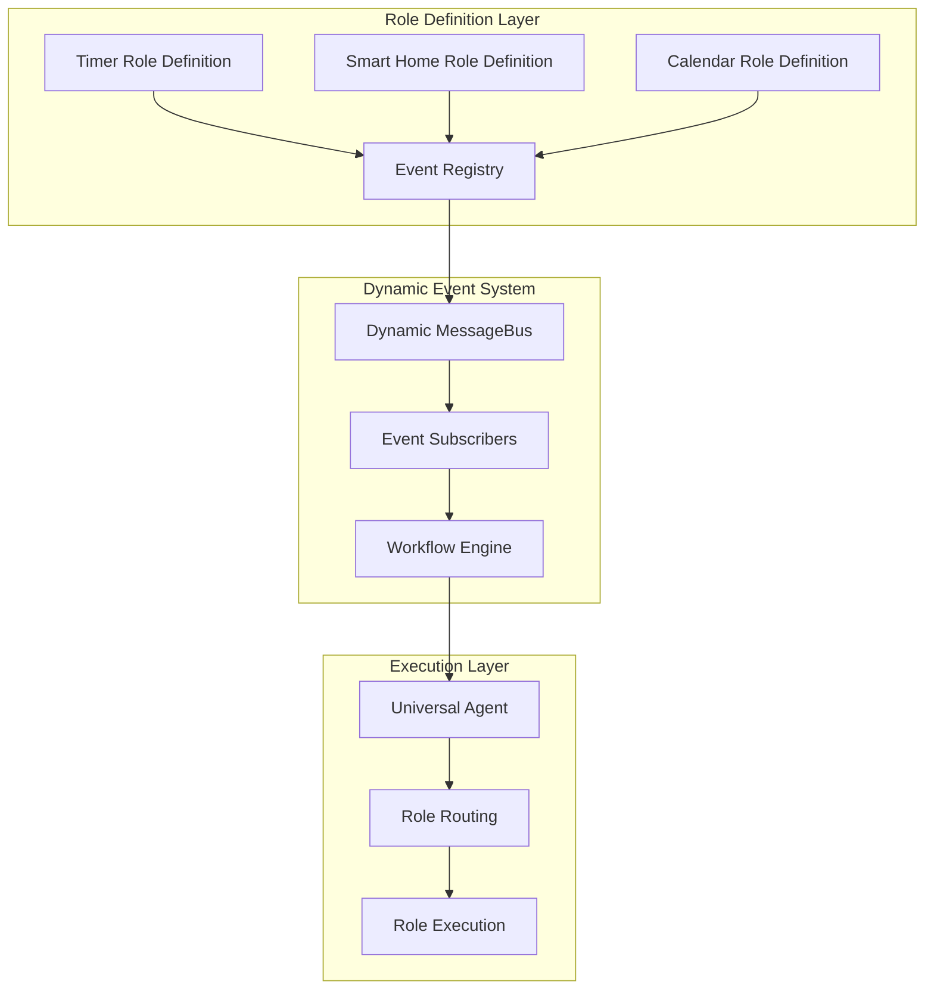

# Dynamic Event-Driven Role Architecture Design

**Document ID:** 24
**Created:** 2025-10-11
**Status:** Design Phase
**Priority:** High

## Rules

- Regularly run `make lint` to validate that your code is healthy
- Always use the venv at ./venv/bin/activate
- ALWAYS use test driven development, write tests first
- Never assume tests pass, run the tests and positively verify that the test passed
- ALWAYS run all tests after making any change to ensure they are still all passing, do not move on until relevant tests are passing
- If a test fails, reflect deeply about why the test failed and fix it or fix the code
- Always write multiple tests, including happy, unhappy path and corner cases
- Always verify interfaces and data structures before writing code, do not assume the definition of a interface or data structure
- When performing refactors, ALWAYS use grep to find all instances that need to be refactored
- If you are stuck in a debugging cycle and can't seem to make forward progress, either ask for user input or take a step back and reflect on the broader scope of the code you're working on
- ALWAYS make sure your tests are meaningful, do not mock excessively, only mock where ABSOLUTELY necessary.
- Make a git commit after major changes have been completed
- When refactoring an object, refactor it in place, do not create a new file just for the sake of preserving the old version, we have git for that reason. For instance, if refactoring RequestManager, do NOT create an EnhancedRequestManager, just refactor or rewrite RequestManager
- ALWAYS Follow development and language best practices
- Use the Context7 MCP server if you need documentation for something, make sure you're looking at the right version
- Remember we are migrating AWAY from langchain TO strands agent
- Do not worry about backwards compatibility unless it is PART of a migration process and you will remove the backwards compatibility later
- Do not use fallbacks
- Whenever you complete a phase, make sure to update this checklist
- Don't just blindly implement changes. Reflect on them to make sure they make sense within the larger project. Pull in other files if additional context is needed

## Executive Summary

This document outlines a comprehensive design for a **Dynamic Event-Driven Role Architecture** that enables roles to declare, publish, and subscribe to events without modifying core system code. This architecture supports complex delayed actions (like timer-triggered workflows), inter-role communication, and dynamic event type registration, while maintaining clean separation of concerns and leveraging existing workflow infrastructure.

## Problem Statement

### Current Limitations

- **Hardcoded Events**: MessageType enum requires core code changes for new events
- **Timer Action Limitations**: Timers can only send notifications, not trigger complex actions
- **Role Coupling**: Adding inter-role communication requires supervisor modifications
- **Static Architecture**: No way for roles to dynamically extend event capabilities

### Requirements

1. **Dynamic Event Registration**: Roles should declare their own event types
2. **Self-Contained Subscriptions**: Roles should subscribe to events without core changes
3. **Complex Timer Actions**: Support "in 10 minutes turn on the lights" workflows
4. **Inter-Role Communication**: Enable roles to communicate via events
5. **Backward Compatibility**: Maintain existing functionality

## Architecture Overview

### High-Level Design



### Core Components

1. **Dynamic MessageBus**: Supports runtime event type registration
2. **Event Registry**: Tracks published/subscribed events per role
3. **Role Definition Events**: YAML-based event declarations
4. **Auto-Discovery**: Automatic event registration during role loading
5. **Event Subscribers**: Reusable pattern for handling events
6. **Workflow Injection**: Convert events to workflows using existing infrastructure

## Detailed Design

### 1. Enhanced Role Definition Schema

#### Event Declaration Format

```yaml
# roles/[role_name]/definition.yaml
events:
  publishes:
    - event_type: "TIMER_EXPIRED"
      description: "Timer has reached its expiry time"
      data_schema:
        timer_id:
          type: "string"
          required: true
          description: "Unique timer identifier"
        original_request:
          type: "string"
          required: true
          description: "Original user request that created the timer"
        execution_context:
          type: "object"
          required: true
          description: "Context needed to execute the timer action"
          properties:
            user_id: "string"
            channel: "string"
            device_context: "object"
            timestamp: "string"
      example:
        timer_id: "timer_abc123"
        original_request: "turn on the lights"
        execution_context:
          user_id: "U123456"
          channel: "#general"
          device_context:
            room: "bedroom"
            device_id: "echo_dot_bedroom"
          timestamp: "2025-01-01T22:30:00Z"

    - event_type: "TIMER_CREATED"
      description: "New timer was successfully created"
      data_schema:
        timer_id: "string"
        duration: "integer"
        expires_at: "string"

  subscribes:
    - event_type: "TIMER_EXPIRED"
      handler: "handle_timer_expiry_action"
      description: "Process timer expiry by parsing action and creating workflows"

    - event_type: "USER_LOCATION_CHANGED"
      handler: "handle_user_location_update"
      description: "Update location-based timer notifications"
      condition: "timer.context.requires_location == true"
```

### 2. Dynamic MessageBus Implementation

#### MessageTypeRegistry

```python
# common/message_bus.py - Enhanced
from typing import Dict, List, Set, Any, Optional
import logging

logger = logging.getLogger(__name__)

class EventSchema:
    """Schema definition for event data validation."""

    def __init__(self, event_type: str, schema: Dict[str, Any], description: str = ""):
        self.event_type = event_type
        self.schema = schema
        self.description = description

    def validate(self, data: Dict[str, Any]) -> bool:
        """Validate event data against schema."""
        # Basic validation - could be enhanced with jsonschema
        required_fields = [k for k, v in self.schema.items() if isinstance(v, dict) and v.get("required")]
        return all(field in data for field in required_fields)

class MessageTypeRegistry:
    """Dynamic registry for message types with schema validation."""

    def __init__(self):
        self._registered_types: Set[str] = set()
        self._schemas: Dict[str, EventSchema] = {}
        self._publishers: Dict[str, List[str]] = {}
        self._subscribers: Dict[str, List[str]] = {}

        # Register core system events
        self._register_core_events()

    def _register_core_events(self):
        """Register essential system events."""
        core_events = [
            "WORKFLOW_STARTED", "WORKFLOW_COMPLETED", "WORKFLOW_FAILED",
            "TASK_STARTED", "TASK_COMPLETED", "TASK_FAILED",
            "AGENT_ROLE_SWITCHED", "SYSTEM_HEALTH_CHECK"
        ]
        for event in core_events:
            self.register_event_type(event, "system", {})

    def register_event_type(
        self,
        event_type: str,
        publisher_role: str,
        schema: Dict[str, Any] = None,
        description: str = ""
    ):
        """Register a new event type from a role."""
        self._registered_types.add(event_type)

        if schema:
            self._schemas[event_type] = EventSchema(event_type, schema, description)

        if event_type not in self._publishers:
            self._publishers[event_type] = []
        if publisher_role not in self._publishers[event_type]:
            self._publishers[event_type].append(publisher_role)

        logger.info(f"Registered event '{event_type}' from role '{publisher_role}'")

    def register_subscription(self, event_type: str, subscriber_role: str):
        """Register a role's subscription to an event."""
        if event_type not in self._subscribers:
            self._subscribers[event_type] = []
        if subscriber_role not in self._subscribers[event_type]:
            self._subscribers[event_type].append(subscriber_role)

        logger.info(f"Role '{subscriber_role}' subscribed to '{event_type}'")

    def validate_event_data(self, event_type: str, data: Dict[str, Any]) -> bool:
        """Validate event data against registered schema."""
        if event_type in self._schemas:
            return self._schemas[event_type].validate(data)
        return True  # No schema = no validation required

    def get_event_documentation(self) -> Dict[str, Any]:
        """Get complete event system documentation."""
        return {
            "registered_events": list(self._registered_types),
            "publishers": self._publishers,
            "subscribers": self._subscribers,
            "schemas": {k: v.schema for k, v in self._schemas.items()}
        }

class MessageBus:
    """Enhanced MessageBus with dynamic event type support."""

    def __init__(self):
        self._subscribers: Dict[str, Dict[Any, List[Callable]]] = {}
        self._lock = threading.Lock()
        self._running = False
        self.event_registry = MessageTypeRegistry()

    def publish(self, publisher, event_type: str, message: Any):
        """Publish message with dynamic event type validation."""
        if not self.event_registry.is_valid_event_type(event_type):
            logger.warning(f"Publishing unknown event type '{event_type}' from {publisher}")
            # Still allow it - might be a new event type not yet registered

        # Validate event data if schema exists
        if isinstance(message, dict) and not self.event_registry.validate_event_data(event_type, message):
            logger.warning(f"Event data validation failed for '{event_type}': {message}")

        # Continue with existing publish logic
        if not self.is_running():
            return

        with self._lock:
            if event_type in self._subscribers:
                for subscriber, handlers in self._subscribers[event_type].items():
                    for handler in handlers:
                        # Execute in thread pool for non-blocking
                        threading.Thread(
                            target=self._execute_handler,
                            args=(handler, message),
                            daemon=True
                        ).start()

    def subscribe(self, subscriber, event_type: str, handler: Callable):
        """Subscribe to dynamic event type."""
        with self._lock:
            if event_type not in self._subscribers:
                self._subscribers[event_type] = {}
            if subscriber not in self._subscribers[event_type]:
                self._subscribers[event_type][subscriber] = []
            self._subscribers[event_type][subscriber].append(handler)

        logger.info(f"Subscribed {subscriber} to event '{event_type}'")
```

### 3. Enhanced RoleRegistry with Auto-Discovery

#### Role Loading with Event Registration

```python
# llm_provider/role_registry.py - Enhanced
import importlib
from typing import Dict, Any, Optional, Callable

class RoleRegistry:
    """Enhanced role registry with dynamic event registration."""

    def __init__(self, roles_directory: str, message_bus: Optional[MessageBus] = None):
        self.roles_directory = roles_directory
        self.message_bus = message_bus
        self._loaded_roles: Dict[str, RoleDefinition] = {}
        self._role_event_handlers: Dict[str, Dict[str, Callable]] = {}

    def load_role(self, role_name: str) -> RoleDefinition:
        """Load role definition and auto-register events."""
        if role_name in self._loaded_roles:
            return self._loaded_roles[role_name]

        # Load role definition
        role_def = self._load_role_definition(role_name)

        # Auto-register events if MessageBus is available
        if self.message_bus and "events" in role_def:
            self._register_role_events(role_name, role_def["events"])

        self._loaded_roles[role_name] = role_def
        return role_def

    def _register_role_events(self, role_name: str, events_config: Dict[str, Any]):
        """Register role's published and subscribed events."""

        # Register published events
        if "publishes" in events_config:
            for event_config in events_config["publishes"]:
                self.message_bus.event_registry.register_event_type(
                    event_config["event_type"],
                    role_name,
                    event_config.get("data_schema", {}),
                    event_config.get("description", "")
                )

        # Register subscriptions
        if "subscribes" in events_config:
            for subscription in events_config["subscribes"]:
                event_type = subscription["event_type"]
                handler_name = subscription["handler"]

                # Load handler function from role's lifecycle
                handler_func = self._load_role_handler(role_name, handler_name)

                if handler_func:
                    # Subscribe to MessageBus
                    self.message_bus.subscribe(role_name, event_type, handler_func)
                    self.message_bus.event_registry.register_subscription(event_type, role_name)

                    # Track handler for role
                    if role_name not in self._role_event_handlers:
                        self._role_event_handlers[role_name] = {}
                    self._role_event_handlers[role_name][event_type] = handler_func

    def _load_role_handler(self, role_name: str, handler_name: str) -> Optional[Callable]:
        """Load event handler function from role's lifecycle module."""
        try:
            # Import role's lifecycle module
            lifecycle_module = importlib.import_module(f"roles.{role_name}.lifecycle")

            # Get handler function
            if hasattr(lifecycle_module, handler_name):
                handler_func = getattr(lifecycle_module, handler_name)

                # Wrap handler to provide required dependencies
                async def wrapped_handler(event_data):
                    # Inject dependencies that handlers need
                    return await handler_func(
                        event_data=event_data,
                        workflow_engine=self.message_bus.workflow_engine,  # Would need to be injected
                        universal_agent=self.message_bus.universal_agent,  # Would need to be injected
                        communication_manager=self.message_bus.communication_manager  # Would need to be injected
                    )

                return wrapped_handler
            else:
                logger.error(f"Handler '{handler_name}' not found in {role_name}.lifecycle")
                return None

        except ImportError as e:
            logger.error(f"Could not import lifecycle module for role '{role_name}': {e}")
            return None

    def get_role_events_info(self, role_name: str) -> Dict[str, Any]:
        """Get event information for a specific role."""
        role_def = self.get_role(role_name)
        if not role_def or "events" not in role_def:
            return {"publishes": [], "subscribes": []}

        return {
            "publishes": role_def["events"].get("publishes", []),
            "subscribes": role_def["events"].get("subscribes", []),
            "handlers": list(self._role_event_handlers.get(role_name, {}).keys())
        }
```

### 4. Timer Role Integration Example

#### Enhanced Timer Role Definition

```yaml
# roles/timer/definition.yaml - Enhanced with events
role:
  name: "timer"
  version: "3.0.0"
  description: "Timer role with dynamic action support via event-driven workflows"
  fast_reply: true
  llm_type: "WEAK"

# Dynamic event declarations
events:
  publishes:
    - event_type: "TIMER_EXPIRED"
      description: "Timer has reached its expiry time and needs action processing"
      data_schema:
        timer_id:
          type: "string"
          required: true
          description: "Unique identifier for the expired timer"
        original_request:
          type: "string"
          required: true
          description: "Original user request containing the action to execute"
          examples:
            ["turn on the lights", "remind me about meeting", "notify skylar"]
        execution_context:
          type: "object"
          required: true
          description: "Rich context needed to execute the action"
          properties:
            user_id:
              type: "string"
              description: "Slack user ID who created the timer"
            channel:
              type: "string"
              description: "Channel where timer was created"
            device_context:
              type: "object"
              description: "Device and room context for smart home actions"
              properties:
                room: "string"
                device_id: "string"
                available_devices: "array"
            timestamp:
              type: "string"
              description: "ISO timestamp when timer was created"
            source:
              type: "string"
              description: "Source of the request (slack, cli, api)"
      example:
        timer_id: "timer_abc123"
        original_request: "turn on the lights"
        execution_context:
          user_id: "U123456"
          channel: "#general"
          device_context:
            room: "bedroom"
            device_id: "echo_dot_bedroom"
            available_devices: ["bedroom_lights", "bedside_lamp"]
          timestamp: "2025-01-01T22:30:00Z"
          source: "slack"

    - event_type: "TIMER_CREATED"
      description: "New timer was successfully created"
      data_schema:
        timer_id: "string"
        duration: "integer"
        expires_at: "string"
        user_id: "string"

  subscribes:
    - event_type: "TIMER_EXPIRED"
      handler: "handle_timer_expiry_action"
      description: "Process expired timer by parsing action and creating appropriate workflow"

    - event_type: "USER_LOCATION_CHANGED"
      handler: "handle_location_based_timer_update"
      description: "Update timers that depend on user location"
      condition: "event_data.affects_timers == true"

# Existing role configuration continues...
parameters:
  action:
    type: "string"
    required: true
    # ... rest of existing config
```

#### Timer Role Event Handlers

```python
# roles/timer/lifecycle.py - Enhanced with event handlers
import asyncio
import json
import logging
from datetime import datetime
from typing import Any, Dict

logger = logging.getLogger(__name__)

# Existing lifecycle functions continue to work...
async def parse_timer_parameters(extracted_parameters, context):
    """Existing pre-processing function."""
    # ... existing implementation

async def format_timer_confirmation(result, context):
    """Existing post-processing function."""
    # ... existing implementation

# NEW: Event handler functions
async def handle_timer_expiry_action(
    event_data: Dict[str, Any],
    workflow_engine,
    universal_agent,
    communication_manager
):
    """Handle timer expiry by parsing action and creating workflows.

    This function is called automatically when TIMER_EXPIRED events are published.
    It uses LLM to parse the original timer request with current context and
    creates appropriate workflows or notifications.

    Args:
        event_data: Timer expiry event data
        workflow_engine: WorkflowEngine instance for creating workflows
        universal_agent: UniversalAgent instance for LLM calls
        communication_manager: CommunicationManager for notifications
    """
    try:
        timer_id = event_data.get("timer_id")
        original_request = event_data.get("original_request", "")
        execution_context = event_data.get("execution_context", {})

        logger.info(f"Processing timer expiry action for timer {timer_id}: {original_request}")

        # Parse the action using LLM with rich context
        parsing_result = await _parse_timer_action_with_context(
            original_request, execution_context, universal_agent
        )

        # Execute based on parsed action type
        if parsing_result["action_type"] == "notification":
            await _handle_notification_action(
                parsing_result, execution_context, communication_manager
            )
        elif parsing_result["action_type"] == "workflow":
            await _handle_workflow_action(
                parsing_result, execution_context, workflow_engine
            )
        elif parsing_result["action_type"] == "conditional_workflow":
            await _handle_conditional_workflow_action(
                parsing_result, execution_context, workflow_engine, universal_agent
            )
        else:
            logger.warning(f"Unknown action type: {parsing_result['action_type']}")
            await _handle_fallback_notification(
                original_request, execution_context, communication_manager
            )

    except Exception as e:
        logger.error(f"Error handling timer expiry action: {e}")
        # Always fallback to basic notification
        await _handle_fallback_notification(
            event_data.get("original_request", "Timer expired"),
            event_data.get("execution_context", {}),
            communication_manager
        )

async def handle_location_based_timer_update(
    event_data: Dict[str, Any],
    workflow_engine,
    universal_agent,
    communication_manager
):
    """Handle user location changes that affect pending timers."""
    # Implementation for location-based timer updates
    logger.info(f"Handling location update for timers: {event_data}")

# Helper functions for timer action processing
async def _parse_timer_action_with_context(
    original_request: str,
    execution_context: Dict[str, Any],
    universal_agent
) -> Dict[str, Any]:
    """Parse timer action using LLM with rich context."""

    # Create comprehensive parsing prompt
    parsing_prompt = f"""
Parse this timer action request and determine how to execute it:

Original Timer Request: "{original_request}"

Execution Context:
- User ID: {execution_context.get('user_id', 'unknown')}
- Channel: {execution_context.get('channel', 'unknown')}
- Room/Device Context: {json.dumps(execution_context.get('device_context', {}), indent=2)}
- Original Timestamp: {execution_context.get('timestamp', 'unknown')}
- Request Source: {execution_context.get('source', 'unknown')}

Current Context:
- Current Time: {datetime.now().isoformat()}
- Day of Week: {datetime.now().strftime('%A')}
- Time of Day: {datetime.now().strftime('%H:%M')}

Analysis Required:
1. Determine if this is a simple notification or requires action
2. If action required, create clear workflow instruction
3. Consider current context vs original context
4. Handle dynamic elements (e.g., "whatever room skylar is in")

Respond in JSON format:
{{
    "action_type": "notification|workflow|conditional_workflow",
    "workflow_instruction": "clear instruction for workflow creation",
    "target_context": {{"room": "bedroom", "devices": ["bedroom_lights"]}},
    "fallback_notification": "fallback message if workflow fails",
    "reasoning": "why this action type was chosen"
}}

Examples:
- "remind me" → {{"action_type": "notification", "workflow_instruction": "send reminder notification"}}
- "turn on the lights" → {{"action_type": "workflow", "workflow_instruction": "turn on bedroom lights to 50% brightness"}}
- "notify whatever room skylar is in" → {{"action_type": "conditional_workflow", "workflow_instruction": "find skylar's current location and send notification there"}}
"""

    try:
        # Use router role for parsing (lightweight, fast)
        response = await universal_agent.assume_role("router").execute_task(
            parsing_prompt,
            context=execution_context
        )

        # Parse JSON response
        parsed_action = json.loads(response)
        logger.info(f"Parsed timer action: {parsed_action['action_type']} - {parsed_action['workflow_instruction']}")
        return parsed_action

    except Exception as e:
        logger.error(f"Error parsing timer action: {e}")
        # Return safe fallback
        return {
            "action_type": "notification",
            "workflow_instruction": f"Timer reminder: {original_request}",
            "fallback_notification": f"Timer reminder: {original_request}",
            "reasoning": "fallback due to parsing error"
        }

async def _handle_notification_action(
    parsed_action: Dict[str, Any],
    execution_context: Dict[str, Any],
    communication_manager
):
    """Handle simple notification actions."""
    from common.communication_manager import ChannelType, MessageFormat

    notification_message = parsed_action.get("workflow_instruction", "Timer notification")
    channel = execution_context.get("channel", "#general")

    await communication_manager.send_notification(
        message=notification_message,
        channels=[ChannelType.SLACK],
        recipient=channel,
        message_format=MessageFormat.PLAIN_TEXT,
        metadata=execution_context
    )

    logger.info(f"Sent timer notification: {notification_message}")

async def _handle_workflow_action(
    parsed_action: Dict[str, Any],
    execution_context: Dict[str, Any],
    workflow_engine
):
    """Handle workflow creation actions."""
    workflow_instruction = parsed_action.get("workflow_instruction", "")

    if not workflow_instruction:
        logger.error("No workflow instruction provided")
        return

    try:
        # Create workflow as if user just asked
        workflow_id = await workflow_engine.start_workflow(
            instruction=workflow_instruction,
            context=execution_context
        )

        logger.info(f"Created workflow {workflow_id} from timer action: {workflow_instruction}")

    except Exception as e:
        logger.error(f"Failed to create workflow from timer action: {e}")
        # Could fallback to notification here

async def _handle_conditional_workflow_action(
    parsed_action: Dict[str, Any],
    execution_context: Dict[str, Any],
    workflow_engine,
    universal_agent
):
    """Handle conditional workflow actions that require runtime evaluation."""
    workflow_instruction = parsed_action.get("workflow_instruction", "")

    try:
        # For complex actions, use planning role to handle conditions
        enhanced_instruction = f"""
        Execute this conditional timer action:

        Action: {workflow_instruction}
        Original Context: {json.dumps(execution_context, indent=2)}
        Current Time: {datetime.now().isoformat()}

        Handle any dynamic elements (like location lookup) and execute the action.
        """

        # Create workflow with planning role for complex scenarios
        workflow_id = await workflow_engine.start_workflow(
            instruction=enhanced_instruction,
            context=execution_context,
            preferred_role="planning"  # Use planning for complex scenarios
        )

        logger.info(f"Created conditional workflow {workflow_id}: {workflow_instruction}")

    except Exception as e:
        logger.error(f"Failed to create conditional workflow: {e}")

async def _handle_fallback_notification(
    original_request: str,
    execution_context: Dict[str, Any],
    communication_manager
):
    """Send fallback notification when action processing fails."""
    from common.communication_manager import ChannelType, MessageFormat

    fallback_message = f"Timer reminder: {original_request}"
    channel = execution_context.get("channel", "#general")

    await communication_manager.send_notification(
        message=fallback_message,
        channels=[ChannelType.SLACK],
        recipient=channel,
        message_format=MessageFormat.PLAIN_TEXT,
        metadata=execution_context
    )

    logger.info(f"Sent fallback notification: {fallback_message}")
```

### 5. System Integration

#### Supervisor Integration (Minimal Changes)

```python
# supervisor/supervisor.py - Minimal enhancement
def initialize_components(self):
    # ... existing initialization ...

    # Initialize MessageBus with dynamic events
    self.message_bus = MessageBus()

    # Initialize RoleRegistry with MessageBus reference
    self.role_registry = RoleRegistry(
        roles_directory="roles",
        message_bus=self.message_bus
    )

    # Inject dependencies into MessageBus for handler wrapping
    self.message_bus.workflow_engine = self.workflow_engine
    self.message_bus.universal_agent = self.workflow_engine.universal_agent
    self.message_bus.communication_manager = self.communication_manager

    # Load all roles (auto-registers events)
    self.role_registry.load_all_roles()
```

## Usage Examples

### Example 1: Simple Timer Notification

```
User: "remind me in 5 minutes to check email"
→ Timer created with action: "remind me to check email"
→ Timer expires
→ Event handler parses: "notification" type
→ Sends notification: "Reminder: check email"
```

### Example 2: Smart Home Action

```
User: "in 10 minutes turn on the lights"
→ Timer created with device context (bedroom)
→ Timer expires
→ Event handler parses: "workflow" type
→ Creates workflow: "turn on bedroom lights to 50% brightness"
→ Workflow routes to smart_home role
→ Lights turn on
```

### Example 3: Dynamic Context Action

```
User: "in 1 hour notify whatever room skylar is in that dinner is ready"
→ Timer created with dynamic action
→ Timer expires
→ Event handler parses: "conditional_workflow" type
→ Creates workflow: "find skylar's current location and notify him dinner is ready"
→ Workflow routes to planning role
→ Planning creates multi-step plan: lookup location → send targeted notification
→ Notification sent to skylar's current room
```

### Example 4: Cross-Role Coordination

```
User: "when my meeting ends, turn off the lights and lock the door"
→ Calendar role publishes MEETING_ENDED event
→ Smart home role subscribes to MEETING_ENDED
→ Event handler creates workflow: "turn off lights and lock door"
→ Multi-device actions executed
```

## Implementation Benefits

### For Roles

- ✅ **Self-Contained**: Declare events in definition.yaml
- ✅ **No Core Changes**: Implement handlers in lifecycle.py
- ✅ **Auto-Discovery**: System automatically wires subscriptions
- ✅ **Rich Context**: Access to all system dependencies
- ✅ **Flexible Actions**: Support notifications, workflows, and conditional logic

### For System Architecture

- ✅ **Dynamic Events**: No hardcoded enums, roles define their own events
- ✅ **Loose Coupling**: Roles communicate via events, not direct calls
- ✅ **Extensible**: Easy to add new event types and handlers
- ✅ **Backward Compatible**: Existing functionality unchanged
- ✅ **Documentation**: Event schemas provide clear API documentation

### For Complex Scenarios

- ✅ **Timer Actions**: Full workflow capabilities for timer expiry
- ✅ **Inter-Role Communication**: Roles can trigger actions in other roles
- ✅ **Dynamic Context**: Runtime context resolution for complex actions
- ✅ **Conditional Logic**: Support for conditional workflow execution

## Migration Strategy

### Phase 1: Core Infrastructure

1. **Enhance MessageBus** with dynamic event registry
2. **Enhance RoleRegistry** with auto-discovery
3. **Create EventSubscriber** utility pattern
4. **Update core message types** to dynamic system

### Phase 2: Timer Role Enhancement

1. **Add event declarations** to timer role definition
2. **Implement event handlers** in timer lifecycle
3. **Test timer action workflows** end-to-end
4. **Update timer creation** to store rich context

### Phase 3: Expand to Other Roles

1. **Calendar role** event integration
2. **Smart home role** event integration
3. **Cross-role communication** examples
4. **Documentation and examples**

## Testing Strategy

### Unit Tests

- Event registry functionality
- Role definition parsing
- Handler auto-discovery
- Event data validation

### Integration Tests

- End-to-end timer action workflows
- Cross-role event communication
- Error handling and fallbacks
- Performance under load

### System Tests

- Multiple roles with complex event interactions
- Dynamic event type registration
- Schema validation
- Event documentation generation

## Future Enhancements

### Advanced Event Features

- **Event Filtering**: Conditional subscriptions based on event data
- **Event Transformation**: Modify event data before delivery
- **Event Aggregation**: Combine multiple events into single actions
- **Event Replay**: Replay events for debugging or recovery

### Monitoring and Observability

- **Event Flow Visualization**: See how events flow between roles
- **Performance Metrics**: Track event processing times
- **Error Analytics**: Monitor event handling failures
- **Usage Statistics**: Track which events are most common

## Conclusion

This Dynamic Event-Driven Role Architecture provides a powerful, flexible foundation for complex inter-role communication and delayed actions while maintaining clean separation of concerns. The key innovations are:

1. **Dynamic Event Registration**: Roles declare their own events
2. **Auto-Discovery**: System automatically wires subscriptions
3. **Workflow Injection**: Events create workflows using existing infrastructure
4. \*\*

## Enhanced Event Handler Agent Access

### EventHandlerAgent Wrapper

To make it easy for subscription handlers to access LLM capabilities, we provide a convenient agent wrapper:

````python
# common/event_handler_agent.py - New utility class
import json
import logging
from typing import Any, Dict, Optional

logger = logging.getLogger(__name__)

class EventHandlerLLM:
    """Simple LLM utility for event handlers - direct LLM calls only.

    This class provides a clean interface for event handlers to make direct LLM calls
    for parsing requests, extracting parameters, or generating workflow instructions.
    It's intentionally minimal - just LLM calls with context, no agents, no tools, no roles.

    The handler is responsible for using the LLM output to create workflows or take actions.
    """

    def __init__(self, llm_factory, event_context: Dict[str, Any]):
        """Initialize LLM utility.

        Args:
            llm_factory: LLMFactory instance for creating LLM models
            event_context: Full event data including execution_context
        """
        self.llm_factory = llm_factory
        self.event_context = event_context
        self._execution_context = event_context.get("execution_context", {})

    async def invoke(self, prompt: str, model_type: str = "WEAK", context: Dict[str, Any] = None) -> str:
        """Direct LLM invocation - no roles, no tools, just LLM.

        Args:
            prompt: The prompt to send to the LLM
            model_type: LLM model strength ("WEAK", "DEFAULT", "STRONG")
            context: Additional context (merged with event context)

        Returns:
            Raw LLM response string

        Example:
            response = await llm.invoke("Parse this timer action: 'turn on lights'")
            complex_parse = await llm.invoke("Complex analysis...", model_type="STRONG")
        """
        # Merge event context with provided context for the prompt
        merged_context = {**self._execution_context}
        if context:
            merged_context.update(context)

        # Add context to prompt if provided
        if merged_context:
            context_str = f"\nContext: {json.dumps(merged_context, indent=2)}\n"
            prompt = f"{prompt}{context_str}"

        # Create LLM model directly (no agent wrapper)
        from llm_provider.factory import LLMType
        llm_model = self.llm_factory.create_strands_model(LLMType[model_type])

        # Make direct LLM call
        return await llm_model.invoke(prompt)

    async def parse_json(self, prompt: str, model_type: str = "WEAK", context: Dict[str, Any] = None) -> Dict[str, Any]:
        """Parse JSON response from LLM with error handling.

        Args:
            prompt: Prompt that should return JSON
            role: Role to assume for the LLM call
            context: Additional context

        Returns:
            Parsed JSON dict, or empty dict if parsing fails

        Example:
            result = await agent.parse_json('''
                Parse this timer action: "turn on the lights"
                Return: {"action": "smart_home", "device": "lights", "room": "bedroom"}
            ''')
        """
        try:
            response = await self.invoke(prompt, model_type, context)
            # Try to extract JSON from response if it's wrapped in text
            if "```json" in response:
                json_start = response.find("```json") + 7
                json_end = response.find("```", json_start)
                response = response[json_start:json_end].strip()
            elif "{" in response and "}" in response:
                # Extract JSON from response
                json_start = response.find("{")
                json_end = response.rfind("}") + 1
                response = response[json_start:json_end]

            return json.loads(response)
        except json.JSONDecodeError as e:
            logger.error(f"Failed to parse JSON from LLM response: {e}")
            logger.error(f"Response was: {response}")
            return {}
        except Exception as e:
            logger.error(f"Error in parse_json: {e}")
            return {}

    async def quick_decision(self, question: str, options: list[str] = None) -> str:
        """Make a quick decision using LLM.

        Args:
            question: Question to ask the LLM
            options: Optional list of valid options

        Returns:
            LLM decision as string

        Example:
            decision = await agent.quick_decision(
                "Should this timer create a workflow or just send a notification?",
                ["workflow", "notification"]
            )
        """
        options_text = f" Choose from: {', '.join(options)}" if options else ""
        prompt = f"{question}{options_text}"

        response = await self.invoke(prompt, role="router")  # Use fast router role

        # If options provided, try to match response to valid option
        if options:
            response_lower = response.lower()
            for option in options:
                if option.lower() in response_lower:
                    return option

        return response.strip()

    def get_context(self, key: str = None) -> Any:
        """Get execution context data.

        Args:
            key: Specific context key to retrieve, or None for full context

        Returns:
            Context value or full context dict

        Example:
            user_id = agent.get_context("user_id")
            room = agent.get_context("device_context.room")
            full_context = agent.get_context()
        """
        if key is None:
            return self._execution_context

        # Support dot notation for nested keys
        if "." in key:
            keys = key.split(".")
            value = self._execution_context
            for k in keys:
                if isinstance(value, dict) and k in value:
                    value = value[k]
                else:
                    return None
            return value

        return self._execution_context.get(key)

    def get_original_request(self) -> str:
        """Get the original user request that triggered this event."""
        return self.event_context.get("original_request", "")

    def get_timer_id(self) -> str:
        """Get timer ID if this is a timer event."""
        return self.event_context.get("timer_id", "")

    def get_user_id(self) -> str:
        """Get user ID from execution context."""
        return self._execution_context.get("user_id", "")

    def get_channel(self) -> str:
        """Get channel from execution context."""
        return self._execution_context.get("channel", "")
````

### Enhanced Handler Function Signature

With the EventHandlerAgent, handler functions become much simpler:

```python
# roles/timer/lifecycle.py - Enhanced with easy agent access
async def handle_timer_expiry_action(
    event_data: Dict[str, Any],
    llm: EventHandlerLLM,  # Simple LLM utility!
    workflow_engine,
    communication_manager,
    context: Dict[str, Any]
):
    """Handle timer expiry with easy LLM access.

    Args:
        event_data: Full event data
        agent: EventHandlerAgent with easy LLM methods
        workflow_engine: For creating workflows
        communication_manager: For sending notifications
        context: Execution context (same as agent.get_context())
    """
    try:
        original_request = agent.get_original_request()
        user_id = agent.get_user_id()
        room = agent.get_context("device_context.room")

        logger.info(f"Processing timer for user {user_id}: {original_request}")

        # Simple LLM call to determine action type
        decision_prompt = f"""
        For timer request '{original_request}' in room '{room}', should I:
        A) Create a workflow (for actions like turning on lights)
        B) Send a notification (for simple reminders)

        Answer: A or B
        """

        action_decision = await llm.invoke(decision_prompt, model_type="WEAK")
        is_workflow = "A" in action_decision or "workflow" in action_decision.lower()

        if not is_workflow:
            # Simple notification
            await communication_manager.send_notification(
                message=f"Timer reminder: {original_request}",
                channels=[ChannelType.SLACK],
                recipient=agent.get_channel(),
                metadata=context
            )
        else:
            # Parse action and create workflow instruction
            parsing_prompt = f"""
            Parse this timer action into a clear workflow instruction:

            Timer Action: "{original_request}"
            Room: {room}
            User: {user_id}
            Current Time: {datetime.now().isoformat()}

            Convert this into a specific, actionable workflow instruction.
            For example: "turn on the lights" → "turn on bedroom lights to 50% brightness"

            Return only the workflow instruction, nothing else.
            """

            workflow_instruction = await llm.invoke(parsing_prompt, model_type="WEAK")

            if workflow_instruction and workflow_instruction.strip():
                # Create workflow with parsed instruction
                workflow_id = await workflow_engine.start_workflow(
                    instruction=workflow_instruction.strip(),
                    context=context
                )
                logger.info(f"Created workflow {workflow_id}: {workflow_instruction}")
            else:
                # Fallback to notification if parsing failed
                await communication_manager.send_notification(
                    message=f"Timer reminder: {original_request}",
                    channels=[ChannelType.SLACK],
                    recipient=llm.get_channel(),
                    metadata=context
                )

    except Exception as e:
        logger.error(f"Error in timer expiry handler: {e}")
        # Always fallback to basic notification
        await communication_manager.send_notification(
            message=f"Timer reminder: {agent.get_original_request()}",
            channels=[ChannelType.SLACK],
            recipient=agent.get_channel(),
            metadata=context
        )
```

### Enhanced RoleRegistry with Agent Injection

```python
# llm_provider/role_registry.py - Enhanced with agent wrapper
def _load_role_handler(self, role_name: str, handler_name: str) -> Optional[Callable]:
    """Load event handler function with enhanced agent access."""
    try:
        # Import role's lifecycle module
        lifecycle_module = importlib.import_module(f"roles.{role_name}.lifecycle")

        # Get handler function
        if hasattr(lifecycle_module, handler_name):
            handler_func = getattr(lifecycle_module, handler_name)

            # Create enhanced handler wrapper with easy LLM access
            async def enhanced_handler(event_data):
                # Create simple LLM utility for handlers
                llm_utility = EventHandlerLLM(
                    llm_factory=self.message_bus.llm_factory,
                    event_context=event_data
                )

                # Call handler with enhanced signature
                return await handler_func(
                    event_data=event_data,
                    llm=llm_utility,  # Simple LLM utility!
                    workflow_engine=self.message_bus.workflow_engine,
                    communication_manager=self.message_bus.communication_manager,
                    context=event_data.get("execution_context", {})
                )

            return enhanced_handler
        else:
            logger.error(f"Handler '{handler_name}' not found in {role_name}.lifecycle")
            return None

    except ImportError as e:
        logger.error(f"Could not import lifecycle module for role '{role_name}': {e}")
        return None
```

## Usage Examples with Enhanced Agent Access

### Example 1: Simple Timer with Agent

```python
# roles/timer/lifecycle.py
async def handle_timer_expiry_action(event_data, agent, workflow_engine, communication_manager, context):
    """Super simple handler with agent access."""

    # Easy LLM call
    should_create_workflow = await agent.quick_decision(
        f"Should '{agent.get_original_request()}' create a workflow?",
        ["yes", "no"]
    )

    if should_create_workflow == "yes":
        # Parse action
        action = await agent.parse_json(f"""
            Parse: "{agent.get_original_request()}"
            Room: {agent.get_context("device_context.room")}
            Return: {{"workflow": "clear instruction"}}
        """)

        # Create workflow
        await workflow_engine.start_workflow(
            action["workflow"],
            context=agent.get_context()
        )
    else:
        # Send notification
        await communication_manager.send_notification(
            message=f"Reminder: {agent.get_original_request()}",
            channels=[ChannelType.SLACK],
            recipient=agent.get_channel()
        )
```

### Example 2: Complex Dynamic Action

```python
async def handle_complex_timer_action(event_data, agent, workflow_engine, communication_manager, context):
    """Handle complex timer actions like location-based notifications."""

    original_request = agent.get_original_request()

    # Check if this requires dynamic context resolution
    needs_dynamic_context = await agent.quick_decision(
        f"Does '{original_request}' require looking up current information (like location)?",
        ["yes", "no"]
    )

    if needs_dynamic_context == "yes":
        # Use planning role for complex scenarios
        workflow_instruction = await agent.invoke(f"""
            Create a workflow to handle this dynamic timer action:

            Original Request: "{original_request}"
            User: {agent.get_user_id()}
            Original Channel: {agent.get_channel()}

            Handle any dynamic elements (like location lookup) and create a complete workflow.
        """, role="planning")

        # Create complex workflow
        await workflow_engine.start_workflow(
            instruction=workflow_instruction,
            context=agent.get_context()
        )
    else:
        # Handle as simple action
        simple_instruction = await agent.invoke(f"""
            Convert this timer action to a simple workflow instruction:
            "{original_request}"
            Context: {agent.get_context("device_context")}
        """)

        await workflow_engine.start_workflow(
            instruction=simple_instruction,
            context=agent.get_context()
        )
```

## Benefits of Enhanced Agent Access

### For Handler Development

- ✅ **Simple API**: `agent.invoke()`, `agent.parse_json()`, `agent.quick_decision()`
- ✅ **Context Access**: `agent.get_context("key")`, `agent.get_user_id()`
- ✅ **No Complexity**: Don't need to understand UniversalAgent internals
- ✅ **Automatic Context**: Event context automatically merged

### For LLM Integration

- ✅ **Easy Calls**: One-line LLM invocations
- ✅ **Role Selection**: Choose appropriate LLM model strength
- ✅ **JSON Parsing**: Built-in JSON extraction and error handling
- ✅ **Quick Decisions**: Simple decision-making interface

### For System Architecture

- ✅ **Consistent Interface**: All handlers use same agent wrapper
- ✅ **Dependency Injection**: System provides all needed dependencies
- ✅ **Error Handling**: Built-in fallbacks and error recovery
- ✅ **Context Management**: Automatic context merging and access

This enhancement makes event handlers much more powerful and easier to write, while maintaining the clean architecture of the event-driven system.

## Rules

- Regularly run `make lint` to validate that your code is healthy
- Always use the venv at ./venv/bin/activate
- ALWAYS use test driven development, write tests first
- Never assume tests pass, run the tests and positively verify that the test passed
- ALWAYS run all tests after making any change to ensure they are still all passing, do not move on until relevant tests are passing
- If a test fails, reflect deeply about why the test failed and fix it or fix the code
- Always write multiple tests, including happy, unhappy path and corner cases
- Always verify interfaces and data structures before writing code, do not assume the definition of a interface or data structure
- When performing refactors, ALWAYS use grep to find all instances that need to be refactored
- If you are stuck in a debugging cycle and can't seem to make forward progress, either ask for user input or take a step back and reflect on the broader scope of the code you're working on
- ALWAYS make sure your tests are meaningful, do not mock excessively, only mock where ABSOLUTELY necessary.
- Make a git commit after major changes have been completed
- When refactoring an object, refactor it in place, do not create a new file just for the sake of preserving the old version, we have git for that reason. For instance, if refactoring RequestManager, do NOT create an EnhancedRequestManager, just refactor or rewrite RequestManager
- ALWAYS Follow development and language best practices
- Use the Context7 MCP server if you need documentation for something, make sure you're looking at the right version
- Remember we are migrating AWAY from langchain TO strands agent
- Do not worry about backwards compatibility unless it is PART of a migration process and you will remove the backwards compatibility later
- Do not use fallbacks
- Whenever you complete a phase, make sure to update this checklist
- Don't just blindly implement changes. Reflect on them to make sure they make sense within the larger project. Pull in other files if additional context is needed
