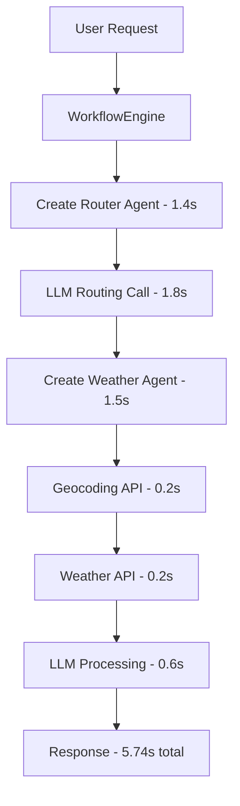
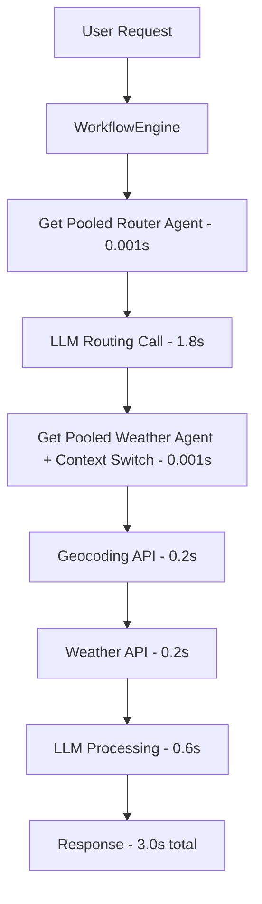

# Fast-Reply Performance Optimization Design

## Rules

- Always use the venv in ./venv/bin/activate
- ALWAYS use test driven development, write tests first
- Never assume tests pass, run the tests and positively verify that the test passed
- ALWAYS run all tests after making any change to ensure they are still all passing, do not move on until relevant tests are passing
- If a test fails, reflect deeply about why the test failed and fix it or fix the code
- Always write multiple tests, including happy, unhappy path and corner cases
- Always verify interfaces and data structures before writing code, do not assume the definition of a interface or data structure
- When performing refactors, ALWAYS use grep to find all instances that need to be refactored
- If you are stuck in a debugging cycle and can't seem to make forward progress, either ask for user input or take a step back and reflect on the broader scope of the code you're working on
- ALWAYS make sure your tests are meaningful, do not mock excessively, only mock where ABSOLUTELY necessary.
- Make a git commit after major changes have been completed
- When refactoring an object, refactor it in place, do not create a new file just for the sake of preserving the old version, we have git for that reason. For instance, if refactoring RequestManager, do NOT create an EnhancedRequestManager, just refactor or rewrite RequestManager
- ALWAYS Follow development and language best practices
- Use the Context7 MCP server if you need documentation for something, make sure you're looking at the right version
- Remember we are migrating AWAY from langchain TO strands agent
- Do not worry about backwards compatibility unless it is PART of a migration process and you will remove the backwards compatibility later
- Do not use fallbacks
- Whenever you complete a phase, make sure to update this checklist
- Don't just blindly implement changes. Reflect on them to make sure they make sense within the larger project. Pull in other files if additional context is needed

## Executive Summary

This document outlines an optimization strategy to improve fast-reply workflow performance from 5.74 seconds to ~3.0 seconds (48% improvement) for simple personal assistant tasks like weather queries, timer setting, and calendar management by focusing on the core architectural inefficiency: Agent creation overhead.

## Problem Analysis

### Current Performance Bottlenecks

Based on analysis of a weather query log showing 5.74s total execution time:

```
2025-10-05 17:05:11,217 - cli - INFO - 🔄 Starting workflow: whats the weather in seattle??
2025-10-05 17:05:12,650 - llm_provider.universal_agent - INFO - Assumed role 'router' with 3 tools
2025-10-05 17:05:14,385 - llm_provider.request_router - INFO - Routed request to 'weather' with confidence 0.95 in 3168.3ms
2025-10-05 17:05:15,909 - llm_provider.universal_agent - INFO - Assumed role 'weather' with 5 tools
2025-10-05 17:05:17,965 - tools_weather_tools - INFO - Getting weather for location: Seattle
2025-10-05 17:05:18,144 - tools_weather_tools - INFO - City Seattle converted to coordinates: {'lat': 47.6038321, 'lon': -122.330062}
2025-10-05 17:05:18,334 - tools_weather_tools - INFO - Weather data retrieved for coordinates 47.6038321, -122.330062
2025-10-05 17:05:20,130 - supervisor.workflow_engine - INFO - Fast-reply 'fr_5b7ec182f999' completed in weather role
```

**Performance Breakdown:**

- **Router Agent Creation (1.4s)**: Creating new Agent instance for routing
- **LLM Routing Call (1.8s)**: LLM call to determine weather role
- **Weather Agent Creation (1.5s)**: Creating new Agent instance for weather role
- **Geocoding API (0.2s)**: Converting "Seattle" to coordinates
- **Weather API (0.2s)**: NOAA weather data retrieval
- **LLM Processing (0.6s)**: Formatting weather response

**Key Insights:**

1. **Agent Creation Overhead (2.9s/5.74s = 50%)**: Biggest bottleneck
2. **Architectural Inefficiency**: Creating throwaway Agent instances instead of reusing pooled agents

## Optimization Strategy

The core optimization focuses on eliminating the Agent creation overhead through provider-based Agent pooling and context switching.

### Provider-Based Agent Pooling

**Problem**: 2.9s creating separate Agent instances for router and weather roles
**Solution**: Cache Agent instances by provider/model, reuse with context switching

#### Architecture Design

The key insight is that Agent instances should be pooled by **infrastructure** (provider/model) not by **business logic** (roles).

```python
class LLMFactory:
    def __init__(self, configs: Dict[LLMType, List[BaseConfig]], framework: str = "strands"):
        self.configs = configs
        self.framework = framework

        # Enhanced caching infrastructure
        self._model_cache: Dict[str, Any] = {}
        self._agent_pool: Dict[str, Agent] = {}  # Provider-based Agent pool
        self._pool_stats = {'hits': 0, 'misses': 0, 'created': 0}

    def get_agent(self, llm_type: LLMType, provider: str = None) -> Agent:
        """
        Get cached Agent for provider/model combination.

        Args:
            llm_type: Semantic model type (WEAK, DEFAULT, STRONG)
            provider: Provider name (defaults to primary provider)

        Returns:
            Cached Agent instance ready for context switching
        """
        # Create pool key based on infrastructure, not business logic
        provider = provider or self._get_default_provider()
        pool_key = f"{provider}_{llm_type.value}"

        # Return cached Agent if available
        if pool_key in self._agent_pool:
            self._pool_stats['hits'] += 1
            logger.debug(f"⚡ Agent pool hit for {pool_key}")
            return self._agent_pool[pool_key]

        # Create new Agent with cached model
        self._pool_stats['misses'] += 1
        logger.info(f"🔧 Creating new Agent for {pool_key}")

        model = self.create_strands_model(llm_type)
        agent = Agent(model=model)  # Minimal Agent creation

        # Cache the Agent
        self._agent_pool[pool_key] = agent
        self._pool_stats['created'] += 1
        logger.info(f"✅ Cached new Agent for {pool_key}")

        return agent

    def warm_agent_pool(self):
        """Pre-warm Agent pool for common provider/model combinations."""
        common_combinations = [
            (LLMType.WEAK, 'bedrock'),    # Fast routing and simple tasks
            (LLMType.DEFAULT, 'bedrock'), # Standard tasks
            (LLMType.STRONG, 'bedrock'),  # Complex planning
        ]

        for llm_type, provider in common_combinations:
            try:
                agent = self.get_agent(llm_type, provider)
                logger.info(f"✅ Pre-warmed {provider}_{llm_type.value}")
            except Exception as e:
                logger.warning(f"⚠️ Failed to pre-warm {provider}_{llm_type.value}: {e}")

    def get_pool_stats(self) -> Dict[str, Any]:
        """Get Agent pool performance statistics."""
        total_requests = self._pool_stats['hits'] + self._pool_stats['misses']
        hit_rate = (self._pool_stats['hits'] / total_requests * 100) if total_requests > 0 else 0

        return {
            'pool_size': len(self._agent_pool),
            'hit_rate_percent': round(hit_rate, 2),
            'total_requests': total_requests,
            **self._pool_stats
        }
```

#### Context Switching in UniversalAgent

```python
class UniversalAgent:
    def assume_role(self, role: str, llm_type: Optional[LLMType] = None,
                   context: Optional[TaskContext] = None, tools: Optional[List[str]] = None) -> Agent:
        """
        Assume role using pooled Agent with context switching.

        Args:
            role: The role name (e.g., 'weather', 'timer', 'calendar')
            llm_type: Semantic model type for performance optimization
            context: Optional TaskContext for state management
            tools: Optional list of additional tool names

        Returns:
            Pooled Agent instance with updated context
        """
        # Handle role fallbacks
        if role == "None" or role is None:
            logger.info("None role requested, falling back to default role")
            role = "default"

        # Load role definition (cached by RoleRegistry)
        role_def = self.role_registry.get_role(role)
        if not role_def:
            logger.warning(f"Role '{role}' not found, falling back to default")
            role = "default"
            role_def = self.role_registry.get_role(role)

        # Get pooled Agent from LLMFactory (< 0.01s for cache hit)
        llm_type = llm_type or self._determine_llm_type_for_role(role)
        agent = self.llm_factory.get_agent(llm_type)

        # Update Agent context (business logic)
        system_prompt = self._get_system_prompt_from_role(role_def)
        role_tools = self._assemble_role_tools(role_def, tools or [])

        # Context switching instead of Agent creation (< 0.01s)
        self._update_agent_context(agent, system_prompt, role_tools)

        # Store current configuration
        self.current_agent = agent
        self.current_role = role
        self.current_llm_type = llm_type

        logger.info(f"⚡ Switched to role '{role}' with {len(role_tools)} tools")
        return agent

    def _update_agent_context(self, agent: Agent, system_prompt: str, tools: List[Any]):
        """
        Update Agent context without recreating the Agent instance.

        Args:
            agent: Pooled Agent instance to update
            system_prompt: New system prompt for the role
            tools: New tool set for the role
        """
        # Update Agent context (implementation depends on Strands Agent API)
        if hasattr(agent, 'update_context'):
            agent.update_context(system_prompt=system_prompt, tools=tools)
        elif hasattr(agent, 'system_prompt') and hasattr(agent, 'tools'):
            agent.system_prompt = system_prompt
            agent.tools = tools
        else:
            # Fallback: recreate Agent if context switching not supported
            logger.warning("Agent context switching not supported, recreating Agent")
            model = agent.model if hasattr(agent, 'model') else None
            return Agent(model=model, system_prompt=system_prompt, tools=tools)
```

**Performance Impact**: 2.9s → 0.002s (1450x improvement)

### Configuration Enhancements

#### Enhanced Fast-Path Configuration

```yaml
# config.yaml enhancements
fast_path:
  enabled: true
  confidence_threshold: 0.7
  max_response_time: 3.0 # Realistic target with Agent pooling only

  # Performance optimizations
  performance:
    agent_pool_warming: true # Pre-warm Agent pool at startup
    skip_telemetry: false # Keep telemetry for monitoring
    minimal_logging: false # Keep logging for debugging

  # Monitoring
  monitoring:
    track_agent_pool_efficiency: true
    track_context_switch_performance: true

# Enhanced LLM configuration for performance
llm_providers:
  bedrock:
    models:
      WEAK: "anthropic.claude-3-haiku-20240307-v1:0" # Faster model for routing
      DEFAULT: "anthropic.claude-sonnet-4-20250514-v1:0"
      STRONG: "anthropic.claude-sonnet-4-20250514-v1:0"

    # Agent pool configuration
    agent_pool:
      enabled: true
      warm_on_startup: true
      max_pool_size: 10
      cleanup_interval: 3600 # 1 hour
```

## Performance Impact Analysis

### Before Optimization

```
Weather Query Timeline (5.74s total):
├── 0.0s → 1.4s (1.4s): Router Agent creation
├── 1.4s → 3.2s (1.8s): LLM routing call
├── 3.2s → 4.7s (1.5s): Weather Agent creation
├── 4.7s → 4.9s (0.2s): Geocoding API call
├── 4.9s → 5.1s (0.2s): Weather API call
└── 5.1s → 5.7s (0.6s): LLM weather processing
```

### After Optimization

```
Weather Query Timeline (3.0s total):
├── 0.0s → 0.001s (0.001s): Get pooled router Agent
├── 0.001s → 1.8s (1.8s): LLM routing call
├── 1.8s → 1.801s (0.001s): Get pooled weather Agent + context switch
├── 1.801s → 2.0s (0.2s): Geocoding API call
├── 2.0s → 2.2s (0.2s): Weather API call
└── 2.2s → 2.8s (0.6s): LLM weather processing
```

### Performance Improvement Summary

| Component      | Before    | After     | Improvement                       |
| -------------- | --------- | --------- | --------------------------------- |
| Agent Creation | 2.9s      | 0.002s    | 1450x faster                      |
| LLM Routing    | 1.8s      | 1.8s      | No change                         |
| API Calls      | 0.4s      | 0.4s      | No change                         |
| LLM Processing | 0.6s      | 0.6s      | No change                         |
| **Total**      | **5.74s** | **~3.0s** | **1.9x faster (48% improvement)** |

## Architecture Diagrams

### Current Architecture (Inefficient)



### Optimized Architecture



## Implementation Plan

### Phase 1: Provider-Based Agent Pooling in LLMFactory

**Target**: Eliminate 2.9s Agent creation overhead
**Impact**: 5.74s → 3.0s (48% improvement)

#### 1.1 Implement Agent Pool in LLMFactory

- [ ] Add `_agent_pool: Dict[str, Agent]` to LLMFactory
- [ ] Implement `get_agent(llm_type, provider)` method
- [ ] Create pool keys based on provider + model type combination
- [ ] Add Agent creation with cached models
- [ ] Implement pool warming during factory initialization

#### 1.2 Update Agent Pool Management

- [ ] Add `warm_agent_pool()` method for startup pre-warming
- [ ] Implement pool size limits and cleanup logic
- [ ] Add logging for pool hits/misses and creation events
- [ ] Handle pool invalidation on configuration changes

#### 1.3 Integration Points

- [ ] Update `create_strands_model()` to support Agent pooling
- [ ] Ensure backward compatibility with existing model caching
- [ ] Add pool statistics and monitoring methods

### Phase 2: Context Switching in UniversalAgent

**Target**: Enable fast role switching without Agent recreation

#### 2.1 Implement Context Switching

- [ ] Update `assume_role()` to use `llm_factory.get_agent()`
- [ ] Implement Agent context updating (system prompt + tools)
- [ ] Remove Agent creation logic from UniversalAgent
- [ ] Add context validation and error handling

#### 2.2 Agent Context Management

- [ ] Implement `_update_agent_context(agent, system_prompt, tools)`
- [ ] Add context caching to avoid redundant updates
- [ ] Handle tool registration and deregistration efficiently
- [ ] Ensure thread safety for concurrent context switches

#### 2.3 Backward Compatibility

- [ ] Maintain existing `assume_role()` API signature
- [ ] Ensure `current_agent` tracking still works
- [ ] Update error handling for pooled agents
- [ ] Add migration path for existing code

### Phase 3: Integration and Testing

**Target**: Ensure all optimizations work together

#### 3.1 End-to-End Integration

- [ ] Update WorkflowEngine to use optimized Agent pooling
- [ ] Test agent pooling → context switching flow
- [ ] Validate error handling and fallback mechanisms
- [ ] Ensure thread safety under concurrent load

#### 3.2 Comprehensive Testing

- [ ] Write integration tests for complete Agent pooling flow
- [ ] Test concurrent requests and thread safety
- [ ] Validate pool behavior under load
- [ ] Test error scenarios and graceful degradation

#### 3.3 Performance Benchmarking

- [ ] Create performance test suite for weather queries
- [ ] Measure timing at each optimization stage
- [ ] Compare before/after performance metrics
- [ ] Test with various query patterns and loads

### Phase 4: Performance Validation and Monitoring

**Target**: Confirm 48% improvement and ongoing monitoring

#### 4.1 Performance Validation

- [ ] Run weather query performance tests
- [ ] Validate Agent pool efficiency and hit rates
- [ ] Confirm 3.0s target performance
- [ ] Test under realistic load conditions

#### 4.2 Monitoring and Observability

- [ ] Add performance metrics to workflow duration logger
- [ ] Implement Agent pool specific logging and telemetry
- [ ] Create performance dashboards and alerts
- [ ] Add pool health monitoring

#### 4.3 Documentation and Rollout

- [ ] Update architecture documentation
- [ ] Create performance optimization guide
- [ ] Document configuration options and tuning
- [ ] Plan gradual rollout strategy

## Risk Mitigation

### Technical Risks

1. **Agent Context Switching Compatibility**: Strands Agent may not support context updates

   - **Mitigation**: Implement fallback to Agent recreation if needed

2. **Concurrency Issues**: Thread safety with Agent pooling

   - **Mitigation**: Thread-safe pool implementation, Agent instance isolation

3. **Memory Usage**: Agent pooling may increase memory consumption
   - **Mitigation**: Pool size limits, cleanup procedures, monitoring

### Operational Risks

1. **Performance Regression**: Optimizations may introduce new bottlenecks

   - **Mitigation**: Comprehensive benchmarking, gradual rollout, rollback procedures

2. **Configuration Complexity**: More configuration options to manage
   - **Mitigation**: Sensible defaults, validation, documentation

## Testing Strategy

### Unit Tests

- Agent pool creation and retrieval
- Context switching functionality
- Pool statistics and monitoring
- Error handling and fallbacks

### Integration Tests

- End-to-end Agent pooling flow
- Concurrent request handling
- Error scenarios and recovery
- Performance under load

### Performance Tests

- Response time benchmarking
- Agent pool efficiency measurement
- Memory usage under sustained load
- Concurrent request performance

## Conclusion

This optimization strategy addresses the fundamental architectural inefficiency in the current fast-reply system by implementing provider-based Agent pooling and context switching. This eliminates the expensive Agent creation overhead (2.9s) while maintaining the existing LLM routing and API call performance.

The optimization will transform weather queries from 5.74s to ~3.0s (48% improvement), making the system significantly more responsive for personal assistant use cases while maintaining accuracy and reliability.

The focused approach ensures minimal risk while delivering substantial performance improvements, with comprehensive testing and monitoring to validate effectiveness and maintain system quality.
