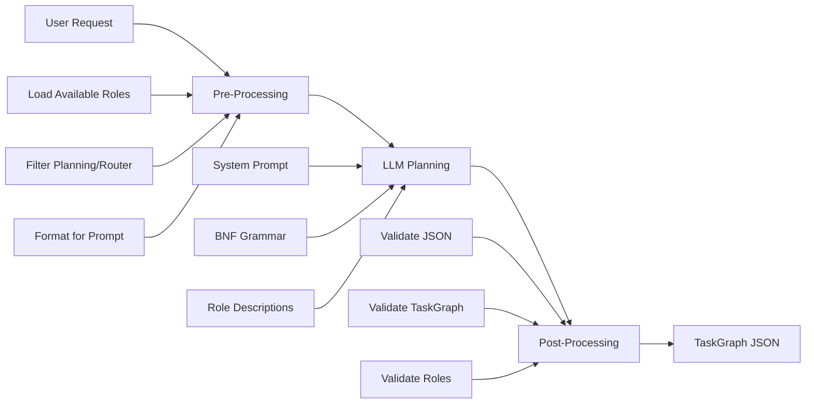

# Planning Role Design & Implementation

**Document ID:** 34
**Created:** 2025-10-18
**Status:** Design & Implementation Specification
**Priority:** High
**Context:** LLM-Driven TaskGraph Generation

## Rules

- Regularly run `make lint` to validate that your code is healthy
- Always use the venv at ./venv/bin/activate
- ALWAYS use test driven development, write tests first
- Never assume tests pass, run the tests and positively verify that the test passed
- ALWAYS run all tests after making any change to ensure they are still all passing, do not move on until relevant tests are passing
- If a test fails, reflect deeply about why the test failed and fix it or fix the code
- Always write multiple tests, including happy, unhappy path and corner cases
- Always verify interfaces and data structures before writing code, do not assume the definition of a interface or data structure
- When performing refactors, ALWAYS use grep to find all instances that need to be refactored
- If you are stuck in a debugging cycle and can't seem to make forward progress, either ask for user input or take a step back and reflect on the broader scope of the code you're working on
- ALWAYS make sure your tests are meaningful, do not mock excessively, only mock where ABSOLUTELY necessary.
- Make a git commit after major changes have been completed
- When refactoring an object, refactor it in place, do not create a new file just for the sake of preserving the old version, we have git for that reason. For instance, if refactoring RequestManager, do NOT create an EnhancedRequestManager, just refactor or rewrite RequestManager
- ALWAYS Follow development and language best practices
- Use the Context7 MCP server if you need documentation for something, make sure you're looking at the right version
- Remember we are migrating AWAY from langchain TO strands agent
- Do not worry about backwards compatibility unless it is PART of a migration process and you will remove the backwards compatibility later
- Do not use fallbacks. Fallbacks tend to be brittle and fragile. Do implement fallbacks of any kind.
- Whenever you complete a phase, make sure to update this checklist
- Don't just blindly implement changes. Reflect on them to make sure they make sense within the larger project. Pull in other files if additional context is needed
- When you complete the implementation of a project add new todo items addressing outstanding technical debt related to what you just implemented, such as removing old code, updating documentation, searching for additional references, etc. Fix these issues, do not accept technical debt for the project being implemented.

## Executive Summary

This document specifies a focused approach for enhancing the planning role to generate executable TaskGraphs using available system roles. The design eliminates over-engineering while leveraging LLM capabilities for intelligent task breakdown and role assignment.

### Current State Problems

- **Hardcoded Logic**: Current planning uses algorithmic templates instead of LLM reasoning
- **No Role Awareness**: Planning doesn't consider available system roles or their capabilities
- **Static Output**: Generates fixed task structures regardless of request complexity
- **Missing Integration**: No connection to actual workflow execution system

### Design Goals

- **LLM-Driven**: Use STRONG model for intelligent task breakdown and role assignment
- **Role-Aware**: Generate plans using actual available system roles
- **Structured Output**: Produce valid TaskGraph JSON using BNF grammar
- **Simple Integration**: Leverage existing Universal Agent lifecycle patterns

## Architecture Design

### Core Flow



### Component Structure

```
roles/core_planning.py (Single File ~400 lines)
├── ROLE_CONFIG (Enhanced with lifecycle and BNF grammar prompt)
├── Pre-processing (load_available_roles)
├── Post-processing (validate_task_graph)
├── Validation Functions (JSON, TaskGraph, role references)
├── Helper Functions (role formatting, error handling)
└── Role Registration (no intents, no tools, no event handlers)
```

## Implementation Specification

### 1. Role Configuration

```python
ROLE_CONFIG = {
    "name": "planning",
    "version": "3.0.0",
    "description": "Generate executable TaskGraphs using available system roles",
    "llm_type": "STRONG",
    "fast_reply": False,
    "when_to_use": "Create multi-step workflows, break down complex tasks, coordinate multiple roles",

    "tools": {
        "automatic": False,  # No tools needed
        "shared": [],
        "include_builtin": False
    },

    "lifecycle": {
        "pre_processing": {"enabled": True, "functions": ["load_available_roles"]},
        "post_processing": {"enabled": True, "functions": ["validate_task_graph"]}
    },

    "prompts": {
        "system": """You are a task planning specialist that creates executable workflows using available system roles.

AVAILABLE ROLES:
{{available_roles}}

Your task is to analyze the user's request and create a TaskGraph that breaks it down into executable tasks using the available roles.

OUTPUT REQUIREMENTS:
- Generate valid JSON following the TaskGraph BNF grammar
- Use only the roles listed above
- Include proper task dependencies
- Provide clear task descriptions

BNF GRAMMAR:
<TaskGraph> ::= {
  "tasks": [<Task>+],
  "dependencies": [<Dependency>*]
}

<Task> ::= {
  "id": <string>,
  "name": <string>,
  "description": <string>,
  "role": <role_name>,
  "parameters": <object>
}

<Dependency> ::= {
  "source_task_id": <string>,
  "target_task_id": <string>,
  "type": "sequential" | "parallel"
}

EXAMPLE OUTPUT:
{
  "tasks": [
    {
      "id": "task_1",
      "name": "Get Weather",
      "description": "Check current weather conditions",
      "role": "weather",
      "parameters": {"location": "current"}
    },
    {
      "id": "task_2",
      "name": "Set Reminder",
      "description": "Set reminder based on weather",
      "role": "timer",
      "parameters": {"duration": "1h", "label": "Check weather again"}
    }
  ],
  "dependencies": [
    {
      "source_task_id": "task_1",
      "target_task_id": "task_2",
      "type": "sequential"
    }
  ]
}

Generate a TaskGraph for the user's request using only the available roles."""
    }
}
```

### 2. Pre-Processing: Role Discovery

```python
def load_available_roles(instruction: str, context, parameters: dict) -> dict:
    """Load available roles and their metadata for planning."""
    try:
        from llm_provider.role_registry import RoleRegistry

        # Get all available roles
        role_registry = RoleRegistry.get_global_registry()
        all_roles = role_registry.roles

        # Filter out planning and router roles
        filtered_roles = {
            name: role_def for name, role_def in all_roles.items()
            if name not in ["planning", "router"]
        }

        # Format role information for prompt injection
        role_info = []
        for name, role_def in filtered_roles.items():
            config = role_def.config
            role_info.append({
                "name": name,
                "description": config.get("description", ""),
                "when_to_use": config.get("when_to_use", ""),
                "parameters": config.get("parameters", {})
            })

        return {
            "available_roles": _format_roles_for_prompt(role_info)
        }

    except Exception as e:
        logger.error(f"Failed to load available roles: {e}")
        return {
            "available_roles": "Error loading roles. Using basic roles: weather, timer, conversation"
        }

def _format_roles_for_prompt(role_info: list) -> str:
    """Format role information for prompt injection."""
    formatted = []
    for role in role_info:
        role_text = f"**{role['name']}**: {role['description']}\n"
        if role['when_to_use']:
            role_text += f"  When to use: {role['when_to_use']}\n"
        if role['parameters']:
            role_text += f"  Parameters: {role['parameters']}\n"
        formatted.append(role_text)

    return "\n".join(formatted)
```

### 3. Post-Processing: TaskGraph Validation

```python
def validate_task_graph(llm_result: str, context, pre_data: dict) -> str:
    """Validate LLM output is valid JSON and TaskGraph structure."""
    try:
        # Parse JSON
        try:
            task_graph = json.loads(llm_result)
        except json.JSONDecodeError as e:
            return f"Invalid JSON generated. Please try again. Error: {e}"

        # Validate TaskGraph structure
        validation_errors = _validate_task_graph_structure(task_graph)
        if validation_errors:
            return f"Invalid TaskGraph structure: {'; '.join(validation_errors)}"

        # Validate role references
        available_roles = _extract_available_role_names(pre_data.get("available_roles", ""))
        role_errors = _validate_role_references(task_graph, available_roles)
        if role_errors:
            return f"Invalid role references: {'; '.join(role_errors)}"

        # Success - return formatted result
        task_count = len(task_graph.get("tasks", []))
        dependency_count = len(task_graph.get("dependencies", []))

        return f"TaskGraph created successfully with {task_count} tasks and {dependency_count} dependencies.\n\n{llm_result}"

    except Exception as e:
        logger.error(f"TaskGraph validation failed: {e}")
        return f"Validation error occurred. Please try again. Error: {e}"

def _validate_task_graph_structure(task_graph: dict) -> list[str]:
    """Validate TaskGraph has required structure."""
    errors = []

    # Check required top-level keys
    if "tasks" not in task_graph:
        errors.append("Missing 'tasks' array")
    if "dependencies" not in task_graph:
        errors.append("Missing 'dependencies' array")

    # Validate tasks
    tasks = task_graph.get("tasks", [])
    if not isinstance(tasks, list):
        errors.append("'tasks' must be an array")
    elif len(tasks) == 0:
        errors.append("At least one task is required")
    else:
        for i, task in enumerate(tasks):
            task_errors = _validate_task_structure(task, i)
            errors.extend(task_errors)

    # Validate dependencies
    dependencies = task_graph.get("dependencies", [])
    if not isinstance(dependencies, list):
        errors.append("'dependencies' must be an array")
    else:
        task_ids = {task.get("id") for task in tasks}
        for i, dep in enumerate(dependencies):
            dep_errors = _validate_dependency_structure(dep, i, task_ids)
            errors.extend(dep_errors)

    return errors

def _validate_task_structure(task: dict, index: int) -> list[str]:
    """Validate individual task structure."""
    errors = []
    required_fields = ["id", "name", "description", "role"]

    for field in required_fields:
        if field not in task:
            errors.append(f"Task {index}: missing '{field}'")
        elif not isinstance(task[field], str) or not task[field].strip():
            errors.append(f"Task {index}: '{field}' must be non-empty string")

    return errors

def _validate_dependency_structure(dep: dict, index: int, task_ids: set) -> list[str]:
    """Validate individual dependency structure."""
    errors = []

    if "source_task_id" not in dep:
        errors.append(f"Dependency {index}: missing 'source_task_id'")
    elif dep["source_task_id"] not in task_ids:
        errors.append(f"Dependency {index}: invalid 'source_task_id'")

    if "target_task_id" not in dep:
        errors.append(f"Dependency {index}: missing 'target_task_id'")
    elif dep["target_task_id"] not in task_ids:
        errors.append(f"Dependency {index}: invalid 'target_task_id'")

    if "type" not in dep:
        errors.append(f"Dependency {index}: missing 'type'")
    elif dep["type"] not in ["sequential", "parallel"]:
        errors.append(f"Dependency {index}: 'type' must be 'sequential' or 'parallel'")

    return errors

def _validate_role_references(task_graph: dict, available_roles: list[str]) -> list[str]:
    """Validate all task roles are available."""
    errors = []

    for task in task_graph.get("tasks", []):
        role = task.get("role")
        if role and role not in available_roles:
            errors.append(f"Task '{task.get('id')}' uses unavailable role '{role}'")

    return errors

def _extract_available_role_names(roles_text: str) -> list[str]:
    """Extract role names from formatted roles text."""
    import re
    matches = re.findall(r'\*\*([^*]+)\*\*:', roles_text)
    return matches
```

### 4. Role Registration

```python
def register_role():
    """Register the planning role."""
    return {
        "config": ROLE_CONFIG,
        "event_handlers": {},  # No event handlers needed
        "tools": [],  # No tools needed
        "intents": {},  # No intents needed
        "lifecycle": {
            "pre_processing": {
                "enabled": True,
                "functions": ["load_available_roles"]
            },
            "post_processing": {
                "enabled": True,
                "functions": ["validate_task_graph"]
            }
        }
    }
```

## Implementation Plan

### Phase 1: Core Implementation (Days 1-3)

#### Day 1: Foundation

- [ ] Backup current `roles/core_planning.py` as `roles/core_planning_v2_backup.py`
- [ ] Create new role structure with enhanced ROLE_CONFIG
- [ ] Implement comprehensive system prompt with BNF grammar
- [ ] Add basic role registration function

#### Day 2: Lifecycle Functions

- [ ] Implement `load_available_roles()` pre-processing function
- [ ] Create role filtering logic (exclude planning/router)
- [ ] Implement role formatting for prompt injection
- [ ] Add error handling for role loading failures

#### Day 3: Validation System

- [ ] Implement `validate_task_graph()` post-processing function
- [ ] Create JSON parsing and validation
- [ ] Add TaskGraph structure validation
- [ ] Implement role reference validation

### Phase 2: Testing & Integration (Days 4-5)

#### Day 4: Unit Testing

```python
# tests/unit/test_planning_role.py
import pytest
import json
from unittest.mock import Mock, patch
from roles.core_planning import (
    load_available_roles,
    validate_task_graph,
    _validate_task_graph_structure,
    _validate_role_references
)

class TestRoleLoading:
    @patch('roles.core_planning.RoleRegistry.get_global_registry')
    def test_load_available_roles_success(self, mock_registry):
        # Mock role registry
        mock_roles = {
            "weather": Mock(config={"description": "Weather info", "when_to_use": "Get weather"}),
            "timer": Mock(config={"description": "Timer management", "parameters": {"duration": "string"}}),
            "planning": Mock(config={"description": "Planning"}),  # Should be filtered out
            "router": Mock(config={"description": "Routing"})  # Should be filtered out
        }
        mock_registry.return_value.roles = mock_roles

        result = load_available_roles("test", Mock(), {})

        assert "available_roles" in result
        assert "weather" in result["available_roles"]
        assert "timer" in result["available_roles"]
        assert "planning" not in result["available_roles"]
        assert "router" not in result["available_roles"]

class TestTaskGraphValidation:
    def test_valid_task_graph(self):
        valid_graph = {
            "tasks": [
                {"id": "task_1", "name": "Test", "description": "Test task", "role": "weather"}
            ],
            "dependencies": []
        }

        errors = _validate_task_graph_structure(valid_graph)
        assert len(errors) == 0

    def test_missing_tasks(self):
        invalid_graph = {"dependencies": []}

        errors = _validate_task_graph_structure(invalid_graph)
        assert "Missing 'tasks' array" in errors

    def test_invalid_role_reference(self):
        task_graph = {
            "tasks": [{"id": "task_1", "role": "nonexistent"}],
            "dependencies": []
        }

        errors = _validate_role_references(task_graph, ["weather", "timer"])
        assert len(errors) == 1
        assert "nonexistent" in errors[0]

class TestEndToEndPlanning:
    @patch('roles.core_planning.RoleRegistry.get_global_registry')
    def test_complete_planning_flow(self, mock_registry):
        # Setup mock registry
        mock_roles = {
            "weather": Mock(config={"description": "Weather info"}),
            "timer": Mock(config={"description": "Timer management"})
        }
        mock_registry.return_value.roles = mock_roles

        # Test pre-processing
        context = Mock()
        pre_result = load_available_roles("Plan my day", context, {})

        # Test post-processing with valid TaskGraph
        valid_json = json.dumps({
            "tasks": [
                {"id": "task_1", "name": "Check Weather", "description": "Get weather", "role": "weather", "parameters": {}}
            ],
            "dependencies": []
        })

        post_result = validate_task_graph(valid_json, context, pre_result)

        assert "TaskGraph created successfully" in post_result
        assert "1 tasks and 0 dependencies" in post_result
```

#### Day 5: Integration Testing

- [ ] Test Universal Agent role assumption with STRONG LLM
- [ ] Validate lifecycle execution (pre → LLM → post)
- [ ] Test role registry auto-discovery
- [ ] Verify prompt injection and context handling

### Phase 3: Production Deployment (Day 6)

#### Deployment Steps

- [ ] Run comprehensive test suite
- [ ] Validate no breaking changes to existing system
- [ ] Deploy enhanced planning role
- [ ] Monitor planning requests and validate output quality
- [ ] Document usage examples and common patterns

## Usage Examples

### Simple Planning Request

```
User: "Plan my morning routine"

Pre-processing: Loads weather, timer, conversation roles
LLM Output:
{
  "tasks": [
    {
      "id": "check_weather",
      "name": "Check Weather",
      "description": "Get current weather to plan outfit",
      "role": "weather",
      "parameters": {"location": "current", "timeframe": "current"}
    },
    {
      "id": "set_alarm",
      "name": "Set Wake-up Alarm",
      "description": "Set alarm for tomorrow morning",
      "role": "timer",
      "parameters": {"duration": "8h", "label": "Wake up"}
    }
  ],
  "dependencies": []
}

Post-processing: Validates JSON and TaskGraph structure
Result: "TaskGraph created successfully with 2 tasks and 0 dependencies."
```

### Complex Planning Request

```
User: "Create a comprehensive weather monitoring system"

LLM Output:
{
  "tasks": [
    {
      "id": "current_weather",
      "name": "Get Current Weather",
      "description": "Check current weather conditions",
      "role": "weather",
      "parameters": {"location": "current", "format": "detailed"}
    },
    {
      "id": "weather_forecast",
      "name": "Get Weather Forecast",
      "description": "Get extended weather forecast",
      "role": "weather",
      "parameters": {"location": "current", "timeframe": "this week"}
    },
    {
      "id": "weather_alert",
      "name": "Set Weather Check Reminder",
      "description": "Set recurring reminder to check weather",
      "role": "timer",
      "parameters": {"duration": "6h", "label": "Weather check"}
    }
  ],
  "dependencies": [
    {
      "source_task_id": "current_weather",
      "target_task_id": "weather_forecast",
      "type": "sequential"
    },
    {
      "source_task_id": "weather_forecast",
      "target_task_id": "weather_alert",
      "type": "sequential"
    }
  ]
}
```

## Design Benefits

### 1. Simplicity

- **Single Purpose**: Generate TaskGraphs, nothing more
- **Clear Interface**: Pre-processing → LLM → Post-processing
- **No Complex State**: Stateless operation with validation
- **Minimal Dependencies**: Only needs RoleRegistry and JSON parsing

### 2. LLM-Optimized

- **Leverages STRONG Model**: Uses appropriate model for complex reasoning
- **Clear Instructions**: BNF grammar provides structured output specification
- **Role-Aware**: Plans use actual available system roles and their capabilities
- **Contextual**: Role descriptions and parameters inform planning decisions

### 3. Robust Validation

- **JSON Validation**: Ensures parseable output
- **Structure Validation**: Verifies TaskGraph schema compliance
- **Role Validation**: Confirms all referenced roles are available
- **Meaningful Errors**: Clear feedback for debugging and user understanding

### 4. Integration Ready

- **Universal Agent Compatible**: Uses standard lifecycle patterns
- **WorkflowEngine Ready**: Generates TaskGraphs that can be executed directly
- **Extensible**: Can add features incrementally (retries, optimization, etc.)
- **Testable**: Simple input/output validation with clear test cases

## Future Enhancements (Optional)

### Phase 4: Error Recovery (Future)

- Add retry logic for malformed JSON
- Implement plan optimization suggestions
- Add user preference learning

### Phase 5: Advanced Features (Future)

- Resource constraint awareness
- Execution time estimation
- Plan quality scoring

## Key Simplifications from Original Design

1. **No Intents**: Direct lifecycle flow eliminates intent complexity
2. **No Tools**: Pure LLM reasoning without external tool calls
3. **No Complex Context**: Only loads essential role information
4. **No Execution Integration**: Generates TaskGraphs, doesn't execute them
5. **No Learning System**: Focuses on core functionality first
6. **No Monitoring**: Simple validation and error reporting

This design achieves the core goal of intelligent, role-aware planning while maintaining the Universal Agent architecture's simplicity principles and avoiding unnecessary complexity.
