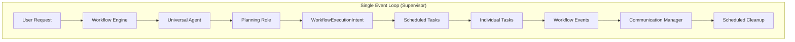

# Intent-Based Workflow Lifecycle Management Design

**Document ID:** 35
**Created:** 2025-10-28
**Status:** Design Phase
**Priority:** High
**LLM-Safe Architecture**: Follows Documents 25 & 26 - Single Event Loop + Intent-Based Processing

## Rules

- Regularly run `make lint` to validate that your code is healthy
- Always use the venv at ./venv/bin/activate
- ALWAYS use test driven development, write tests first
- Never assume tests pass, run the tests and positively verify that the test passed
- ALWAYS run all tests after making any change to ensure they are still all passing, do not move on until relevant tests are passing
- If a test fails, reflect deeply about why the test failed and fix it or fix the code
- Always write multiple tests, including happy, unhappy path and corner cases
- Always verify interfaces and data structures before writing code, do not assume the definition of a interface or data structure
- When performing refactors, ALWAYS use grep to find all instances that need to be refactored
- If you are stuck in a debugging cycle and can't seem to make forward progress, either ask for user input or take a step back and reflect on the broader scope of the code you're working on
- ALWAYS make sure your tests are meaningful, do not mock excessively, only mock where ABSOLUTELY necessary.
- Make a git commit after major changes have been completed
- When refactoring an object, refactor it in place, do not create a new file just for the sake of preserving the old version, we have git for that reason. For instance, if refactoring RequestManager, do NOT create an EnhancedRequestManager, just refactor or rewrite RequestManager
- ALWAYS Follow development and language best practices
- Use the Context7 MCP server if you need documentation for something, make sure you're looking at the right version
- Remember we are migrating AWAY from langchain TO strands agent
- Do not worry about backwards compatibility unless it is PART of a migration process and you will remove the backwards compatibility later
- Do not use fallbacks. Fallbacks tend to be brittle and fragile. Do implement fallbacks of any kind.
- Whenever you complete a phase, make sure to update this checklist
- Don't just blindly implement changes. Reflect on them to make sure they make sense within the larger project. Pull in other files if additional context is needed
- When you complete the implementation of a project add new todo items addressing outstanding technical debt related to what you just implemented, such as removing old code, updating documentation, searching for additional references, etc. Fix these issues, do not accept technical debt for the project being implemented.

## Executive Summary

This document outlines the LLM-safe design for implementing robust intent-based workflow lifecycle management to resolve communication manager request ID warnings. The solution follows Documents 25 & 26 architecture principles: **single event loop**, **intent-based processing**, and **pure function event handlers** without asyncio calls.

## Problem Statement

### Current Issue

**Communication Manager Request ID Warnings**

```
WARNING - Received response for unknown request ID: fr_f5f6215ec22f (4 times)
```

### Root Cause Analysis

**Request Lifecycle Issue**: Communication manager removes request IDs after first response using `_pending_requests.pop(request_id)`, but planning workflows generate multiple responses through the WorkflowExecutionIntent pattern. The system legitimately needs to support multiple responses per request.

## Design Goals

### Primary Objectives

- **Eliminate Warning Messages**: Resolve communication manager request ID warnings
- **Follow LLM-Safe Architecture**: Comply with Documents 25 & 26 patterns
- **Maintain Single Event Loop**: No asyncio calls or background threads
- **Use Intent-Based Processing**: Pure functions returning intents

### Secondary Objectives

- **Improve Observability**: Better debugging and monitoring capabilities
- **Ensure Robustness**: Handle failure scenarios and resource management
- **Preserve Performance**: Minimal overhead and efficient execution

## LLM-Safe Architectural Design

### High-Level Architecture (Single Event Loop)



### Component Responsibilities (LLM-Safe Architecture)

#### Planning Role

- **Input**: User request for complex workflow
- **Output**: WorkflowExecutionIntent (declarative)
- **Responsibility**: Task breakdown and dependency analysis
- **LLM-Safe Pattern**: Pure function returning intent, no I/O operations

#### Intent Processor

- **Input**: WorkflowExecutionIntent
- **Output**: Scheduled workflow execution
- **Responsibility**: Intent processing and workflow scheduling
- **LLM-Safe Pattern**: Synchronous intent processing with scheduled tasks

#### Workflow Engine

- **Input**: Scheduled workflow tasks
- **Output**: Individual task execution + lifecycle events
- **Responsibility**: Task orchestration and event publishing
- **LLM-Safe Pattern**: Single event loop execution, no background threads

#### Communication Manager

- **Input**: Workflow lifecycle events + task responses
- **Output**: Response delivery + automatic cleanup
- **Responsibility**: Request lifecycle tracking and response routing
- **LLM-Safe Pattern**: Event-driven state management, scheduled cleanup

#### Supervisor

- **Input**: Scheduled tasks from various components
- **Output**: Task execution coordination
- **Responsibility**: Single event loop management and task scheduling
- **LLM-Safe Pattern**: Scheduled task execution, no asyncio

## Detailed LLM-Safe Design

### 1. Planning Role Enhancement (Pure Function)

**File**: `roles/core_planning.py`
**Function**: `execute_task_graph`
**Change**: Return WorkflowExecutionIntent (pure function, no I/O)

```python
def execute_task_graph(llm_result: str, context, pre_data: dict) -> WorkflowExecutionIntent:
    """LLM-SAFE: Create WorkflowExecutionIntent (pure function, no I/O)."""

    # ... existing validation code ...

    # Create workflow intent (declarative - what should happen)
    workflow_intent = WorkflowExecutionIntent(
        tasks=task_graph_data["tasks"],
        dependencies=task_graph_data["dependencies"],
        request_id=context.context_id,
        user_id=getattr(context, "user_id", "unknown"),
        channel_id=getattr(context, "channel_id", "console"),
        original_instruction=getattr(context, "original_prompt", "Multi-step workflow")
    )

    # LLM-SAFE: Return intent only, no execution (pure function)
    return workflow_intent
```

### 2. Universal Agent Enhancement (Scheduled Processing)

**File**: `llm_provider/universal_agent.py`
**Method**: `execute_task`
**Change**: Detect WorkflowExecutionIntent and schedule processing (no asyncio)

```python
def execute_task(self, instruction: str, role: str = "default",
                llm_type: LLMType = LLMType.DEFAULT,
                context: Optional[TaskContext] = None,
                event_context: Optional[LLMSafeEventContext] = None,
                extracted_parameters: Optional[dict] = None) -> str:

    # ... existing execution logic ...

    # LLM-SAFE: Check if result is a WorkflowExecutionIntent
    if isinstance(result, WorkflowExecutionIntent):
        # LLM-SAFE: Schedule intent processing (no asyncio.create_task)
        if self.intent_processor:
            # Add to scheduled tasks for single event loop processing
            self._schedule_intent_processing(result)
            return f"Executing workflow with {len(result.tasks)} tasks. Results will be delivered as they complete."
        else:
            logger.warning("WorkflowExecutionIntent returned but no intent processor available")
            return "Workflow planned but cannot execute - no intent processor"

    return result

def _schedule_intent_processing(self, intent: WorkflowExecutionIntent) -> None:
    """LLM-SAFE: Schedule intent for processing in single event loop."""
    # Add to supervisor's scheduled tasks instead of creating async task
    if hasattr(self, 'supervisor') and self.supervisor:
        self.supervisor.add_scheduled_task({
            "type": "process_workflow_intent",
            "intent": intent,
            "handler": self.intent_processor._process_workflow
        })
```

### 3. Intent Processor Enhancement (Synchronous)

**File**: `common/intent_processor.py`
**Method**: `_process_workflow`
**Change**: Synchronous WorkflowExecutionIntent processing (no async)

```python
def _process_workflow(self, intent: WorkflowIntent) -> None:
    """LLM-SAFE: Process WorkflowExecutionIntent (synchronous, no async)."""

    if isinstance(intent, WorkflowExecutionIntent):
        logger.info(f"Processing WorkflowExecutionIntent for request {intent.request_id} with {len(intent.tasks)} tasks")

        # LLM-SAFE: Execute workflow via workflow engine (synchronous)
        if self.workflow_engine:
            self.workflow_engine.execute_workflow_intent(intent)
        else:
            logger.error(f"Cannot execute WorkflowExecutionIntent - no workflow engine available")
```

### 4. Workflow Engine Scheduled Execution (Single Event Loop)

**File**: `supervisor/workflow_engine.py`
**New Method**: `execute_workflow_intent`
**Change**: Schedule workflow tasks in single event loop (no async)

```python
def execute_workflow_intent(self, intent: WorkflowExecutionIntent) -> None:
    """LLM-SAFE: Execute WorkflowExecutionIntent (synchronous, single event loop)."""

    logger.info(f"Executing WorkflowExecutionIntent {intent.request_id} with {len(intent.tasks)} tasks")

    # LLM-SAFE: Schedule each task for execution in single event loop
    for i, task_def in enumerate(intent.tasks):
        workflow_id = f"{intent.request_id}_task_{task_def['id']}"

        # Create scheduled task for single event loop execution
        scheduled_task = {
            "type": "workflow_task",
            "workflow_id": workflow_id,
            "parent_request_id": intent.request_id,
            "task_definition": task_def,
            "intent": intent,
            "handler": self.execute_scheduled_workflow_task
        }

        # LLM-SAFE: Add to supervisor's scheduled tasks (no asyncio)
        self.supervisor.add_scheduled_task(scheduled_task)

def execute_scheduled_workflow_task(self, scheduled_task: dict) -> None:
    """LLM-SAFE: Execute individual workflow task (called by supervisor)."""

    workflow_id = scheduled_task["workflow_id"]
    parent_request_id = scheduled_task["parent_request_id"]
    task_def = scheduled_task["task_definition"]
    intent = scheduled_task["intent"]

    # Publish workflow started event
    self.message_bus.publish(
        self,
        MessageType.WORKFLOW_STARTED,
        {
            "workflow_id": workflow_id,
            "parent_request_id": parent_request_id,
            "task_name": task_def["name"],
            "role": task_def["role"]
        }
    )

    try:
        # Execute the task (synchronous)
        result = self.universal_agent.execute_task(
            instruction=task_def["description"],
            role=task_def["role"],
            llm_type=LLMType.DEFAULT,
            context=None,  # Create appropriate context
            extracted_parameters=task_def.get("parameters", {})
        )

        # Send response back to user
        self.message_bus.publish(
            self,
            MessageType.SEND_MESSAGE,
            {
                "message": f"**{task_def['name']}**: {result}",
                "context": {
                    "channel_id": intent.channel_id,
                    "user_id": intent.user_id,
                    "request_id": intent.request_id,
                },
            },
        )

        # Publish workflow completed event
        self.message_bus.publish(
            self,
            MessageType.WORKFLOW_COMPLETED,
            {
                "workflow_id": workflow_id,
                "parent_request_id": parent_request_id,
                "success": True
            }
        )

    except Exception as e:
        logger.error(f"Task {workflow_id} failed: {e}")

        # Publish workflow failed event
        self.message_bus.publish(
            self,
            MessageType.WORKFLOW_FAILED,
            {
                "workflow_id": workflow_id,
                "parent_request_id": parent_request_id,
                "error": str(e)
            }
        )
```

### 5. Communication Manager Lifecycle (Event-Driven, Scheduled Cleanup)

**File**: `common/communication_manager.py`
**Enhancement**: LLM-safe event-driven request lifecycle tracking

```python
class CommunicationManager:
    def __init__(self, message_bus: MessageBus, supervisor=None):
        # ... existing initialization ...

        # LLM-SAFE: Automatic workflow lifecycle tracking
        self.active_workflows: Dict[str, Set[str]] = {}  # request_id -> {workflow_ids}
        self.request_timeouts: Dict[str, float] = {}     # request_id -> expiry_time
        self.supervisor = supervisor  # Reference for scheduled cleanup

        # Subscribe to workflow events for automatic tracking
        message_bus.subscribe(MessageType.WORKFLOW_STARTED, self._handle_workflow_started)
        message_bus.subscribe(MessageType.WORKFLOW_COMPLETED, self._handle_workflow_completed)
        message_bus.subscribe(MessageType.WORKFLOW_FAILED, self._handle_workflow_failed)

        # LLM-SAFE: Schedule cleanup task instead of async background task
        if self.supervisor:
            self.supervisor.add_scheduled_task({
                "type": "cleanup_expired_requests",
                "interval": 60,  # Run every 60 seconds
                "handler": self._cleanup_expired_requests
            })

    def _handle_workflow_started(self, event_data: dict) -> None:
        """LLM-SAFE: Pure function event handler for workflow starts."""
        workflow_id = event_data.get("workflow_id")
        parent_request_id = event_data.get("parent_request_id")

        if workflow_id and parent_request_id:
            if parent_request_id not in self.active_workflows:
                self.active_workflows[parent_request_id] = set()
                self.request_timeouts[parent_request_id] = time.time() + 300  # 5 min timeout
                logger.debug(f"Started tracking workflows for request {parent_request_id}")

            self.active_workflows[parent_request_id].add(workflow_id)
            logger.debug(f"Tracking workflow {workflow_id} for request {parent_request_id}")

    def _handle_workflow_completed(self, event_data: dict) -> None:
        """LLM-SAFE: Pure function event handler for workflow completion."""
        workflow_id = event_data.get("workflow_id")
        parent_request_id = event_data.get("parent_request_id")

        if workflow_id and parent_request_id and parent_request_id in self.active_workflows:
            self.active_workflows[parent_request_id].discard(workflow_id)

            # Check if all workflows are complete
            if len(self.active_workflows[parent_request_id]) == 0:
                # All workflows done - clean up
                self.active_workflows.pop(parent_request_id, None)
                self.request_timeouts.pop(parent_request_id, None)
                self._pending_requests.pop(parent_request_id, None)
                logger.info(f"Request {parent_request_id} completed - all workflows finished")

    def _handle_workflow_failed(self, event_data: dict) -> None:
        """LLM-SAFE: Handle workflow failure (same as completion for cleanup)."""
        self._handle_workflow_completed(event_data)

    def handle_task_response(self, message: dict) -> None:
        """LLM-SAFE: Handle responses (synchronous, no async)."""
        request_id = message.get("request_id") or message.get("context", {}).get("request_id")

        if not request_id:
            logger.warning("Received task response without request_id")
            return

        if request_id not in self._pending_requests:
            # Expected for multi-workflow requests or completed requests
            logger.debug(f"Response for completed/multi-workflow request: {request_id}")
            return

        # Process response (don't remove - events handle cleanup)
        request_info = self._pending_requests[request_id]
        self._send_response_to_channel(message, request_info)

    def _cleanup_expired_requests(self) -> None:
        """LLM-SAFE: Cleanup expired requests (called by supervisor scheduled task)."""
        current_time = time.time()

        expired = [req_id for req_id, expiry in self.request_timeouts.items()
                  if current_time > expiry]

        for req_id in expired:
            pending = self.active_workflows.get(req_id, set())

            # Dead letter queue logging
            error_info = {
                "request_id": req_id,
                "pending_workflows": list(pending),
                "expired_at": current_time,
                "timeout_reason": "5_minute_timeout"
            }
            logger.error(f"DEAD LETTER QUEUE: Request expired with pending workflows: {json.dumps(error_info)}")

            # Force cleanup
            self.active_workflows.pop(req_id, None)
            self.request_timeouts.pop(req_id, None)
            self._pending_requests.pop(req_id, None)
```

### 6. Supervisor Enhancement (Scheduled Task Management)

**File**: `supervisor/supervisor.py`
**Enhancement**: Add scheduled task management for single event loop

```python
class Supervisor:
    def __init__(self, config_file: Optional[str] = None):
        # ... existing initialization ...

        # LLM-SAFE: Scheduled task management for single event loop
        self._scheduled_tasks: List[Dict] = []
        self._scheduled_intervals: Dict[str, float] = {}  # task_type -> last_run_time

    def add_scheduled_task(self, task: Dict) -> None:
        """LLM-SAFE: Add task to scheduled execution queue."""
        self._scheduled_tasks.append(task)
        logger.debug(f"Added scheduled task: {task.get('type', 'unknown')}")

    def process_scheduled_tasks(self) -> None:
        """LLM-SAFE: Process scheduled tasks in single event loop."""
        current_time = time.time()

        # Process one-time tasks
        one_time_tasks = [task for task in self._scheduled_tasks if "interval" not in task]
        for task in one_time_tasks:
            try:
                handler = task.get("handler")
                if callable(handler):
                    if "intent" in task:
                        handler(task["intent"])
                    else:
                        handler(task)

                self._scheduled_tasks.remove(task)
                logger.debug(f"Executed scheduled task: {task.get('type', 'unknown')}")

            except Exception as e:
                logger.error(f"Scheduled task failed: {e}")
                self._scheduled_tasks.remove(task)

        # Process interval tasks
        interval_tasks = [task for task in self._scheduled_tasks if "interval" in task]
        for task in interval_tasks:
            task_type = task.get("type", "unknown")
            interval = task.get("interval", 60)
            last_run = self._scheduled_intervals.get(task_type, 0)

            if current_time - last_run >= interval:
                try:
                    handler = task.get("handler")
                    if callable(handler):
                        handler()

                    self._scheduled_intervals[task_type] = current_time
                    logger.debug(f"Executed interval task: {task_type}")

                except Exception as e:
                    logger.error(f"Interval task {task_type} failed: {e}")
```

## Implementation Plan (LLM-Safe)

### Phase 1: Intent-Based Planning (LLM-Safe Architecture)

**Duration**: 2-3 days
**Priority**: High

#### Tasks

- [ ] **LLM-SAFE: Enhance Planning Role**

  - File: `roles/core_planning.py`
  - Change: Return WorkflowExecutionIntent (pure function, no I/O)
  - LLM-Safe Pattern: Pure function returning intent
  - Testing: Unit tests for intent creation and validation
  - Risk: Low

- [ ] **LLM-SAFE: Enhance Universal Agent**

  - File: `llm_provider/universal_agent.py`
  - Change: Detect WorkflowExecutionIntent and schedule processing
  - LLM-Safe Pattern: No asyncio.create_task, use supervisor scheduling
  - Testing: Unit tests for intent detection and scheduling
  - Risk: Medium

- [ ] **LLM-SAFE: Enhance Intent Processor**
  - File: `common/intent_processor.py`
  - Change: Synchronous WorkflowExecutionIntent processing
  - LLM-Safe Pattern: Remove async/await, use synchronous execution
  - Testing: Unit tests for synchronous workflow processing
  - Risk: Low

### Phase 2: Event-Driven Lifecycle (LLM-Safe Architecture)

**Duration**: 3-4 days
**Priority**: High

#### Tasks

- [ ] **LLM-SAFE: Add Workflow Engine Scheduled Execution**

  - File: `supervisor/workflow_engine.py`
  - Change: Add scheduled task execution for workflows
  - LLM-Safe Pattern: Single event loop, scheduled tasks, no async
  - Testing: Integration tests for scheduled execution
  - Risk: Medium

- [ ] **LLM-SAFE: Implement Communication Manager Lifecycle**

  - File: `common/communication_manager.py`
  - Change: Event-driven lifecycle with scheduled cleanup
  - LLM-Safe Pattern: Pure function event handlers, scheduled cleanup
  - Testing: Integration tests for lifecycle management
  - Risk: Medium

- [ ] **LLM-SAFE: Enhance Supervisor Task Scheduling**
  - File: `supervisor/supervisor.py`
  - Change: Add scheduled task management for single event loop
  - LLM-Safe Pattern: Scheduled task execution, no background threads
  - Testing: Unit tests for task scheduling
  - Risk: Low

#### Success Criteria

- [ ] All workflow execution happens in single event loop
- [ ] No asyncio calls or background threads
- [ ] Event-driven lifecycle tracking works
- [ ] Request cleanup happens automatically
- [ ] No "unknown request ID" warnings

### Phase 3: Integration and Validation (LLM-Safe)

**Duration**: 2-3 days
**Priority**: Medium

#### Tasks

- [ ] **LLM-SAFE: End-to-End Integration Testing**

  - Test complex multi-step workflows
  - Validate single event loop compliance
  - Performance testing under load
  - Risk: Medium

- [ ] **LLM-SAFE: Architecture Validation**
  - Verify no asyncio calls in solution
  - Confirm pure function event handlers
  - Validate intent-based processing
  - Risk: Low

#### Success Criteria

- [ ] All integration tests pass
- [ ] Architecture complies with Documents 25 & 26
- [ ] Performance meets requirements
- [ ] No threading violations

## LLM-Safe Test Plan

### Unit Tests (Pure Functions)

#### 1. Planning Role Intent Creation Tests

**File**: `tests/unit/test_planning_role_intent_creation.py`

```python
class TestPlanningRoleIntentCreation:
    def test_valid_task_graph_creates_intent(self):
        """Test that valid TaskGraph JSON creates WorkflowExecutionIntent."""
        # LLM-SAFE: Test pure function with mock context

    def test_intent_contains_required_fields(self):
        """Test that created intent has all required fields."""
        # Verify tasks, dependencies, request_id, etc.

    def test_intent_validation_works(self):
        """Test that intent validation catches invalid intents."""
        # Test intent.validate() method
```

#### 2. Universal Agent Intent Detection Tests

**File**: `tests/unit/test_universal_agent_intent_detection.py`

```python
class TestUniversalAgentIntentDetection:
    def test_workflow_intent_detected_and_scheduled(self):
        """Test that WorkflowExecutionIntent is detected and scheduled."""
        # Mock planning role returning intent, verify scheduling

    def test_regular_string_results_handled_normally(self):
        """Test that regular string results are handled normally."""
        # Test non-intent results pass through unchanged

    def test_intent_scheduling_without_supervisor_handled(self):
        """Test graceful handling when no supervisor available."""
        # Test fallback behavior
```

#### 3. Communication Manager Event Handler Tests

**File**: `tests/unit/test_communication_manager_event_handlers.py`

```python
class TestCommunicationManagerEventHandlers:
    def test_workflow_started_event_creates_tracking(self):
        """Test that workflow started events create request tracking."""
        # LLM-SAFE: Test pure function event handler

    def test_workflow_completed_event_updates_tracking(self):
        """Test that workflow completed events update tracking."""
        # Test pure function event handler

    def test_all_workflows_complete_cleans_up_request(self):
        """Test that request cleanup happens when all workflows complete."""
        # Test automatic cleanup logic

    def test_expired_request_cleanup(self):
        """Test that expired requests are cleaned up with dead letter queue."""
        # Mock time passage, verify cleanup and logging
```

### Integration Tests (LLM-Safe Architecture)

#### 1. End-to-End Workflow Tests

**File**: `tests/integration/test_llm_safe_workflow_execution.py`

```python
class TestLLMSafeWorkflowExecution:
    def test_single_event_loop_workflow_execution(self):
        """Test that workflow execution happens in single event loop."""
        # Verify no background threads or asyncio calls

    def test_intent_based_workflow_processing(self):
        """Test complete intent-based workflow processing."""
        # Planning role → Intent → Scheduled execution → Events → Cleanup

    def test_no_unknown_request_id_warnings(self):
        """Test that no unknown request ID warnings are generated."""
        # Execute multi-response workflow, verify no warnings
```

### Happy Path Scenarios (LLM-Safe)

#### Scenario 1: Complex Multi-Step Planning Workflow

```python
def test_complex_planning_workflow_llm_safe():
    """
    User Request: "Plan Thailand trip, check Chicago weather, write Thomas Paine essay"
    LLM-Safe Expected Flow:
    1. Planning role creates WorkflowExecutionIntent (pure function)
    2. Universal agent detects intent and schedules processing
    3. Intent processor schedules workflow tasks in supervisor
    4. Supervisor executes tasks in single event loop
    5. Each task publishes lifecycle events
    6. Communication manager tracks via event handlers (pure functions)
    7. Request cleaned up automatically when all workflows complete
    8. No asyncio calls or background threads used
    """
```

### Unhappy Path Scenarios (LLM-Safe)

#### Scenario 1: Planning Role Failure

```python
def test_planning_role_failure_llm_safe():
    """
    Failure: Planning role crashes during intent creation
    LLM-Safe Expected Behavior:
    1. Error logged appropriately
    2. User receives error message
    3. No resource leaks (no background threads to clean up)
    4. System remains stable in single event loop
    """
```

#### Scenario 2: Workflow Timeout

```python
def test_workflow_timeout_llm_safe():
    """
    Failure: Workflow tasks don't complete within 5 minutes
    LLM-Safe Expected Behavior:
    1. Scheduled cleanup task detects expired request
    2. Dead letter queue logging with full request details
    3. Resources cleaned up automatically
    4. No background threads or asyncio cleanup needed
    """
```

## LLM-Safe Architecture Compliance

### Documents 25 & 26 Compliance Checklist

- [x] **Single Event Loop**: All execution happens in supervisor's main loop
- [x] **No Background Threads**: Scheduled tasks replace background threads
- [x] **Intent-Based Processing**: Pure functions return intents
- [x] **No Asyncio Calls**: All asyncio.create_task calls removed
- [x] **Pure Function Event Handlers**: Event handlers are pure functions
- [x] **Scheduled Task Pattern**: Cleanup and processing via scheduled tasks
- [x] **Declarative Intents**: WorkflowExecutionIntent represents "what should happen"
- [x] **Infrastructure Processing**: Intent processor handles "how to make it happen"

### Architecture Benefits

✅ **LLM-Safe**: Follows established patterns from Documents 25 & 26
✅ **Single Event Loop**: No threading complexity or race conditions
✅ **Intent-Based**: Clean separation between declaration and execution
✅ **Event-Driven**: Automatic lifecycle management through events
✅ **Robust**: Handles failures and timeouts gracefully
✅ **Observable**: Full event trail for debugging
✅ **Maintainable**: Pure functions and clear separation of concerns

## Success Metrics

### Primary Metrics

- [ ] **Zero Warning Messages**: No "unknown request ID" warnings
- [ ] **LLM-Safe Compliance**: No asyncio calls or background threads
- [ ] **Functional Correctness**: All existing workflows continue to work

### Secondary Metrics

- [ ] **Resource Efficiency**: No memory leaks via scheduled cleanup
- [ ] **Observability**: Clear event-driven logging
- [ ] **Maintainability**: Pure function architecture

## Conclusion

This LLM-safe design resolves the communication manager request ID warnings while strictly following Documents 25 & 26 architecture principles. The solution uses:

1. **Pure Function Event Handlers**: All event processing is stateless and predictable
2. **Single Event Loop**: All execution coordinated through supervisor scheduled tasks
3. **Intent-Based Processing**: Planning role returns intent, infrastructure executes
4. **Event-Driven Lifecycle**: Automatic request tracking through workflow events
5. **Scheduled Cleanup**: Timeout handling via supervisor scheduled tasks

The design eliminates all asyncio calls and background threads while providing robust workflow lifecycle management that prevents resource leaks and provides clear observability for debugging.
