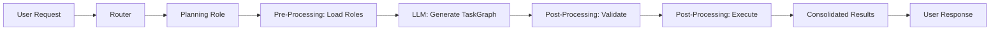
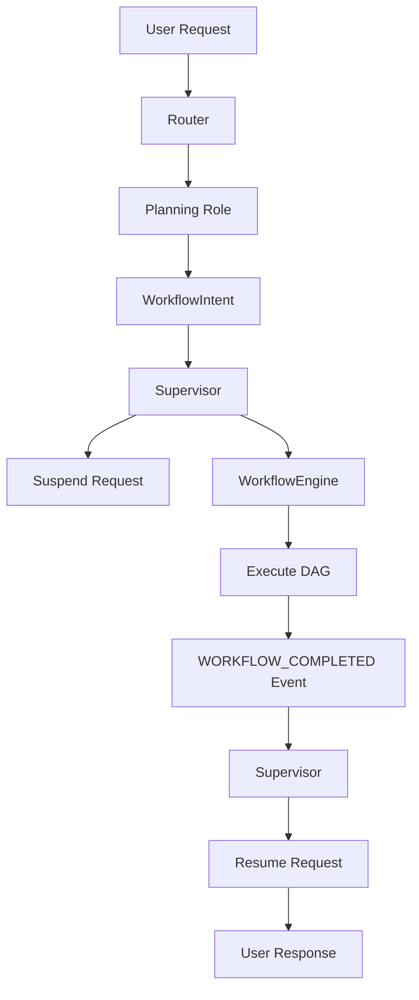

# Planning Role Design & Implementation - Event-Driven Architecture

**Document ID:** 34
**Created:** 2025-10-18
**Updated:** 2025-10-27
**Status:** Design & Implementation Specification
**Priority:** High
**Context:** Event-Driven TaskGraph Generation and Execution

## Rules

- Regularly run `make lint` to validate that your code is healthy
- Always use the venv at ./venv/bin/activate
- ALWAYS use test driven development, write tests first
- Never assume tests pass, run the tests and positively verify that the test passed
- ALWAYS run all tests after making any change to ensure they are still all passing, do not move on until relevant tests are passing
- If a test fails, reflect deeply about why the test failed and fix it or fix the code
- Always write multiple tests, including happy, unhappy path and corner cases
- Always verify interfaces and data structures before writing code, do not assume the definition of a interface or data structure
- When performing refactors, ALWAYS use grep to find all instances that need to be refactored
- If you are stuck in a debugging cycle and can't seem to make forward progress, either ask for user input or take a step back and reflect on the broader scope of the code you're working on
- ALWAYS make sure your tests are meaningful, do not mock excessively, only mock where ABSOLUTELY necessary.
- Make a git commit after major changes have been completed
- When refactoring an object, refactor it in place, do not create a new file just for the sake of preserving the old version, we have git for that reason. For instance, if refactoring RequestManager, do NOT create an EnhancedRequestManager, just refactor or rewrite RequestManager
- ALWAYS Follow development and language best practices
- Use the Context7 MCP server if you need documentation for something, make sure you're looking at the right version
- Remember we are migrating AWAY from langchain TO strands agent
- Do not worry about backwards compatibility unless it is PART of a migration process and you will remove the backwards compatibility later
- Do not use fallbacks. Fallbacks tend to be brittle and fragile. Do implement fallbacks of any kind.
- Whenever you complete a phase, make sure to update this checklist
- Don't just blindly implement changes. Reflect on them to make sure they make sense within the larger project. Pull in other files if additional context is needed
- When you complete the implementation of a project add new todo items addressing outstanding technical debt related to what you just implemented, such as removing old code, updating documentation, searching for additional references, etc. Fix these issues, do not accept technical debt for the project being implemented.

## Executive Summary

This document specifies an event-driven architecture for planning role enhancement that generates and executes TaskGraphs using available system roles. The design provides both immediate fixes and long-term scalable architecture through Intent-based workflow execution.

### Current State Problems

- **Planning Returns Plans**: Planning role returns TaskGraph JSON as text instead of executing workflows
- **Broken Complex Workflows**: Multi-step requests don't get executed, users receive plans instead of results
- **Architectural Mismatch**: No connection between TaskGraph generation and WorkflowEngine execution
- **Over-engineered Complex Handler**: `_handle_complex_workflow()` routes back to fast-reply instead of executing DAGs

### Design Goals

- **Immediate Fix**: Planning role executes TaskGraphs and returns consolidated results
- **Event-Driven Future**: Intent-based architecture for scalable workflow execution
- **Clean Architecture**: Eliminate complex workflow handler, use unified request flow
- **Supervisor Orchestration**: Supervisor manages complete request lifecycle including workflow suspension/resumption

## Architecture Design

### Phase 1: Immediate Fix - Post-Processing Execution



### Phase 2: Event-Driven Architecture



## Phase 1: Immediate Fix Implementation

### 1. Enhanced Planning Role Configuration

```python
ROLE_CONFIG = {
    "name": "planning",
    "version": "4.0.0",
    "description": "Generate and execute TaskGraphs using available system roles",
    "llm_type": "STRONG",
    "fast_reply": False,
    "when_to_use": "Create multi-step workflows, break down complex tasks, coordinate multiple roles",

    "tools": {
        "automatic": False,
        "shared": [],
        "include_builtin": False
    },

    "lifecycle": {
        "pre_processing": {"enabled": True, "functions": ["load_available_roles"]},
        "post_processing": {"enabled": True, "functions": ["validate_task_graph", "execute_task_graph"]}
    },

    "prompts": {
        "system": """You are a task planning specialist that creates executable workflows using available system roles.

AVAILABLE ROLES:
{{available_roles}}

Your task is to analyze the user's request and create a TaskGraph that breaks it down into executable tasks using the available roles.

OUTPUT REQUIREMENTS:
- Generate valid JSON following the TaskGraph BNF grammar
- Use only the roles listed above
- Include proper task dependencies
- Provide clear task descriptions

BNF GRAMMAR:
<TaskGraph> ::= {
  "tasks": [<Task>+],
  "dependencies": [<Dependency>*]
}

<Task> ::= {
  "id": <string>,
  "name": <string>,
  "description": <string>,
  "role": <role_name>,
  "parameters": <object>
}

<Dependency> ::= {
  "source_task_id": <string>,
  "target_task_id": <string>,
  "type": "sequential" | "parallel"
}

Generate a TaskGraph for the user's request using only the available roles."""
    }
}
```

### 2. TaskGraph Execution Function

```python
def execute_task_graph(llm_result: str, context, pre_data: dict) -> str:
    """Execute TaskGraph synchronously and return consolidated results."""
    try:
        import json
        from common.task_context import TaskContext
        from common.task_graph import TaskGraph, TaskNode, TaskStatus

        # Parse validated TaskGraph JSON
        task_graph_data = json.loads(llm_result)

        # Convert planning format to WorkflowEngine format
        task_nodes = []
        for task_def in task_graph_data["tasks"]:
            task_node = TaskNode(
                task_id=task_def["id"],
                task_name=task_def["name"],
                request_id=context.context_id,
                agent_id=task_def["role"],  # Use role as agent_id
                task_type="planning_generated",
                prompt=task_def["description"],
                status=TaskStatus.PENDING,
                llm_type="DEFAULT",
                parameters=task_def.get("parameters", {})
            )
            task_nodes.append(task_node)

        # Create TaskGraph with dependencies
        task_graph = TaskGraph(
            tasks=task_nodes,
            dependencies=task_graph_data["dependencies"],
            request_id=context.context_id
        )

        # Create TaskContext
        task_context = TaskContext(
            task_graph=task_graph,
            context_id=context.context_id,
            user_id=getattr(context, 'user_id', None),
            channel_id=getattr(context, 'channel_id', None)
        )

        # Get WorkflowEngine from Universal Agent context
        workflow_engine = getattr(context, 'workflow_engine', None)
        if not workflow_engine:
            # Fallback: get from global registry or supervisor
            from supervisor.supervisor import Supervisor
            supervisor = Supervisor._current_instance  # Add this to supervisor
            workflow_engine = supervisor.workflow_engine

        # Execute TaskGraph synchronously
        workflow_engine._execute_dag_parallel(task_context)

        # Wait for completion and collect results
        max_wait = 300  # 5 minutes timeout
        start_time = time.time()

        while not task_context.is_completed() and (time.time() - start_time) < max_wait:
            time.sleep(1)  # Poll every second

        if task_context.is_completed():
            # Collect results from all completed tasks
            results = []
            for task_id, task_node in task_context.task_graph.nodes.items():
                if task_node.status == TaskStatus.COMPLETED and task_node.result:
                    results.append(f"**{task_node.task_name}**: {task_node.result}")

            if results:
                return f"Workflow completed successfully:\n\n" + "\n\n".join(results)
            else:
                return "Workflow completed but no results were generated."
        else:
            return f"Workflow execution timed out after {max_wait} seconds"

    except json.JSONDecodeError as e:
        return f"Invalid TaskGraph JSON: {e}"
    except Exception as e:
        logger.error(f"TaskGraph execution failed: {e}")
        return f"TaskGraph execution failed: {e}"
```

### 3. Universal Agent Context Injection

```python
# In llm_provider/universal_agent.py - _execute_task_with_lifecycle method
def _execute_task_with_lifecycle(self, instruction, role, llm_type, context=None, event_context=None, extracted_parameters=None):
    """Execute task with lifecycle hooks and context injection."""

    # Create execution context with WorkflowEngine reference
    execution_context = ExecutionContext(
        context_id=getattr(context, 'context_id', str(uuid.uuid4())),
        user_id=getattr(event_context, 'user_id', None) if event_context else None,
        channel_id=getattr(event_context, 'channel_id', None) if event_context else None,
        workflow_engine=self._get_workflow_engine()  # Inject WorkflowEngine
    )

    # Rest of existing lifecycle execution...
```

## Phase 2: Event-Driven Architecture (Future)

### 1. WorkflowIntent Definition

```python
from dataclasses import dataclass
from typing import List, Dict, Any
from common.intents import Intent

@dataclass
class WorkflowExecutionIntent(Intent):
    """Intent for executing multi-step workflows."""

    tasks: List[Dict[str, Any]]
    dependencies: List[Dict[str, Any]]
    request_id: str
    user_id: str
    channel_id: str
    original_instruction: str

    def validate(self) -> bool:
        """Validate workflow execution intent."""
        return bool(
            self.tasks and
            self.request_id and
            all(task.get("id") and task.get("role") for task in self.tasks)
        )
```

### 2. Supervisor Workflow Management

```python
class Supervisor:
    def initialize_components(self):
        # ... existing initialization ...

        # Track suspended requests
        self.suspended_requests: Dict[str, Dict] = {}

        # Register workflow intent handler
        self.intent_processor.register_handler(
            WorkflowExecutionIntent,
            self.handle_workflow_execution_intent
        )

        # Subscribe to workflow completion events
        self.message_bus.subscribe("WORKFLOW_COMPLETED", self.handle_workflow_completed)

    def handle_workflow_execution_intent(self, intent: WorkflowExecutionIntent):
        """Handle workflow execution intent by suspending request and starting execution."""
        # Suspend original request
        self.suspended_requests[intent.request_id] = {
            "intent": intent,
            "suspended_at": time.time(),
            "user_id": intent.user_id,
            "channel_id": intent.channel_id
        }

        # Start workflow execution
        workflow_id = self.workflow_engine.execute_workflow_from_intent(intent)

        logger.info(f"Workflow {workflow_id} started for request {intent.request_id}")
        return f"Multi-step workflow initiated"

    def handle_workflow_completed(self, event_data):
        """Resume suspended request with consolidated results."""
        request_id = event_data["request_id"]

        if request_id in self.suspended_requests:
            suspended_request = self.suspended_requests[request_id]

            # Send results back to user via communication manager
            self.communication_manager.send_message(
                channel_id=suspended_request["channel_id"],
                message=event_data["consolidated_results"],
                context={
                    "user_id": suspended_request["user_id"],
                    "request_id": request_id
                }
            )

            # Clean up suspended request
            del self.suspended_requests[request_id]

            logger.info(f"Workflow results sent for request {request_id}")
```

### 3. Enhanced WorkflowEngine

```python
class WorkflowEngine:
    def execute_workflow_from_intent(self, intent: WorkflowExecutionIntent) -> str:
        """Execute workflow from WorkflowExecutionIntent."""
        # Convert intent to TaskGraph format
        task_nodes = self._convert_intent_to_task_nodes(intent)

        # Create TaskGraph and TaskContext
        task_graph = TaskGraph(
            tasks=task_nodes,
            dependencies=intent.dependencies,
            request_id=intent.request_id
        )

        task_context = TaskContext(
            task_graph=task_graph,
            context_id=intent.request_id,
            user_id=intent.user_id,
            channel_id=intent.channel_id
        )

        # Execute DAG asynchronously
        asyncio.create_task(self._execute_workflow_async(task_context))

        return intent.request_id

    async def _execute_workflow_async(self, task_context: TaskContext):
        """Execute workflow asynchronously and emit completion event."""
        try:
            # Execute DAG
            await self._execute_dag_parallel_async(task_context)

            # Collect consolidated results
            consolidated_results = self._get_consolidated_results(task_context)

            # Emit completion event
            self.message_bus.emit("WORKFLOW_COMPLETED", {
                "request_id": task_context.context_id,
                "consolidated_results": consolidated_results,
                "success": task_context.is_successful(),
                "execution_time": task_context.get_execution_time()
            })

        except Exception as e:
            logger.error(f"Workflow execution failed: {e}")

            # Emit failure event
            self.message_bus.emit("WORKFLOW_COMPLETED", {
                "request_id": task_context.context_id,
                "error": str(e),
                "success": False
            })
```

## Implementation Plan

### Phase 1: Immediate Fix (Days 1-3)

#### Day 1: Core Implementation

- [ ] Add `execute_task_graph` function to planning role
- [ ] Update planning role lifecycle configuration
- [ ] Add WorkflowEngine context injection to Universal Agent
- [ ] Create ExecutionContext class for context passing

#### Day 2: Integration & Testing

- [ ] Test TaskGraph execution with simple workflows
- [ ] Test complex multi-step workflows (Thailand + weather + essay)
- [ ] Verify consolidated results are returned to users
- [ ] Add error handling and timeout management

#### Day 3: Validation & Cleanup

- [ ] Remove `_handle_complex_workflow()` method
- [ ] Simplify WorkflowEngine request handling to single path
- [ ] Run comprehensive test suite
- [ ] Validate no breaking changes

### Phase 2: Event-Driven Architecture (Future)

#### Week 1: Intent Infrastructure

- [ ] Implement WorkflowExecutionIntent class
- [ ] Add intent handler registration to Supervisor
- [ ] Create workflow suspension/resumption mechanism
- [ ] Test intent-based workflow execution

#### Week 2: Async Execution

- [ ] Implement async DAG execution in WorkflowEngine
- [ ] Add WORKFLOW_COMPLETED event emission
- [ ] Test event-driven workflow completion
- [ ] Add monitoring and observability

#### Week 3: Migration & Optimization

- [ ] Migrate planning role to emit WorkflowIntent
- [ ] Add performance monitoring and metrics
- [ ] Optimize for concurrent workflow execution
- [ ] Add workflow cancellation and timeout handling

## Success Criteria

### Phase 1 Success:

- ✅ Complex requests like "plan Thailand trip + check Chicago weather + write Thomas Paine essay" return actual consolidated results
- ✅ Planning role executes TaskGraphs instead of returning JSON text
- ✅ No architectural debt or over-engineering
- ✅ System remains stable and performant

### Phase 2 Success:

- ✅ Event-driven workflow execution with proper request suspension/resumption
- ✅ Scalable async execution for multiple concurrent workflows
- ✅ Clean separation of concerns between planning, execution, and coordination
- ✅ Full observability and monitoring of workflow execution

## Key Architectural Principles

1. **Start Simple**: Phase 1 provides immediate fix with minimal changes
2. **Evolve Gradually**: Phase 2 adds scalability without breaking existing functionality
3. **Clean Separation**: Each component has single responsibility
4. **Event-Driven**: Loose coupling through message bus events
5. **Supervisor Orchestration**: Supervisor owns complete request lifecycle
6. **No Over-Engineering**: Add complexity only when needed for scale/performance

This design provides both immediate problem resolution and a clear path to scalable, event-driven workflow execution.
