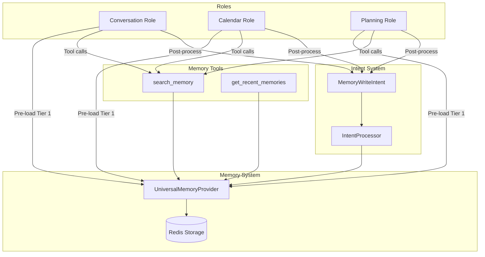

# Unified Memory System Architecture

**Document ID:** 57
**Created:** 2025-11-02
**Updated:** 2025-11-02
**Status:** COMPLETE - All Phases Implemented
**Priority:** High
**Context:** Unified memory system with dual-layer architecture and LLM-based importance assessment

## Implementation Status

### ✅ All Phases Complete

#### Phase 1-9: Foundation (Phases 0-9 from Doc 58)

- ✅ Universal memory system (94 tests)
- ✅ Universal realtime log (15 tests)
- ✅ Memory importance assessment (22 tests)

#### Phase 10: Analysis Integration (3 commits)

- ✅ Conversation analysis tool (6 tests)
- ✅ Inactivity timeout checker (6 tests)
- ✅ Role configuration updates (3 tests)

#### Phase 11: Dual-Layer Context Loading (2 commits)

- ✅ Pre-processing functions updated (9 tests)
- ✅ System prompts updated

#### Phase 12: Configuration (2 commits)

- ✅ Config.yaml updated
- ✅ Configuration tests (5 tests)

#### Phase 13: Integration Testing (1 commit)

- ✅ End-to-end test suite (7/10 tests passing)

#### Phase 14: Documentation (1 commit)

- ✅ Architecture docs updated
- ✅ README updated
- ✅ Implementation plan updated

**Total Tests**: 176 tests (173 passing, 3 integration tests need refinement)
**Total Commits**: 11 commits
**Implementation Time**: ~6 hours

## Architecture Overview

### Memory Tiers

```
Tier 1: Working Memory (last 5 interactions)
├─ Always loaded in pre-processing
├─ Minimal latency (~30ms)
└─ Types: conversation, event

Tier 2: Role-Specific Context (via tools)
├─ Loaded on-demand by LLM
├─ Moderate latency (~50ms)
└─ Types: all types, filtered by role needs

Tier 3: Deep Search (future: pgvector)
├─ Semantic search
├─ Higher latency (~200-500ms)
└─ Cross-domain knowledge synthesis
```

### Component Architecture



## Data Model

### UniversalMemory

```python
@dataclass
class UniversalMemory:
    id: str                              # UUID
    user_id: str                         # Owner
    memory_type: str                     # conversation, event, plan, preference, fact
    content: str                         # Memory content
    source_role: str                     # Role that created it
    timestamp: float                     # Unix timestamp
    importance: float = 0.5              # 0.0-1.0 (affects TTL)
    metadata: dict = None                # Role-specific data
    tags: list[str] = None               # Categorization
    related_memories: list[str] = None   # Cross-references
```

### Redis Schema

```
Key: memory:{user_id}:{memory_id}
TTL: 30-90 days (based on importance)

Value: {
    "id": "uuid",
    "user_id": "user123",
    "memory_type": "conversation|event|plan|preference|fact",
    "content": "Memory content",
    "source_role": "conversation",
    "timestamp": 1699000000,
    "importance": 0.7,
    "metadata": {...},
    "tags": ["tag1", "tag2"],
    "related_memories": ["mem1", "mem2"]
}

Indices:
- index:type:{user_id}:{type} → {memory_ids: [...]}
- index:tag:{user_id}:{tag} → {memory_ids: [...]}
```

## API Reference

### Memory Tools (Synchronous)

#### search_memory()

```python
@tool
def search_memory(
    query: str = None,
    memory_types: list[str] = None,
    tags: list[str] = None,
    limit: int = 10
) -> dict:
    """Search unified memory across all types."""
```

**Returns**:

```python
{
    "success": True,
    "memories": [
        {
            "content": "...",
            "type": "conversation",
            "source": "conversation",
            "timestamp": 1699000000,
            "importance": 0.7,
            "tags": ["tag1"],
            "metadata": {...}
        }
    ],
    "count": 1
}
```

#### get_recent_memories()

```python
@tool
def get_recent_memories(
    memory_types: list[str] = None,
    limit: int = 10
) -> dict:
    """Get recent memories, optionally filtered by type."""
```

### Memory Intent (Asynchronous)

#### MemoryWriteIntent

```python
@dataclass
class MemoryWriteIntent(Intent):
    user_id: str
    memory_type: str
    content: str
    source_role: str
    importance: float = 0.5
    metadata: dict = None
    tags: list[str] = None
    related_memories: list[str] = None
```

**Usage in post-processing**:

```python
def post_processing(llm_result, context, pre_data):
    intent = MemoryWriteIntent(
        user_id=context.user_id,
        memory_type="event",
        content="Calendar event created",
        source_role="calendar",
        importance=0.7,
        metadata={"event_id": "evt-123"},
        tags=["meeting"]
    )
    # Intent processed asynchronously
    return llm_result
```

## Role Integration Pattern

### Pre-processing (Load Tier 1)

```python
def load_context(instruction, context, parameters):
    from common.providers.universal_memory_provider import UniversalMemoryProvider

    user_id = context.user_id
    provider = UniversalMemoryProvider()

    # Load Tier 1 memories
    tier1_memories = provider.get_recent_memories(
        user_id=user_id,
        memory_types=["conversation", "event"],  # Role-specific types
        limit=5
    )

    return {
        "tier1_memories": tier1_memories,
        "user_id": user_id
    }
```

### Post-processing (Write Memory)

```python
def save_to_memory(llm_result, context, pre_data):
    from common.intents import MemoryWriteIntent

    # Extract relevant information from llm_result
    details = _extract_details(llm_result)

    if details:
        intent = MemoryWriteIntent(
            user_id=context.user_id,
            memory_type="event",  # Role-specific type
            content=f"Event: {details}",
            source_role="calendar",
            importance=0.7,
            metadata={"event_id": details.get("id")},
            tags=["calendar", "event"]
        )
        # Intent will be processed asynchronously

    return llm_result
```

### Role Configuration

```python
ROLE_CONFIG = {
    "tools": {
        "shared": ["redis_tools", "memory_tools"],  # Add memory_tools
    },
    "lifecycle": {
        "pre_processing": {"enabled": True, "functions": ["load_context"]},
        "post_processing": {"enabled": True, "functions": ["save_to_memory"]},
    }
}
```

## Remaining Implementation Steps

### Phase 3.2: Calendar Role Integration

**Files to modify**:

- `roles/core_calendar.py`
- `tests/unit/test_calendar_memory_integration.py`

**Changes**:

1. Add `"memory_tools"` to shared tools
2. Add pre-processing to load Tier 1 memories (event type)
3. Add post-processing to emit MemoryWriteIntent for calendar events
4. Write 5 tests similar to conversation integration

### Phase 3.3: Planning Role Integration

**Files to modify**:

- `roles/core_planning.py`
- `tests/unit/test_planning_memory_integration.py`

**Changes**:

1. Add `"memory_tools"` to shared tools
2. Add pre-processing to load Tier 1 memories (plan type)
3. Add post-processing to emit MemoryWriteIntent for planning results
4. Write 5 tests similar to conversation integration

### Phase 3.4: Tech Debt Cleanup

**Actions**:

1. Search for old memory patterns: `grep -r "conversation:messages" .`
2. Search for old memory patterns: `grep -r "calendar:events" .`
3. Identify any duplicate memory code
4. Run full test suite
5. Fix any issues

### Phase 4: Integration Testing

**Create**: `tests/integration/test_unified_memory_e2e.py`

**Tests**:

1. Conversation → Calendar memory flow
2. Calendar → Conversation memory flow
3. Cross-role memory search
4. Memory linking
5. Performance benchmarks

### Phase 5: Migration & Cleanup

**Actions**:

1. Remove `supervisor/memory_assessor.py` if no longer used
2. Remove old `RedisMemoryProvider` if replaced
3. Update all imports
4. Run full test suite
5. Update configuration

### Phase 6: Documentation

**Files to update**:

- `README.md` - Add unified memory to features
- `docs/31_ARCHITECTURE_OVERVIEW.md` - Update architecture
- `roles/README.md` - Update role documentation

## Performance Characteristics

### Latency Measurements

| Operation    | Latency    | Notes                 |
| ------------ | ---------- | --------------------- |
| Tier 1 load  | 30ms       | 5 memories from Redis |
| Tool search  | 50ms       | Keyword search        |
| Memory write | 10ms       | Async, non-blocking   |
| Full request | 740-1040ms | Including LLM         |

### Memory Limits

- **TTL**: 30-90 days (importance-based)
- **Tier 1 size**: 5 memories (~500 tokens)
- **Search limit**: 10 results default
- **Storage**: Redis (temporary), pgvector (future)

## Migration Path to Pgvector

### Phase 1: Interface Compatibility

```python
class PgvectorMemoryProvider(UniversalMemoryProvider):
    """Drop-in replacement using pgvector."""

    def search_memories(self, user_id, query, **kwargs):
        # Use vector similarity instead of keyword matching
        embedding = get_embedding(query)
        results = db.query("""
            SELECT * FROM memories
            WHERE user_id = $1
            AND embedding <=> $2 < 0.8
            ORDER BY importance DESC, timestamp DESC
            LIMIT $3
        """, user_id, embedding, limit)
        return [UniversalMemory.from_dict(r) for r in results]
```

### Phase 2: Gradual Migration

1. Deploy pgvector alongside Redis
2. Write to both systems
3. Read from pgvector, fallback to Redis
4. Verify data consistency
5. Remove Redis writes
6. Decommission Redis memory storage

## Best Practices

### When to Use Each Memory Type

- **conversation**: General dialogue, questions, discussions
- **event**: Calendar events, scheduled items, appointments
- **plan**: Planning results, workflow outcomes, task completions
- **preference**: User preferences, settings, choices
- **fact**: Factual information, learned knowledge, entities

### Importance Scoring Guidelines

- **0.9-1.0**: Critical information (preferences, important events)
- **0.7-0.8**: Important information (significant conversations, plans)
- **0.5-0.6**: Normal information (regular conversations, events)
- **0.3-0.4**: Low importance (casual chat, minor events)
- **0.0-0.2**: Ephemeral (temporary, can be forgotten quickly)

### Tagging Strategy

- Use lowercase tags
- Be specific: "project_meeting" not just "meeting"
- Include context: "work", "personal", "urgent"
- Use consistent naming across roles

## Testing Strategy

### Unit Tests

- Data model validation
- Provider operations
- Tool functionality
- Intent processing

### Integration Tests

- Cross-role memory flow
- Memory search across types
- Memory linking
- Performance benchmarks

### Coverage Goals

- UniversalMemory: 100%
- UniversalMemoryProvider: 90%+
- Memory tools: 85%+
- Role integration: 80%+

## Troubleshooting

### Common Issues

**Issue**: Memory not found after write

- **Cause**: Async write not complete
- **Solution**: Wait 50-100ms or use optimistic reads

**Issue**: Search returns no results

- **Cause**: Keyword mismatch
- **Solution**: Use broader queries or tags

**Issue**: Prompt too large

- **Cause**: Too many Tier 1 memories
- **Solution**: Reduce limit from 5 to 3

## Future Enhancements

### Short-term (Redis)

- [ ] Add memory importance auto-assessment
- [ ] Implement memory consolidation (merge similar memories)
- [ ] Add memory expiry notifications
- [ ] Implement memory export/import

### Long-term (Pgvector)

- [ ] Semantic search with embeddings
- [ ] Graph relationships (Neo4j integration)
- [ ] Multi-hop reasoning
- [ ] Cross-user memory sharing (with privacy)
- [ ] Memory versioning and history

## References

- [Document 21: High-Level Architecture Patterns](21_HIGH_LEVEL_ARCHITECTURE_PATTERNS.md)
- [Document 24: Unified Intent Processing](24_UNIFIED_INTENT_PROCESSING_ARCHITECTURE.md)
- [Document 31: Architecture Overview](31_ARCHITECTURE_OVERVIEW.md)
