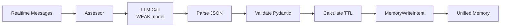

# Memory Importance Assessor: Detailed Design

**Document ID:** 59
**Created:** 2025-11-02
**Status:** DESIGN - Ready for Implementation
**Priority:** High

## Overview

The MemoryImportanceAssessor uses an LLM (WEAK model) to assess the importance of interactions and generate structured metadata (summary, tags, topics) for storage in the unified memory system.

## Architecture



## LLM Prompt Design

### System Prompt

```
You are a memory importance assessor. Analyze interactions and respond with ONLY valid JSON.

CRITICAL: Respond with ONLY valid JSON. No explanations, no additional text.

Your task is to assess the importance of storing this interaction as a long-term memory.

IMPORTANCE SCORING GUIDELINES:
0.9-1.0: Critical (explicit preferences, important decisions, key facts to remember)
0.7-0.8: High (significant conversations, important events, useful information)
0.5-0.6: Medium (normal conversations, regular events, general information)
0.3-0.4: Low (casual chat, minor events, transient information)
0.0-0.2: Minimal (greetings, acknowledgments, trivial exchanges)

SUMMARY GUIDELINES:
- Concise but complete
- Self-contained (understandable without full content)
- Include key details (who, what, when, where if relevant)
- Actionable (what was decided/discussed)

TAGGING GUIDELINES:
- Use lowercase only
- Be specific: "project_meeting" not just "meeting"
- Include context: "work", "personal", "urgent"
- 1-10 tags maximum
- Common tags: work, personal, urgent, project, meeting, planning, decision, preference

TOPIC EXTRACTION:
- Main subjects discussed
- Key entities mentioned (people, places, projects)
- Important concepts
- 0-5 topics maximum

RESPOND WITH ONLY THIS JSON FORMAT:
{
  "importance": 0.7,
  "summary": "User scheduled team meeting for tomorrow at 2pm to discuss Q4 budget",
  "tags": ["meeting", "work", "team", "budget", "q4"],
  "topics": ["Q4 Budget Planning", "Team Meetings"],
  "reasoning": "Important work event with specific time, participants, and agenda"
}

NO EXPLANATIONS. ONLY JSON.
```

### User Prompt Template

```
Analyze this interaction:

User: {user_message}
Assistant: {assistant_response}

Role: {source_role}
Context: {context}

Assess importance and generate metadata.
```

## Implementation Specification

### Class Structure

```python
class MemoryImportanceAssessor:
    """Assesses memory importance using LLM."""

    def __init__(
        self,
        llm_factory: LLMFactory,
        permanent_threshold: float = 0.7,
        timeout_seconds: int = 5
    ):
        self.llm_factory = llm_factory
        self.permanent_threshold = permanent_threshold
        self.timeout_seconds = timeout_seconds
        self.agent: Optional[Agent] = None

    async def initialize(self):
        """Initialize with WEAK model."""
        self.agent = self.llm_factory.get_agent(LLMType.WEAK)

    async def assess_memory(
        self,
        user_message: str,
        assistant_response: str,
        source_role: str,
        context: dict = None
    ) -> Optional[MemoryAssessment]:
        """Assess memory importance."""
        # Build prompt
        # Call LLM
        # Parse JSON
        # Validate with Pydantic
        # Return assessment or None if fails

    def calculate_ttl(self, importance: float) -> Optional[int]:
        """Calculate TTL based on importance."""
        if importance >= self.permanent_threshold:
            return None  # Permanent
        elif importance >= 0.5:
            return 30 * 24 * 3600  # 1 month
        elif importance >= 0.3:
            return 7 * 24 * 3600   # 1 week
        else:
            return 3 * 24 * 3600  # 3 days
```

### Error Handling

```python
try:
    # LLM call with timeout
    result = await asyncio.wait_for(
        self.agent.execute(prompt),
        timeout=self.timeout_seconds
    )
except asyncio.TimeoutError:
    logger.warning("Assessment timed out")
    return None
except json.JSONDecodeError:
    logger.warning("Failed to parse JSON")
    return None
except ValidationError as e:
    logger.warning(f"Validation failed: {e}")
    return None
```

### Integration Points

**Called by**:

- `process_topic_analysis_intent()` - When analyze_conversation() is triggered
- Inactivity timeout checker - When 30min passes

**Outputs**:

- `MemoryAssessment` object → Used to create `MemoryWriteIntent`
- TTL value → Passed to UniversalMemoryProvider

## Test Strategy

### Unit Tests (10 tests)

1. Successful assessment
2. Assessment with context
3. Timeout handling
4. JSON parse failure
5. Validation failure
6. TTL calculation (permanent)
7. TTL calculation (1 month)
8. TTL calculation (1 week)
9. TTL calculation (3 days)
10. Edge cases

### Integration Tests (5 tests)

1. End-to-end assessment flow
2. Assessment triggers memory write
3. Graduated TTL applied correctly
4. Multiple messages assessed
5. Performance validation

## Performance Targets

- **Assessment latency**: < 300ms (WEAK model)
- **Timeout**: 5 seconds
- **Success rate**: > 95%
- **Cost per assessment**: ~$0.0001

## Configuration

```yaml
memory_system:
  assessment:
    enabled: true
    model: "WEAK"
    timeout_seconds: 5
    permanent_threshold: 0.7
  ttl_calculation:
    very_low_days: 3
    low_days: 7
    medium_days: 30
```

## Next Implementation Steps

1. Create test file: `tests/unit/test_importance_assessor.py`
2. Implement: `common/memory_importance_assessor.py`
3. Run tests, verify pass
4. Commit
5. Move to Phase 9

This design is complete and ready for implementation.
