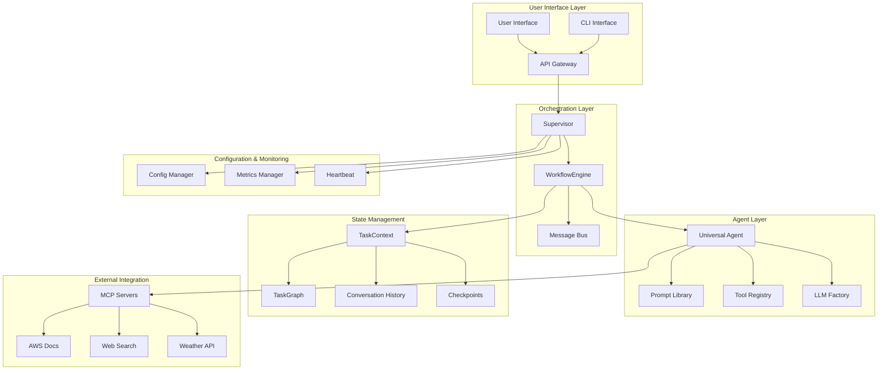
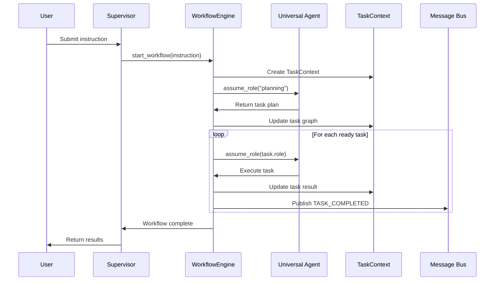

# Architecture Overview

## System Architecture

The StrandsAgent Universal Agent system implements a clean, modular architecture that provides workflow management, role-based task delegation, and external state management.

## High-Level Architecture



## Core Components

### 1. Supervisor

The `Supervisor` is the top-level system coordinator responsible for:

- System initialization and configuration loading
- WorkflowEngine lifecycle management
- Health monitoring and metrics collection
- Component coordination and status reporting

**Key Responsibilities:**
- Load and validate system configuration
- Initialize WorkflowEngine with proper dependencies
- Provide system status and health information
- Coordinate shutdown and cleanup procedures

### 2. WorkflowEngine

The `WorkflowEngine` is the unified orchestration component that combines:

- **Request Management**: Workflow lifecycle and progress tracking
- **Task Scheduling**: Priority-based task execution with concurrency control
- **Universal Agent Integration**: Role-based task delegation
- **State Management**: External state through TaskContext

**Key Features:**
- DAG-based workflow execution with parallel task processing
- Pause/resume functionality with comprehensive checkpointing
- Message bus integration for event-driven communication
- Comprehensive metrics and monitoring

### 3. Universal Agent

The `UniversalAgent` provides a single agent interface that can assume different roles:

**Supported Roles:**
- **Planning**: Complex task planning and dependency analysis
- **Search**: Web search and information retrieval
- **Weather**: Weather data lookup and forecasting
- **Summarizer**: Text summarization and key point extraction
- **Slack**: Slack integration and messaging

**Role-based LLM Optimization:**
- **STRONG Models**: Used for planning and complex reasoning tasks
- **DEFAULT Models**: Used for balanced processing and conversational tasks
- **WEAK Models**: Used for simple lookups and basic operations

### 4. TaskContext & TaskGraph

**TaskContext** provides external state management wrapping the enhanced **TaskGraph**:

- **DAG Execution**: Directed Acyclic Graph for task dependencies
- **Conversation History**: Complete interaction tracking
- **Progressive Summary**: Incremental summary building
- **Checkpointing**: Full state serialization for pause/resume
- **Metadata Management**: Task execution context and parameters

### 5. LLM Factory

Enhanced factory pattern for creating StrandsAgent models:

- **Provider Abstraction**: Support for Bedrock, OpenAI, and other providers
- **Semantic Types**: WEAK/DEFAULT/STRONG model selection
- **Configuration Management**: Centralized model configuration
- **Framework Integration**: Native StrandsAgent model creation

### 6. Tool System

Converted from individual agent classes to @tool decorated functions:

**Tool Categories:**
- **Planning Tools**: Task planning, dependency analysis, execution optimization
- **Search Tools**: Web search, filtered search, result processing
- **Weather Tools**: Current weather, forecasts, location resolution
- **Summarizer Tools**: Text summarization, key point extraction
- **Slack Tools**: Message sending, channel management, history retrieval

## Data Flow

### Workflow Execution Flow

1. **User Request** → Supervisor receives instruction
2. **Workflow Creation** → WorkflowEngine creates TaskContext with TaskGraph
3. **Task Planning** → Universal Agent in planning role creates execution plan
4. **DAG Execution** → WorkflowEngine executes tasks in dependency order
5. **Role Switching** → Universal Agent assumes different roles per task
6. **State Management** → TaskContext tracks progress and conversation history
7. **Result Aggregation** → Final results compiled and returned

### Message Flow



## State Management

### TaskGraph Enhancement

The enhanced TaskGraph provides:

- **Node Types**: Task nodes with role, tools, and dependency information
- **Edge Types**: Dependency relationships with conditional logic
- **Status Tracking**: PENDING, RUNNING, COMPLETED, FAILED states
- **History Management**: Complete execution history with configurable retention
- **Checkpoint Support**: Serializable state for pause/resume operations

### Conversation History

Comprehensive conversation tracking including:

- **User Messages**: Original instructions and follow-up queries
- **Agent Responses**: Responses from each role assumption
- **Tool Calls**: External tool invocations and results
- **Context Switches**: Role changes and reasoning
- **Error Handling**: Failed operations and recovery attempts

### Progressive Summary

Incremental summary building that:

- **Maintains Context**: Key information across long conversations
- **Reduces Token Usage**: Summarizes older conversation parts
- **Preserves Critical Data**: Important decisions and results
- **Enables Resume**: Context restoration after pause/resume

## External Integrations

### MCP (Model Context Protocol) Servers

The system integrates with multiple MCP servers for enhanced capabilities:

**Configured MCP Servers:**
- **AWS Documentation**: Technical documentation and API references
- **Web Search**: Internet search capabilities
- **Weather Services**: Real-time weather data
- **Filesystem**: File system operations
- **GitHub**: Repository management and code search
- **Slack**: Team communication and collaboration

**MCP Integration Features:**
- **Dynamic Discovery**: Automatic server discovery and registration
- **Tool Registration**: MCP tools automatically available to Universal Agent
- **Authentication**: Secure authentication with external services
- **Error Handling**: Graceful degradation when MCP servers unavailable

### Message Bus Integration

Event-driven architecture with comprehensive event types:

**Core Events:**
- `WORKFLOW_STARTED`: New workflow initiated
- `WORKFLOW_COMPLETED`: Workflow finished successfully
- `WORKFLOW_FAILED`: Workflow failed with error
- `WORKFLOW_PAUSED`: Workflow paused with checkpoint
- `WORKFLOW_RESUMED`: Workflow resumed from checkpoint
- `TASK_STARTED`: Individual task execution began
- `TASK_COMPLETED`: Task completed successfully
- `TASK_FAILED`: Task failed with error
- `AGENT_ROLE_SWITCHED`: Universal Agent assumed new role

## Performance Characteristics

### Concurrency Model

- **Task-Level Parallelism**: Multiple tasks execute concurrently within workflows
- **Workflow-Level Isolation**: Each workflow maintains independent state
- **Resource Management**: Configurable concurrency limits prevent resource exhaustion
- **Priority Scheduling**: High-priority tasks execute before lower-priority ones

### Memory Management

- **Checkpoint Compression**: State data compressed for storage efficiency
- **History Pruning**: Conversation history pruned based on configurable limits
- **Resource Cleanup**: Automatic cleanup of completed workflow resources
- **Memory Monitoring**: Built-in memory usage tracking and alerts

### Scalability Considerations

- **Horizontal Scaling**: WorkflowEngine instances can be distributed
- **State Persistence**: External state enables cross-instance workflow migration
- **Load Balancing**: Workflow distribution across multiple instances
- **Resource Pooling**: Shared LLM model instances across workflows

## Security Architecture

### Authentication & Authorization

- **API Authentication**: Token-based authentication for external access
- **Role-Based Access**: Different permission levels for different operations
- **Service Authentication**: Secure authentication with external MCP servers
- **Audit Logging**: Complete audit trail of all operations

### Data Security

- **Conversation Encryption**: Sensitive conversation data encrypted at rest
- **Secure Checkpoints**: Checkpoint data protected with encryption
- **Credential Management**: Secure storage and rotation of API credentials
- **Input Validation**: Comprehensive validation of all user inputs

## Monitoring & Observability

### Metrics Collection

**System Metrics:**
- Active workflow count
- Task execution rates
- Error rates by component
- Resource utilization (CPU, memory)
- Response times and latencies

**Business Metrics:**
- Workflow completion rates
- User satisfaction scores
- Feature usage statistics
- Performance benchmarks

### Health Monitoring

**Component Health Checks:**
- WorkflowEngine status and capacity
- Universal Agent availability
- MCP server connectivity
- Database connectivity
- External service availability

**System Health Indicators:**
- Overall system status (healthy/degraded/critical)
- Component-specific health scores
- Performance trend analysis
- Capacity utilization metrics

## Design Patterns

### Universal Agent Pattern

Single agent interface with role-based specialization:

```python
# Instead of multiple agent classes
planning_agent = PlanningAgent()
search_agent = SearchAgent()

# Use single Universal Agent with roles
agent = universal_agent.assume_role("planning")
result = agent.execute(task)

agent = universal_agent.assume_role("search")
result = agent.execute(task)
```

### External State Pattern

State externalized from agent instances:

```python
# State managed externally in TaskContext
task_context = TaskContext(task_graph)
task_context.conversation_history.add_message(message)
checkpoint = task_context.create_checkpoint()

# Agent instances are stateless
agent = universal_agent.assume_role("planning", context=task_context)
```

### Factory Pattern

Centralized model creation with semantic types:

```python
# Semantic model selection
strong_model = llm_factory.create_strands_model(LLMType.STRONG)  # Complex reasoning
weak_model = llm_factory.create_strands_model(LLMType.WEAK)     # Simple tasks
default_model = llm_factory.create_strands_model(LLMType.DEFAULT) # Balanced
```

## Migration Benefits

### Before Migration (LangChain-based)

- **5 Individual Agent Classes**: Separate classes for each capability
- **Complex Orchestration**: Multiple coordination layers
- **Tight Coupling**: Agents tightly coupled to LangChain framework
- **Limited Flexibility**: Difficult to add new capabilities
- **State Management**: State scattered across multiple components

### After Migration (StrandsAgent-based)

- **1 Universal Agent**: Single agent with role-based specialization
- **Simplified Architecture**: Clean, modular component structure
- **Framework Independence**: Clean abstraction over LLM frameworks
- **Enhanced Flexibility**: Easy addition of new roles and tools
- **External State**: Centralized state management with checkpointing

### Key Improvements

1. **90% Code Reuse**: Leveraged existing TaskGraph, MessageBus, and configuration
2. **Simplified Testing**: Fewer components to test and mock
3. **Better Performance**: Reduced overhead from multiple agent instances
4. **Enhanced Capabilities**: Pause/resume, external state, MCP integration
5. **Cleaner Codebase**: Removed complex orchestration and coupling

## Future Architecture Considerations

### Planned Enhancements

- **Distributed Execution**: Multi-node workflow execution
- **Advanced Scheduling**: ML-based task scheduling optimization
- **Enhanced Security**: Zero-trust security model
- **Performance Optimization**: Caching and optimization layers
- **Plugin Architecture**: Formal plugin system beyond MCP

### Extensibility Points

- **New Roles**: Easy addition of new Universal Agent roles
- **Custom Tools**: @tool decorator pattern for new capabilities
- **MCP Servers**: Integration with additional external services
- **State Backends**: Alternative storage backends for TaskContext
- **Monitoring Integrations**: Additional monitoring and alerting systems